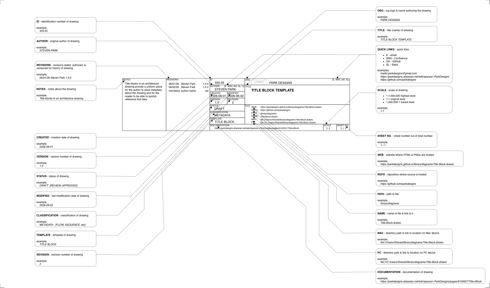

# portfolio

Portfolio of experience and knowledge

# Portfolio

* Websites
* UI/UX
* Diagrams
* Documentation
* Products

## Websites

* [royalcaribbean.com](./websites/royalcaribbean.com) - 4 million hits/day
* [celebritycruises.com](./websites/celebritycruises.com) - 1 million hits/day
* [americanexpress.com](./websites/americanexpress.com) -  16 million hits/day

## UI/UX

* Contact Center - Customer
   * 🚧 Chat - Amex
   * 🚧 Email - Amex

* Contact Center - Colleague
   * 🚧 Chat - Amex
   * 🚧 Email - Amex

## Diagrams

* [Diagrams](./diagrams/)
   * Metadata
      * 
      * [Title Block](https://parkdesigns.atlassian.net/wiki/spaces/~ParkDesigns/pages/9109507/Title+Block)
   * 🚧 Experience Map
   * 🚧 Journey
   * 🚧 Data Flow
   * 🚧 Sequence
   * 🚧 Data Structure
   * 🚧 UI Decomposition

## Documentation

* 🚧 Policies
* 🚧 Standards
* 🚧 Procedures
* 🚧 Requirements
   * 🚧 Nonfunctional Requirements (30+ created)
   * 🚧 Use Cases (200+ created)
* 🚧 Product documentation (200+ created)

## Products

* DNS
   * 🚧 BIND
* CDN
   * 🚧 [Akamai](https://parkdesigns.atlassian.net/wiki/spaces/~ParkDesigns/pages/2228225/Akamai)
* WAF
   * 🚧 Akamai WAF (Kona)
   * 🚧 F5 WAF
* Network
   * 🚧 Akamai Site Shield
   * 🚧 Firewall
   * 🚧 NetScout
* Gateway
   * 🚧 Envoy Proxy
   * 🚧 Proofpoint
* Load Balancer
   * 🚧 F5 Big IP
* Security
   * 🚧 F5 ASM
   * 🚧 Custom Bot Mitigation
   * 🚧 Menlo Security
   * 🚧 Intrusion Detection System
* Virtualization
   * 🚧 RedHat OpenShift
* OS
   * 🚧 RedHat Enterprise Linux
* Email Server
   * 🚧 Sendmail
   * 🚧 Proofpoint Email Relay
* Web Server
   * 🚧 Apache HTTPD
* App Server
   * 🚧 Apache Tomcat
   * 🚧 Apache Jetty
* Cache
   * 🚧 Redis
* NoSQL
   * 🚧 Couchbase
* Search
   * 🚧 Lucene
   * 🚧 Elasticsearch
* Database
   * 🚧 Oracle RDBMS
   * 🚧 Postgres
* File Storage
   * ❌️ Amazon S3
   * ❌️ Google Cloud Storage
* Observability
   * 🚧 Google Postmaster Tools
   * 🚧 Grafana
   * 🚧 AppDynamics
   * 🚧 Dynatrace
   * 🚧 Splunk
   * 🚧 OpenSearch
* Content Management System
   * 🚧 Adobe Experience Manager
* Repository
   * 🚧 GitHub
* CI/CD
   * 🚧 Jenkins
   * 🚧 GitHub Actions
* Testing
   * 🚧 Mercury Load-Runner
   * 🚧 Selenium
   * 🚧 JUnit
   * 🚧 [Deque Axe](https://www.deque.com/axe/)
* Modeling
   * 🚧 [IriusRisk](https://www.iriusrisk.com/)
* Diagramming
   * 🚧 Gliffy
   * 🚧 [Draw.io](https://app.diagrams.net/)
* Design
   * 🚧 Figma
* Email Clients
   * 🚧 Gmail
   * 🚧 Yahoo Mail
   * 🚧 Outlook
* Browsers
   * 🚧 Chrome (Canary, etc)
   * 🚧 Safari
   * 🚧 Firefox
* Tools
   * 🚧 [Google Admin Toolbox](https://toolbox.googleapps.com/apps) (Dig, Decode/Encode, etc)
   * 🚧 [DigiCert SSL](https://www.digicert.com/help/)
   * 🚧 WireShark
   * 🚧 [SnagIt](https://www.techsmith.com/snagit/)
   * 🚧 [TextEdit](https://support.apple.com/guide/textedit/welcome/mac)
* CLI
   * 🚧 openssl
   * 🚧 curl
   * 🚧 telnet
* Keyboard Shortcuts
   * 🚧 Screencapture
* 🚧 . . .