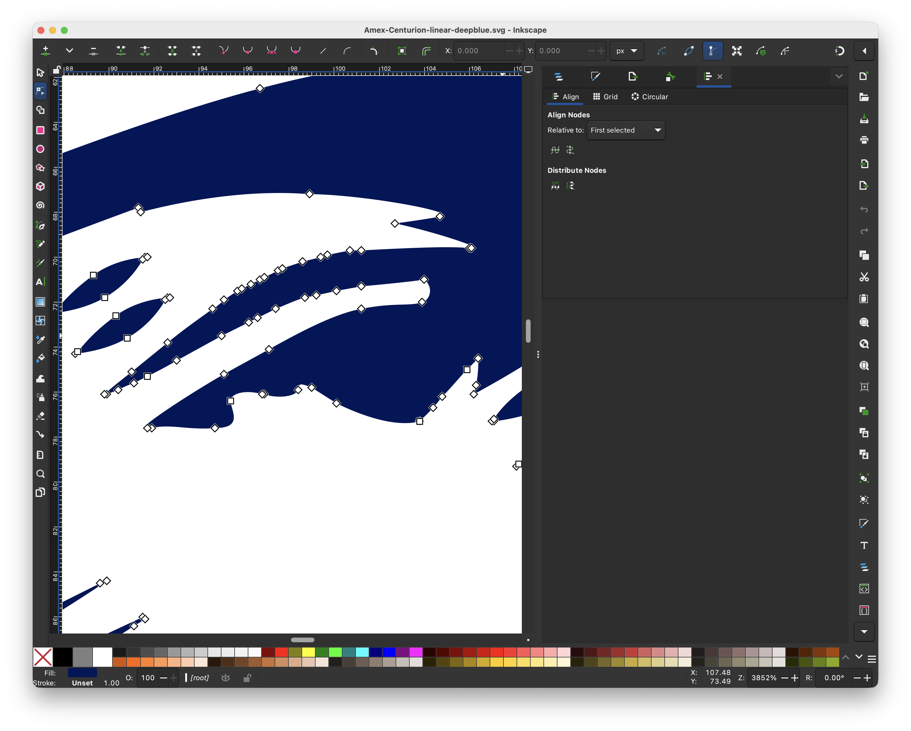

SVG Tiny Portable/Secure

BIMI requires a 32 KB SVG Tiny image. Editing 99 KB SVG down to 32 KB is challenging.

* SVG - Scalable Vector Graphics 
* SVG Tiny 1.2 (see w3.org/TR/SVGTiny12)
* SVG v2 (see w3.org/TR/SVG2)

After 2026 May layoff I proved my 2025 BIMI proposal.

I reduced the famous trademarked American Express Centurion emblem redrawn by Steven Noble (stevennobleillustrations.com) in 2015.
* 99 KB to 32 KB

Reduction methods:
* reduce path coordinates
  * 41 KB cut
  * 14,131 coordinates down to 5,529 (61% reduction)
* reduce decimal precision
  * 14 KB cut
  * round up/down
  * remove hundrenth place
  * ex, change 0.12345 into 0.12
* remove zeros
  * 6 KB cut
  * ex, change 0.1 into .1
  * ex, change 1.0 into 1
* remove spaces
  * 5 KB cut
  * ex, 100 C 38.7 into 100C38.7
* remove extraneous data
  * 1 KB cut

Future improvements would be to:
* scale viewbox to 7998 x 9998
* remove decimal point
* improve path precision

For more see,
* SVG Tiny Portable/Secure - https://parkdesigns.github.io/images/SVG-Tiny-Portable-Secure.html
* BIMI - https://parkdesigns.github.io/security/BIMI.html

&nbsp;&nbsp;&nbsp;&nbsp;&nbsp;&nbsp;&nbsp;&nbsp;

&nbsp;&nbsp;&nbsp;&nbsp;&nbsp;&nbsp;&nbsp;&nbsp;

## Reference

* [LinkedIn post 2026-09-13](https://www.linkedin.com/posts/steven-park-6611856_svg-tiny-portablesecure-bimi-requires-a-activity-7504947682650673152-0glv)