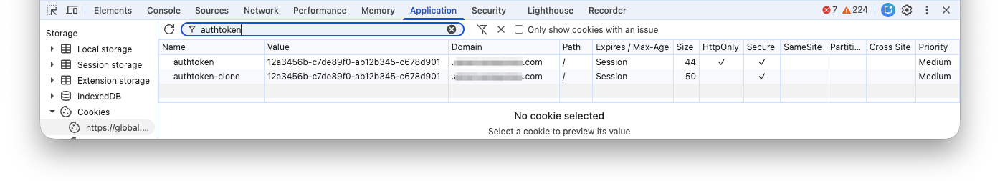
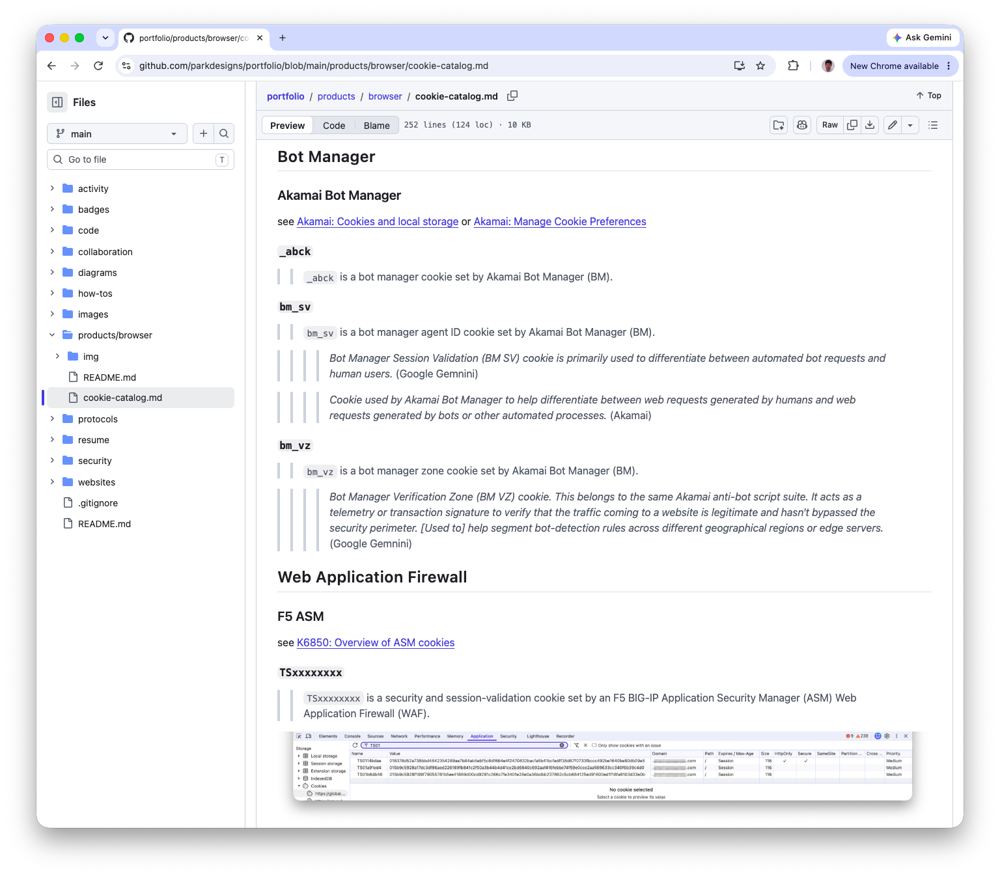

# Non-HttpOnly Auth Token Cookie Exploit

Security breaks if a HttpOnly cookie is cloned as non-HttpOnly.

In 2017 review I found this security hole.
 - production Chat webapp affected

🔍 Discovery Method: 
⠀⠀⠀⠀PEN Test inspection with Chrome DevTools > App > Cookies.

💥 Impact: 
⠀⠀⠀⠀Increased attack surface for customers using website.

📋 Standard: 
⠀⠀⠀⠀Auth Token value MUST not be readable by browser client-side JavaScript (JS). 
⠀⠀⠀⠀see `NIST SP 800-63B: 5. Session Mgmt > 5.1.1. Browser Cookies` 
⠀⠀⠀⠀[https://pages.nist.gov/800-63-4/sp800-63b.html](https://pages.nist.gov/800-63-4/sp800-63b.html) 
⠀⠀⠀⠀Cookies used for session maintenance: 
⠀⠀⠀⠀3. SHOULD be tagged as inaccessible via JavaScript (i.e., HttpOnly). 

🔓 Vulnerability: 
⠀⠀⠀⠀JS allowed to read sensitive Auth Token value. 
⠀⠀⠀⠀see `CWE-1004: Sensitive Cookie Without 'HttpOnly' Flag` 
⠀⠀⠀⠀[https://cwe.mitre.org/data/definitions/1004.html](https://cwe.mitre.org/data/definitions/1004.html)

⚠️ Exploit: 
⠀⠀⠀⠀Malicious JS, if present, could exfiltrate Auth Token value for unauthorized use outside of victim’s browser.

🛠️ Remediation: 
 - Remove use of cloning Auth Token cookie as non-HttpOnly

🛡️ Controls:
 - Catalog all cookies
 - Restrict server-side code in Set-Cookie
 - Require CI workflow to approve new Set-Cookie
 - Scan cookies in test env
 - Monitor & alert of any unapproved cookie(s)

## Reference

* [LinkedIn post 2026-09-22](https://www.linkedin.com/posts/steven-park-6611856_non-httponly-auth-token-cookie-exploit-security-ugcPost-7508231672786518016-5QEY)