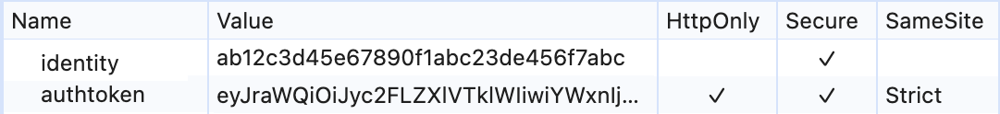
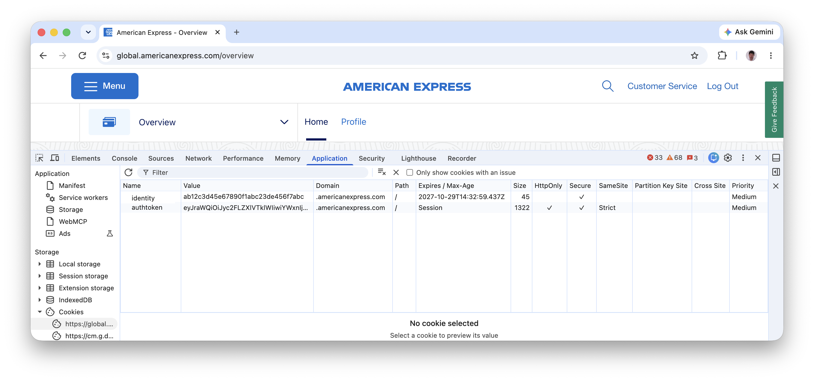
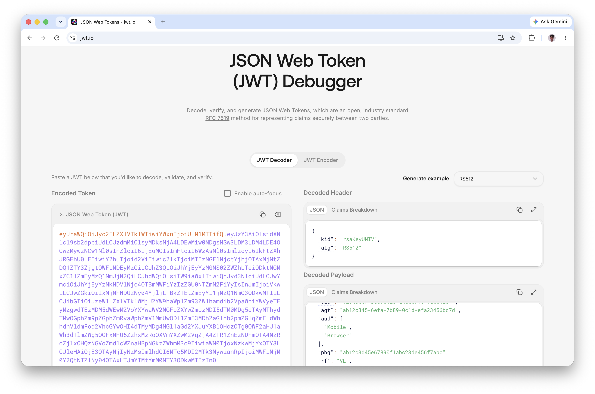
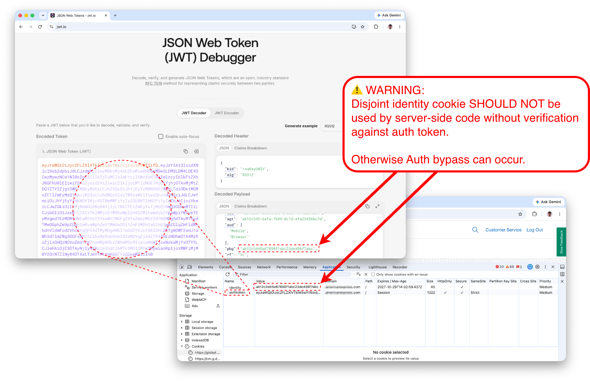

# Identity Cookie Disjoint from Auth Token Exploit

Security breaks if identity is NOT verified against auth token.

In 2019 review I found this security hole.
 - test Chat webapp affected

🔍 Discovery Method: 
⠀⠀⠀⠀PEN Test inspection and exploitation with Chrome DevTools > App > Cookies.

💥 Impact: 
⠀⠀⠀⠀None. Code with vulnerability not released.

💥 Hypothetical Impact: 
⠀⠀⠀⠀If released, any authenticated and authorized user of website could manually edit Identity cookie to a prior harvested victim Identity and gain unauthorized access to the victim’s chat and its history.

📋 Standard: 
⠀⠀⠀⠀Identity value MUST be verified against Auth Token in public APIs by server-side code. 
⠀⠀⠀⠀see `NIST SP 800-63B: 2. Authentication Assurance Levels` 
⠀⠀⠀⠀[https://pages.nist.gov/800-63-4/sp800-63b.html](https://pages.nist.gov/800-63-4/sp800-63b.html) 
⠀⠀⠀⠀_The authentication process results in an identifier that uniquely identifies the subscriber each time they authenticate to that RP. The identifier MAY be pseudonymous._

🔓 Vulnerability: 
⠀⠀⠀⠀Server-side code using Identity unverified against Auth Token bypasses auth controls. 
⠀⠀⠀⠀see `CWE-784: Reliance on Cookies without Validation and Integrity Checking in a Security Decision` 
⠀⠀⠀⠀[https://cwe.mitre.org/data/definitions/784.html](https://cwe.mitre.org/data/definitions/784.html)

⚠️ Exploit: 
⠀⠀⠀⠀Attacker could modify Identity cookie to a prior harvested victim Identity cookie and gain access to victim’s chat capabilities (history, new chat, etc).

🛠️ Remediation: 
 - Change server-side code to use Identity verified against Auth Token.

🛡️ Controls:
 - Do NOT use client-side convenience cookies (non-HttpOnly) in server-side logic
 - Use server-side cookies (HttpOnly) for Identity
 - Check source of Identity is bound to and verified against Authentication Token

## Reference

* [LinkedIn post 2026-09-24](https://www.linkedin.com/posts/steven-park-6611856_identity-cookie-disjoint-from-auth-token-ugcPost-7508930770099679232-oIcu)