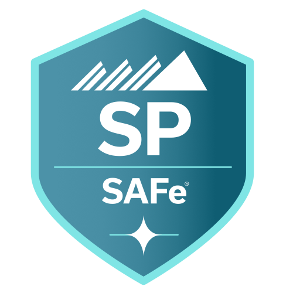

# SP

SP - SAFe Practitioner

 

* [Scaled Agile Framework](https://framework.scaledagile.com/#big-picture)
* [Scaled Agile](https://scaledagile.com/what-is-safe/)

## Status - ⭐ Certified

In ~2018 I became SAFe Practitioner certified in Scaled Agile Framework (SAFe).

* 8+ years SAFe experience
* additional 8+ years Agile experience

## Books

## Work History

* PI Planning
  * T-shirt sized initiatives
  * Raised visibility on Enterprise initiatives
  * Lobbied to reduce Tech Debt
  * Planned architecture runway two PIs in advance
  * Completed preplanning activities
  * Attended big team planning events
* NFRs
  * Create non-functional requirements
* User Stories
  * Created business user stories
  * Reviewed and 
  * Created technology enabler user stories
  * Created architectural runway user stories
  * Created template user stories
  * Assisted sizing user stories
  * Implemented user stories
  * Reviewed Scrum team user stories in Architecture Review meetings
* Defects
  * Created defects for security countermeasures
* AC
  * Assisted Agile Champion several times

  ## Reference

* [Scaled Agile Framework](https://framework.scaledagile.com/#big-picture)
* [Scaled Agile](https://scaledagile.com/what-is-safe/)
* [Agile Manifesto](https://agilemanifesto.org/)