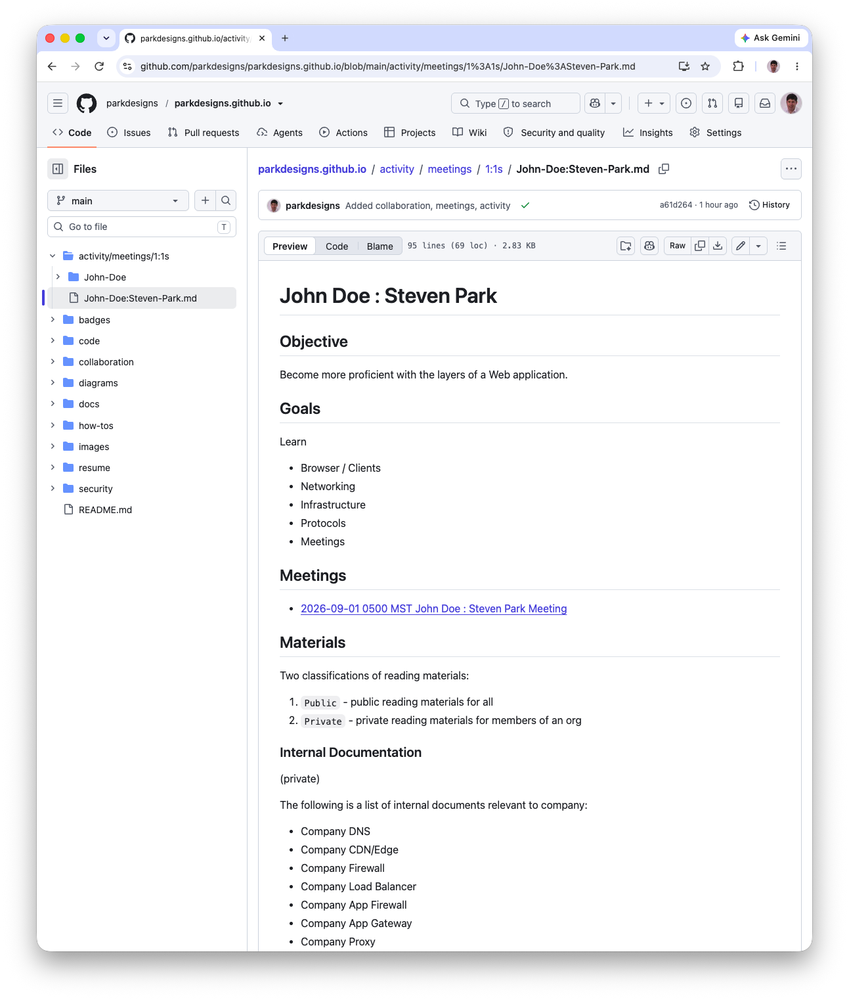
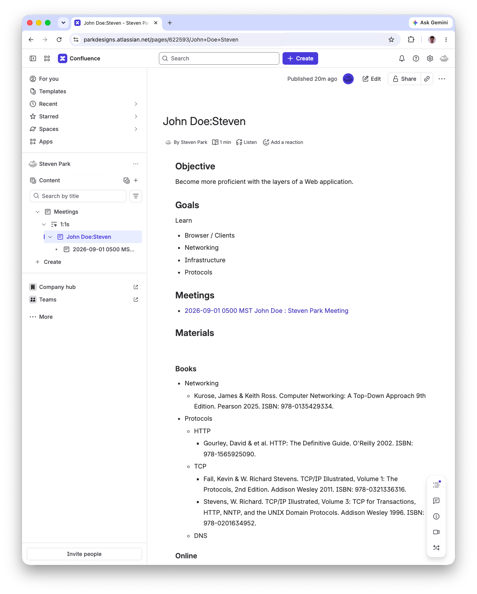

# 1-on-1 Main page

A main page for one-on-one meetings for an individual provides a single-point of reference.

Benefits
* Organized
  * No need to catalog an email of meeting minutes into a folder
  * No need to move a OneNote note of meeting minutes into a folder
  * Demonstrates how to organize for others to emulate better org skills
* Readable
  * Clear objective
  * Descending order means recent meeting is first (more relevant)
  * No need for a listener to guess what acronym or new words were
* Linked
  * Page itself is linkable
  * Content in page links to other HTTP Resources
  * No need for a listener to guess what the URL is
* Baked
  * Adding 1-on-1 progress to a portfolio can be done by copying this page

# GitHub example

# Confluence example

# Text example

## Objective

Become more proficient with the layers of a Web application.

## Goals

Learn

* Browser / Clients
* Networking
* Infrastructure
* Protocols
* Meetings

## Meetings

* [2026-09-01 0500 MST John Doe : Steven Park Meeting](./1-on-1-Meeting-page.md)

## Materials

Two classifications of reading materials:

1. `Public` - public reading materials for all
2. `Private` - private reading materials for members of an org

### Internal Documentation

(private)

The following is a list of internal documents relevant to company:

* Company DNS
* Company CDN/Edge
* Company Firewall
* Company Load Balancer
* Company App Firewall
* Company App Gateway
* Company Proxy
* Company Virtualization

These documents provide examples, screenshots, contacts, diagrams, explanations, incidents, tools, etc all within the context of the company.

### Books

(public)

* Networking
  * [Kurose, James & Keith Ross. Computer Networking: A Top-Down Approach 9th Edition. Pearson 2025. ISBN: 978-0135429334.](../books/networking/Computer-Networking-A-Top-Down-Approach.md)
* Infrastructure
  * DNS
  * Content Delivery Network
  * Router
  * VPN
  * Firewall
  * Load Balancer
  * App Firewall
  * App Gateway
  * Proxy
  * Virtualization
* Protocols
  * HTTP
    * [Gourley, David & et al. HTTP: The Definitive Guide. O'Reilly 2002. ISBN: 978-1565925090.](../books/networking/HTTP-The-Definitive-Guide.md)
  * TCP/IP
    * [Stevens, W. Richard. TCP/IP Illustrated, Volume 1: The Protocols. Addison Wesley 1994. ISBN: 978-0201633467.](../books/networking/TCP-IP-Illustrated-Vol-1-The-Protocols.md)
    * [Stevens, W. Richard. TCP/IP Illustrated, Volume 3: TCP for Transactions, HTTP, NNTP, and the UNIX Domain Protocols. Addison Wesley 1996. ISBN: 978-0201634952.](../books/networking/TCP-IP-Illustrated-Vol-3-TCP-HTTP-NNTP.md)
  * DNS

### Online

(public)

* Protocols
  * HTTP
    * Mozilla Developer Network (MDN)
      * [HTTP: Hypertext Transfer Protocol](https://developer.mozilla.org/en-US/docs/Web/HTTP)
    * Internet Engineering Task Force (IETF)
      * [RFC 9110: HTTP Semantics](https://datatracker.ietf.org/doc/html/rfc9110)
      * [RFC 9113: HTTP/2](https://datatracker.ietf.org/doc/html/rfc9113)
      * [RFC 9114: HTTP/3](https://datatracker.ietf.org/doc/html/rfc9114)
      * (obsolete) [RFC 2616: HTTP/1.1](https://datatracker.ietf.org/doc/rfc2616/)
    * Worldwide Web Consortium (W3)
      * (obsolete) [HTTP: Hypertext Transfer Protocol](https://www.w3.org/Protocols/)
  * TCP
    * RFC 9293: Transmission Control Protocol (TCP) https://datatracker.ietf.org/doc/rfc9293/

## Reference

* Link to GitHub example
  * [John Doe : Steven Park](../../activity/meetings/1-on-1s/John-Doe:Steven-Park.md)