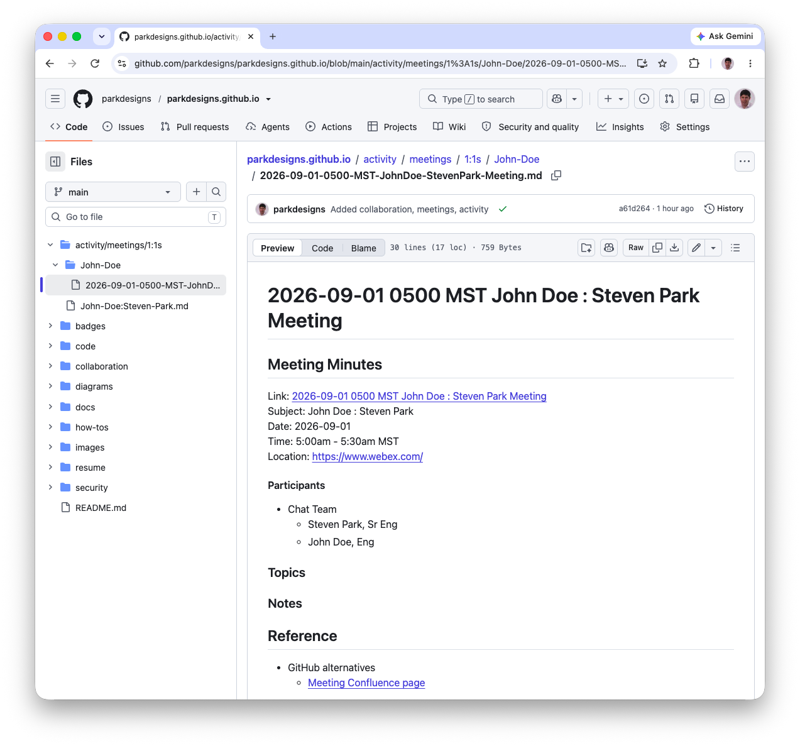
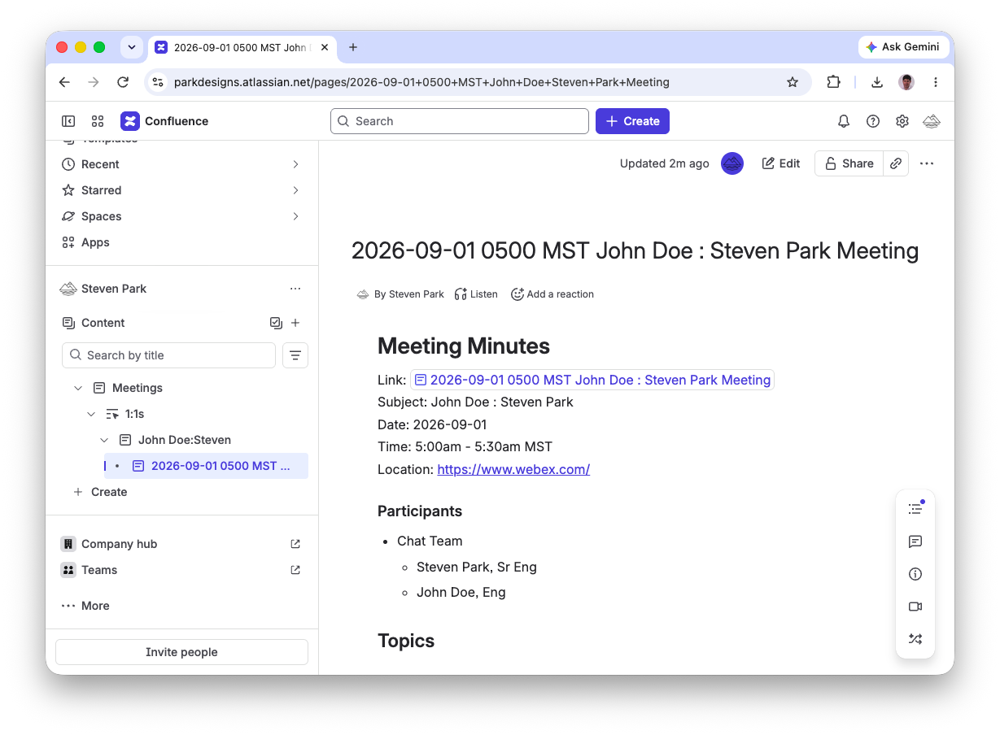

# 1-on-1 Meeting page

A page for a meeting provides a single-point of reference.

Benefits
* Prepared
  * Topics prepared in advance
* Editable
  * No need to update meeting body in M365 Calendar/Outlook
  * Page is editable anytime; meeting simply references page via link
* Organized
  * No need to catalog an email of meeting minutes into a folder
  * No need to move a OneNote note of meeting minutes into a folder
  * Demonstrates how to organize for others to emulate better org skills
* Readable
  * No need for a listener to guess what acronym or new words were
* Linked
  * Page itself is linkable
  * Content in page links to other HTTP Resources
  * No need for a listener to guess what the URL is
* Repeatable
  * Page can be used as template
  * Iteration of page improvements can be done upon each repetition

# GitHub example

`2026-09-01 0500 MST John Doe : Steven Park Meeting`

# Confluence example

`2026-09-01 0500 MST John Doe : Steven Park Meeting`

## Meeting Minutes

Link: [2026-09-01 0500 MST John Doe : Steven Park Meeting ](https://parkdesigns-1788874127479.atlassian.net/wiki/x/AYBT) 
Subject: John Doe : Steven Park 
Date: 2026-09-01 
Time: 5:00am - 5:30am MST 
Location: https://www.webex.com/ 

#### Participants

* Chat Team
  * Steven Park, Sr Eng
  * John Doe, Eng

### Topics
 

### Notes

## Reference

* Link to GitHub example
  * [2026-09-01 0500 MST John Doe : Steven Park Meeting](../../activity/meetings/1-on-1s/John-Doe/2026-09-01-0500-MST-JohnDoe-StevenPark-Meeting.md)