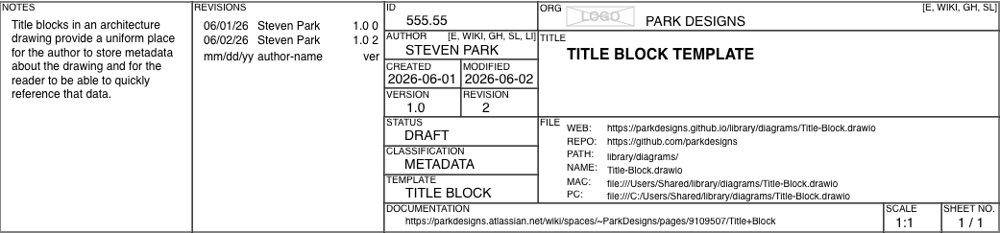

# Diagrams & Drawings

Diagrams and drawings are key to many aspects of software:
* Customer Journey
* Colleague Journey
* Privacy Risk Assessment
* Threat Modeling
* Capacity Planning
* Troubleshooting
* Knowledge Transfer

🚧 Work in Progress
Though I diagrammed more than 800 diagrams at my last employer those diagrams were property of said employer. Here I am working to recreate as many relevant diagrams in an employer-agnostic way to show case areas and my working style.

## Metadata

### Title Block

Attribution and referability of a diagram enable ability to:
* Clarify
* Share
* Collaborate
* Iterate

Many authors of diagrams fail to:
* Store diagram source in public single source of truth location
* Date or version diagram
* Document research and notes involved in the creation of the diagram
* Provide links in diagram itself

Below is a new version of Title Block from what I used at my last employer.

~~[Confluence Cloud - Park Designs > Architecture > Diagrams > Metadata > Title Block](https://parkdesigns.atlassian.net/wiki/spaces/~ParkDesigns/pages/9109507/Title+Block)~~ (Free Trial expired)

see HTML [Title Block Template - Annotated](./Title-Block.drawio_annotated.html)

see HTML [Title Block Template](./Title-Block.drawio.html)

### Embedded Source

Quick access to source of a diagram via embedded source in the diagram PNG itself can improve:
* Faster review & feedback
* On-the-fly alternate proposals

Many authors of diagrams fail to:
* Embed diagram source in PNG image
* Create diagram PNG copies for different purposes (smaller size, finer detail, etc)

## Documentation

Documentation of a diagram itself improves:
* Lineage
* Review
* Understanding

Many authors of diagrams fail to:
* Document research and notes involved in the creation of the diagram

## Access

Accessibility to the diagram and its source enables ability to:
* Revise
* Collaborate
* Iterate

Many authors of diagrams fail to:
* Grant permission to view and edit diagram source

## Hosting

| Host     | URL      | Function |
| -------- | -------- | ----------- |
| GitHub   | [https://github.com/parkdesigns](https://github.com/parkdesigns) | source repo  |
| GitHub Pages  | [https://parkdesigns.github.io/](https://parkdesigns.github.io/s) | website  |
| Confluence Cloud  | [https://parkdesigns.atlassian.net/wiki/spaces/~ParkDesigns](https://parkdesigns.atlassian.net/wiki/spaces/~ParkDesigns) | documentation website  |

## Experience Map

## Journey

## Data Flow

## Sequence

## Data Structure

