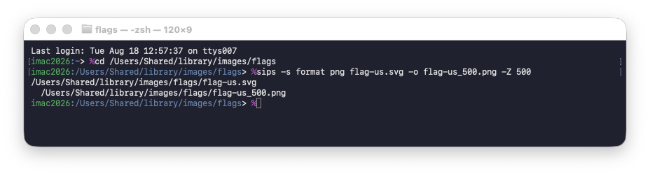
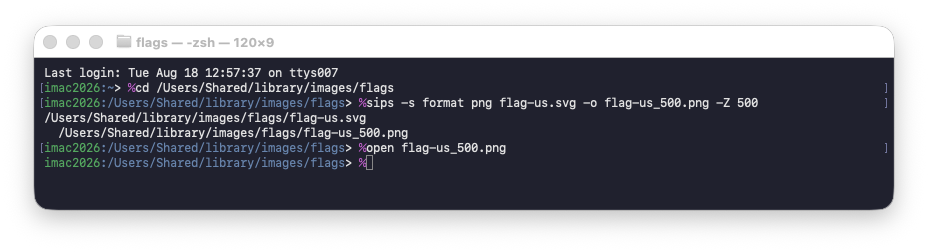
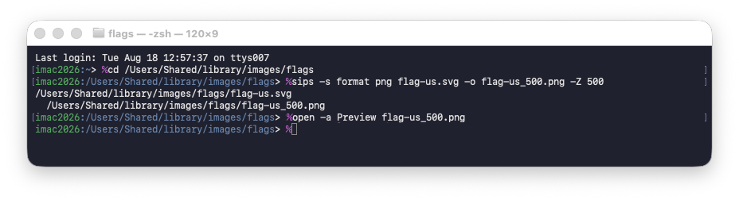
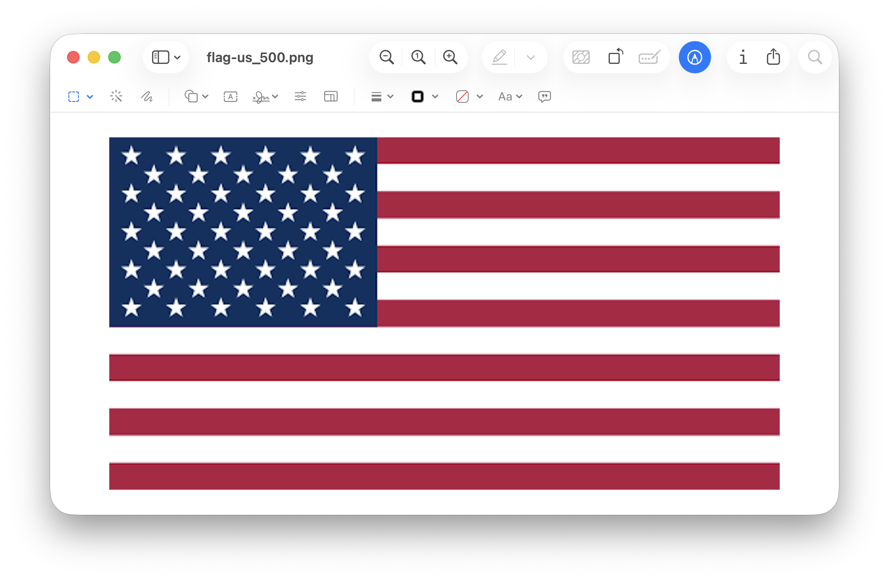

# How to convert SVG to PNG

This guide shows how to use simply CLI command on MacOS to convert a SVG to PNG.

Usage

 * Generate PNGs
   * for web
   * for drawings
   * for higher resolution

## MacOS

### Step 1. Open terminal

Cmd-Space


Type `terminal` & hit enter


### Step 2. Change directory to SVG file

Example,
```
cd /Users/Shared/library/images/flags
```


### Step 3. Execute `sips` command

`sips -s format png input.svg -o output.png -Z 500`



### Step 4. (optional) Open PNG in Preview

Open the generated PNG in Preview app by running command: 

* `open output.png`
* `open -a Preview output.png`

Examples,
```
open flag-us_500.png
```


```
open -a Preview flag-us_500.png
```




Example PNG,


### Step 5. (optional) Open SVG in Browser

Open the original SVG in browser to compare:
`open -a "Google Chrome" input.svg`

Example,
```
open -a "Google Chrome" flag-us.svg
```


## Reference

sips

`sips -s format png input.svg -o output.png -Z 500`

Example,

`sips -s format png BlueCrossBlueShield-logo.svg -o BlueShieldBlueCross-logo.png -Z 500`

