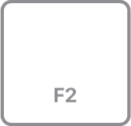
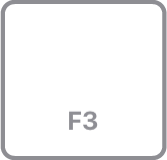
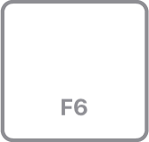
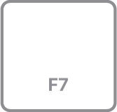

# How to

## Font SF Pro

https://developer.apple.com/fonts/

Go to the Apple Fonts Page.

Download the SF Pro design resources package.

Open or mount the downloaded file.

Run the installer package (.pkg).

Open the Font Book app on your Mac.

Verify that SF Pro Display and SF Pro Text appear in your user font list.

## Font Color

RGB `142, 142, 147`

Hex `#8e8e93`

## Sample Keyboard Keys

### Keyboards

### en-US Keys

* 
* 
* 
* 

* 
* 

Example mocked key,

List of keys,

* 
* 
* 
* 
* 
* 
* 

* 
* 
* 
* 
* 
* 
* 

* 
* 
