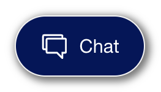
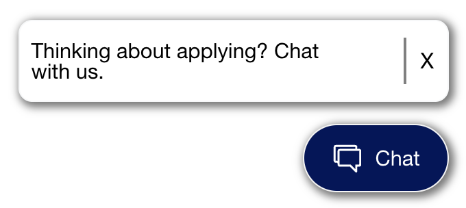
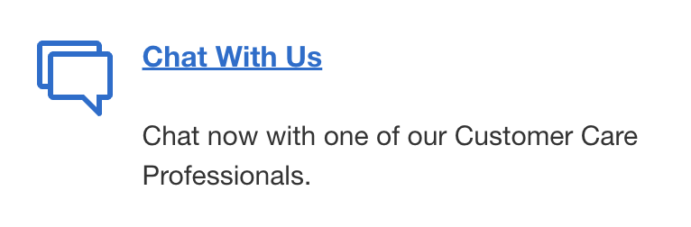

# CSS driven Chat Button

I took initiative by examining the UX/UI at the time in ~2017 and clearly pointed out the pitfalls of the existing image-based chat button/invites at the time. Business did not initially like the idea of moving to CSS driven button.

My CSS driven chat button/invite design replaced the image-based chat button/invite, improving the UX/UI.

Improvements

* No image load required
* No image redeploy for changes
* Reuse of website font glyph chat icon
* Merge with website CSS themes/colors
* More accessible
* Configurable invite text `Thinking about applying? Chat with us.`
* Configurable button text `Chat`
* Easier equivalence with Mobile App chat buttons

## Old HTML

```
<div id="chatInvite" style="display: block;">
    <div class="flex legacy" id="chatButtonInvite" alt="Chat">
        <button>
            
        </button>
    </div>
</div>
```

## New HTML

HTML
```
<div id="chatInvite" style="display: block;">
    <div class="flex legacy" id="chatButtonInvite" alt="Chat">
        <button class="btn btn-icon btn-sm icon-hover dls-icon-chat dls-chat-pill dls-chat-pill-blue aa-chat-pill" style="background-color:#00175A;border-radius: 2rem;" aria-label="Chat" tabindex="0">
            <span class="lbl-chat">Chat</span>
        </button>
    </div>
</div>
```

[CSS](https://www.aexp-static.com/cdaas/one/axp-askamex-chat/1.0.167/darwin/css/targetingBootStrap.css)
```
#chatInvite {
    z-index: 100;
}
```

## Chat Offer Button

### Unauthenticated Anonymous Prospect

#### Unauth Chat Offer Button

| Image        | Description    |
| :---         | :---    |
|  | pill |

#### Unauth Chat Offer Button

| Image        | Description    |
| :---         | :---    |
|  | pill & message bubble w/ text |

### Authenticated Customer

#### Auth Chat Offer Button

| Image        | Description    |
| :---         | :---    |
|  | pill |
|  | pill hoverover |
|  | inline |
|  | mobile circle |
|  | mobile circle hoverover |


### Minimized Chat Window Button


## Reference

### Font Icon Glyphs

* [dls-chat__outline.svg](./img/css-chat-button/dls-chat__outline.svg) 
* [dls-chat__filled.svg](./img/css-chat-button/dls-chat__filled.svg) 


```
<svg xmlns="http://www.w3.org/2000/svg" width="0" height="0" style="position:absolute" id="dls-icon-root">
    <defs>
        <svg viewBox="0 0 48 48" fill="currentColor" id="dls-chat__filled">
            <path d="M6 3h30a3.01 3.01 0 0 1 2.995 2.824L39 6v3h3a3.01 3.01 0 0 1 2.995 2.824L45 12v21a3.01 3.01 0 0 1-2.824 2.995L42 36h-3v7.5a1.5 1.5 0 0 1-2.448 1.162l-.112-.101L27.879 36h-15.88a3.01 3.01 0 0 1-2.994-2.824L9 33v-3H6a3.01 3.01 0 0 1-2.995-2.824L3 27V6a3.01 3.01 0 0 1 2.824-2.995L6 3h30H6zm30 3H6v21h3V12a3.01 3.01 0 0 1 2.824-2.995L12 9h24V6z"></path>
        </svg>
        <svg viewBox="0 0 48 48" fill="currentColor" id="dls-chat__outline">
            <path d="M6 3h30a3.01 3.01 0 0 1 2.995 2.824L39 6v3h3a3.01 3.01 0 0 1 2.995 2.824L45 12v21a3.01 3.01 0 0 1-2.824 2.995L42 36h-3v7.5a1.5 1.5 0 0 1-2.448 1.162l-.112-.101L27.879 36h-15.88a3.01 3.01 0 0 1-2.994-2.824L9 33v-3H6a3.01 3.01 0 0 1-2.995-2.824L3 27V6a3.01 3.01 0 0 1 2.824-2.995L6 3h30H6zm36 9H12v21h17.109l6.89 6.879V33h6V12zm-6-6H6v21h3V12a3.01 3.01 0 0 1 2.824-2.995L12 9h24V6z"></path>
        </svg>
    </defs>
</svg>
. . .
<i class="icon dls-bright-blue" data-dls-icon-size="lg" data-dls-icon="chat" title="chat">
    <svg data-dls-icon="chat" data-dls-icon-variant="outline" role="img" aria-labelledby="dls-icon-alt-outline-45">
        <title id="dls-icon-alt-outline-45">chat</title>
        <use href="#dls-chat__outline"></use>
    </svg>
    <svg data-dls-icon="chat" data-dls-icon-variant="filled" role="img" aria-labelledby="dls-icon-alt-filled-46">
        <title id="dls-icon-alt-filled-46">chat</title>
        <use href="#dls-chat__filled"></use>
    </svg>
</i>
```

### Image Icon Glyphs

It appears Business and/or Tech deviated away from using Font/SVG for Icon Glyphs.

*  https://www.aexp-static.com/cdaas/one/axp-askamex-chat/1.0.167/darwin/css/img/gen-chat.png

*  https://www.aexp-static.com/cdaas/one/axp-askamex-chat/1.0.167/darwin/css/img/gen-chat-hover.png

Critique

* background color immutable
* new images MUST be created to achieve
  * new icon
  * new line/fill color
  * new background color