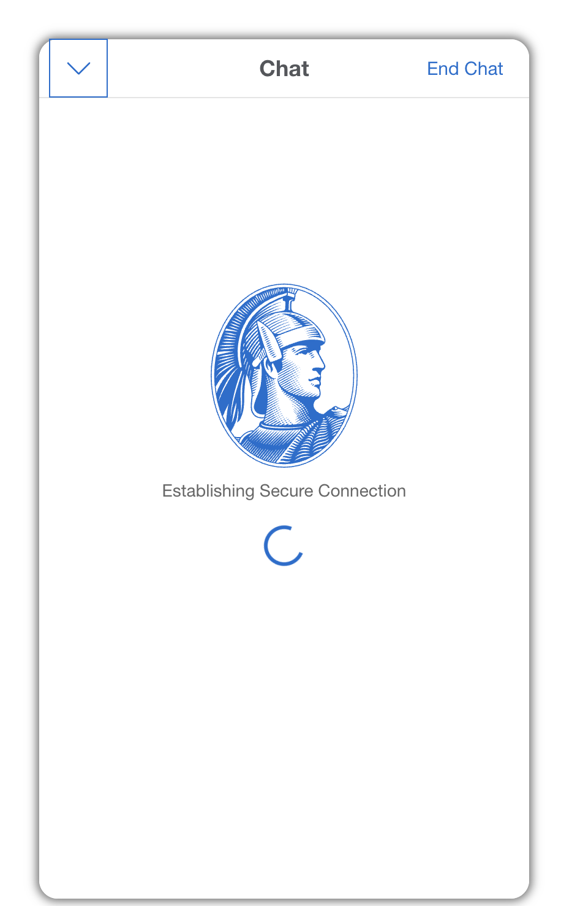

# i18n g10n of Images with Text

I pointed out problem of images with text in terms of target language (ie internationalization and globalization). Business was not easily convinced of UX/UI impact to people of different language origins.

My recommendation to remove images with text or replace with alternatives was taken, improving the UX/UI.

Improvements

* No image version alternate needed for i18n g10n
  * Fewer image assets
* More readable
* More accessible

## Image i18n / g10n

### Example Image with Text,

"Powerful Backing" text in English


* sourced and derived from [BB_Flip.gif](https://www.americanexpress.com/content/dam/amex/en-us/benefits/membership/elevated-membership/content-assets/blue-box/BB_Flip.gif)

### Example Image without Text,

Above "Powerful Backing" image was replaced with a spinner CSS animation.


### Internationalized / Globalized Image

Below is result of all images being internationalized / globalized.



## Button i18n / g10n

### Example Button using Image with Text,

"Chat" text in English in image


```
<div id="chatInvite" style="display: block;">
    <div class="flex legacy" id="chatButtonInvite" alt="Chat">
        <button>
            
        </button>
    </div>
</div>
```

### Example Button using CSS,

"チャット" (Chat) text in Japanese in HTML (not in an image)


```
<div id="chatInvite" style="display: block;">
    <div class="flex legacy" id="chatButtonInvite" alt="Chat">
        <button class="btn btn-icon btn-sm icon-hover dls-icon-chat dls-chat-pill dls-chat-pill-blue aa-chat-pill" style="background-color:#00175A;border-radius: 2rem;" aria-label="Chat" tabindex="0">
            <span class="lbl-chat">Chat</span>
        </button>
    </div>
</div>
```
