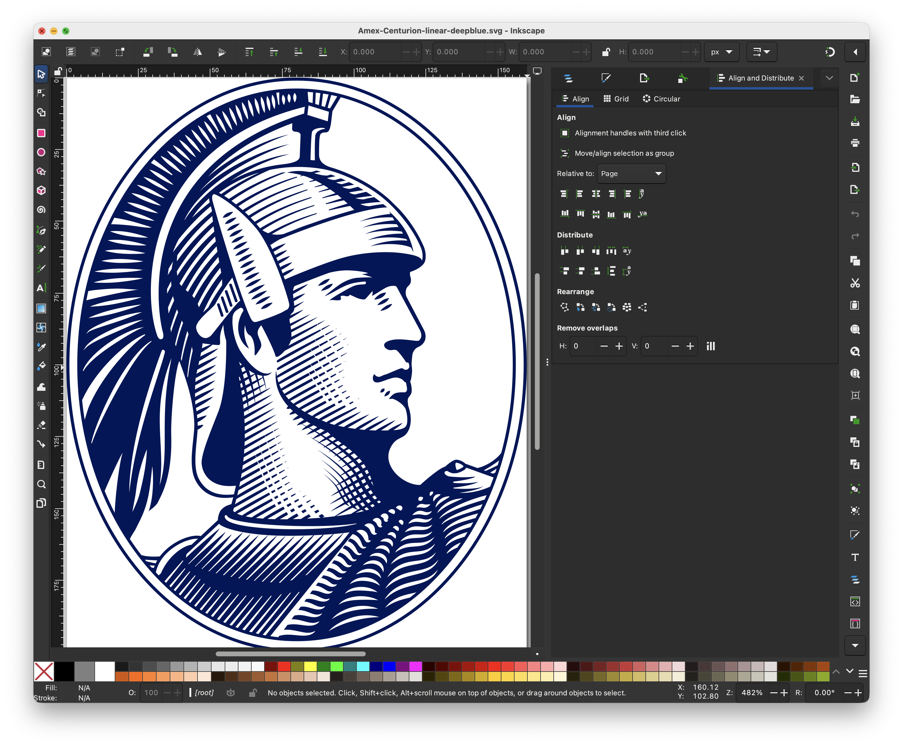
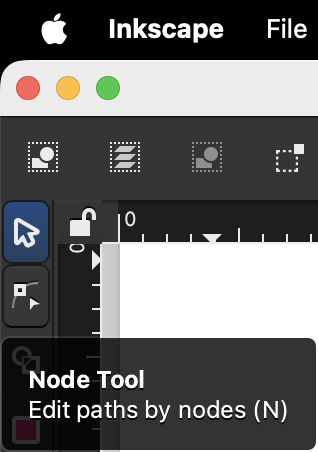
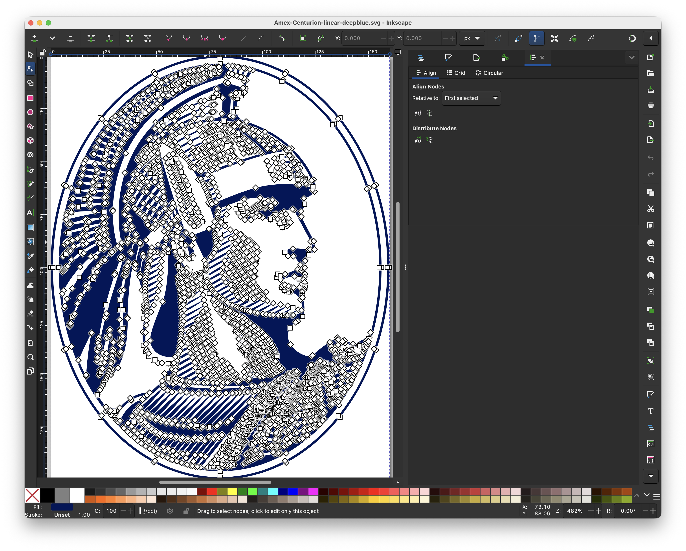
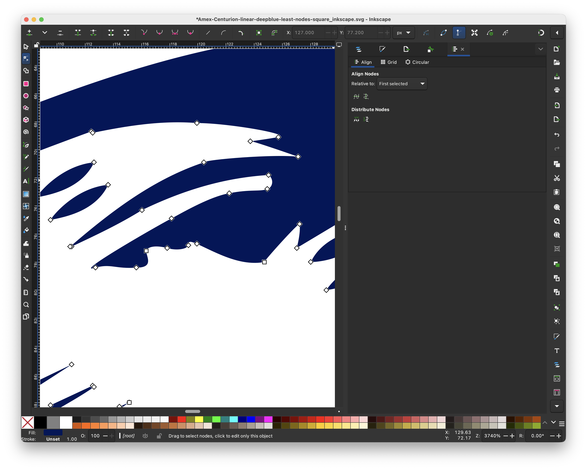

# SVG Tiny Portable/Secure

🚧 DRAFT: Request For Comments (RFC) in draft in IETF
https://www.ietf.org/archive/id/draft-svg-tiny-ps-abrotman-07.html

* SVG - Scalable Vector Graphics

## Usage

Compatibility across multiple systems is the primary driver of SVG Tiny Portable/Secure

Aspects

* Renders fast
* Memory-exhaustion proof
* No motion

Use cases:

* Email Authenticity
  * BIMI - Brand Indicators for Message Identification
    - see [bimigroup.org](https://bimigroup.org/))
    - see IETF draft [RFC BIMI](https://datatracker.ietf.org/doc/draft-brand-indicators-for-message-identification/)

## Requirements

SVG Tiny Portable/Secure

* https://www.ietf.org/archive/id/draft-svg-tiny-ps-abrotman-07.html
* https://www.oasis-open.org/committees/relax-ng/compact-20021121.html
* http://bimigroup.org/resources/SVG_PS-latest.rnc.txt

The file size of SVG Tiny PS documents SHOULD be as small as possible, and SHOULD NOT exceed 32 kilobytes. That size should be evaluated when the document is uncompressed.

An SVG Tiny PS document MUST include at least two colors when rendered.

  <rect width="100%" height="100%" fill="white" />

https://knowledge.workspace.google.com/admin/security/create-a-bimi-svg-file-detailed-steps

width="96" height="96"

solid color background

a. Minimum height and width is 96 pixels.

b. Image size must be specified in absolute pixels. Example: width="96" height="96"

c. Don't use relative dimensions to specify image size. Example: width="100%" height="100%"

d. The logo image should be centered in a square.

e. The logo image should appear on a solid color background. Transparent backgrounds might not display as expected.

f. SVG file size should be 32 KB or smaller.

g. SVG file should include the <desc> element (description) for accessibility.

## Editing an SVG

### Tool Options

* Online
  * [SVGOMG](https://jakearchibald.github.io/svgomg/)
* Professional Apps
  * [Adobe Illustrator](https://www.adobe.com/products/illustrator.html)
* Free Apps
  * [Inkscape](https://inkscape.org/)
* Shell Scripts
  * Vim

Below uses Inkscape and Vim to get it under 32 KB.

### Inkscape


Downloand & Install: https://inkscape.org/release/inkscape-1.4.4/

Here are some steps to editing a SVG with Inkscape.

#### 1. Open SVG w/ Inkscape



#### 2. Click on `Node Tool` icon

(see left horizontal toolbar)




#### 3. Click SVG path with `Node Tool`



See the thousands of `nodes` now shown

#### 4. Zoom in `+` key

See the multiple `nodes` for the eye


Ideally after simplifying the `nodes` there can be fewer like this



#### 5. Simplify nodes

Repeat the editing of deleting nodes.

#### 6. Save file

#### 7. Check file size


In this example,

* Original had: `14131` SVG path coordinates
* Edited had: `5529` SVG path coordinates

That's a reduction of: `61%` of `99 KB` file

`39 KB` are still left (`7 KB` over the `32 KB` max of BIMI)


### Text Editor

Use a simple text editor to replace `<svg>`, `<metadata>`, and other extraneous data added by Inkscape.

Objectives

* Reduce SVG file size
* Add key attributes for SVG Tiny Portable/Secure
* Add Readability
* Add Accessibility


#### 1. Replace `<svg>` extraneous data

Example Inkscape `<svg>` data of `1,236 bytes`:

```
<?xml version="1.0" encoding="UTF-8" standalone="no"?>
<svg
   width="160"
   height="200"
   viewBox="0 0 160 200"
   version="1.1"
   id="svg1"
   sodipodi:docname="Amex-Centurion-linear-deepblue-least-nodes-reduced-decimal-to-tenth-square_inkscape.svg"
   inkscape:version="1.4.4 (dcaf3e7, 2026-05-05)"
   xmlns:inkscape="http://www.inkscape.org/namespaces/inkscape"
   xmlns:sodipodi="http://sodipodi.sourceforge.net/DTD/sodipodi-0.dtd"
   xmlns="http://www.w3.org/2000/svg"
   xmlns:svg="http://www.w3.org/2000/svg"
   xmlns:rdf="http://www.w3.org/1999/02/22-rdf-syntax-ns#"
   xmlns:cc="http://creativecommons.org/ns#"
   xmlns:dc="http://purl.org/dc/elements/1.1/">
  <defs
     id="defs1" />
  <sodipodi:namedview
     id="namedview1"
     pagecolor="#ffffff"
     bordercolor="#000000"
     borderopacity="0.25"
     inkscape:showpageshadow="2"
     inkscape:pageopacity="0.0"
     inkscape:pagecheckerboard="0"
     inkscape:deskcolor="#d1d1d1"
     inkscape:zoom="4.815"
     inkscape:cx="99.169263"
     inkscape:cy="88.785047"
     inkscape:window-width="2042"
     inkscape:window-height="1112"
     inkscape:window-x="0"
     inkscape:window-y="30"
     inkscape:window-maximized="0"
     inkscape:current-layer="svg1" />
```

Change to:

```
<svg xmlns="http://www.w3.org/2000/svg" width="160" height="200" viewBox="0 0 160 200">
```

#### 2. Add attributes and `<title>`, `<desc>`, and `<g>`

Reduced from original `1,236 bytes` to `271 bytes`:
```
<svg xmlns="http://www.w3.org/2000/svg" width="160" height="200" viewBox="0 0 160 200" version="1.2" baseProfile="tiny-ps" aria-labelledby="svg-title svg-desc">
<title id="svg-title">American Express</title>
<desc id="svg-desc">Oval Centurion Cameo</desc>
<g id="design">
```

ⓘ IMPORTANT: For readability consider adding `<title>`

ⓘ IMPORTANT: For accessibility consider adding `<desc>`


#### 2. Add `<rect>`, `<circle>`, or `<ellipse>` white background:

⚠ WARNING: At least two colors are required per SVG Tiny Portable/Secure to be compatible with `light mode`, `dark mode`, etc.

The suggestion here is to provide a white background.

Examples,

```
<ellipse cx="80" cy="100" rx="80" ry="100" fill="#ffffff" />
```

```
<rect x="0" y="0" width="160" height="200" fill="#ffffff" />
```

#### 3. Remove `nodetypes` and `<metadata>`

Example Inkscape metadata:

Remove `5791 bytes` of `sodipodi:nodetypes` attribute on `<path>`

```
       id="path1"
       sodipodi:nodetypes="scscscccscccscccsscccscscscscscccsccccsccscccsccccccccccccccccccccccccccccccccccccccccccccccccccccccccccccccccccccccccccccccccccccccccsccccccccccccccccccccccccccccccccccccccccccccccssccccccccccccccccccccccccccccccccccccccccccccccccccccccccccccccccccccscccccccccccccccccccccccccccccccccccccccccccccccccccccccccccccccccccccccccccccccccccccccccccccccccccccccccccccccccccccccccccccccccccccccccccccccccccccccccccccccccccccccccccccccccccccccccccccccccccccccccccccccccccccccccccccccccccccccccccccccccccccccccccccccccccccccccccccccccccccccccccccccccccccccccccccccccccccccccccccccccccccccccccccccccccccccccccccccccccccccccccccccccccccccccccccccccccccccccccccccccccccccccccccccccccccccccccccccccccccccccccccccccccccccccccccccccccccccccccccccccccccccccccccccccccccccccccccccccccccccccccccccccccccccccccccccccccccccccccccccccccccccccccccccccccccccccccccccccccccccccccccccccccccccccccccccccccccccccccccccccccccccccccccccccccccccccccccccccccccccccccccccccccccccccccccccccccccccccccccccccccccccccccccccccccccccccccccccccccccccccccccccccccccccccccccccccccccccccccccccccccccccccccccccccccccccccccccccccccccccccsccccccccccccccccccccccccccccccccccccccccccccccccccccccccccccccccccccccccccccccccccccccccccccccccccccccccccccccccccccccccccccccccccccccccccccccccccccccccccccccccccccccccccccccccccccccccccccccccccccccccccccccccccsccccccscccccccccccccccsccccccccccccccccccccccccccccccccccccccccccccccccccccccccccccccccccccccccscccccccccccccccccccccccccccccccccccccccccccccccccccccccccccccccccccccccccccccccccccccccccccccccccccccccccccccccccccccccccccccccccccccccccccccccccccccccccccccccccccccccccccccccccccccccccccccccccccccccccccccccccccccccccccccccccscccccccccccccccccccccccccccccccccccccccscccccccccccccccccccccccccccccccccccccccccccccccccccssccccccccccccccccccccccccccccccccccccccscccccccccccccccccccsccccccccccccccccccccccccccccccccccccccccccccccccccccccccccccccccccccccccccccccccccccccccccccccccccccccccccccccccccccccccccccccccccccccccccsccsccccccccccccccccccccccccccccccccccccccccccccccccccccccccccccccccccccccccccccccccccccccccccccccccccccccccccccccccccccccccccccccccccccccccccccccccccccccccccccccccccccccccccccccccccccccccccccccccccccccccccccccccccccccccccccccccccccccccccccccccccccccccccccccccccccccccccccccccccccccccccccccccccccccccccccccccccccccccccccccccccccccccccccccccccccccccccccccccccccccccccccccccccccccccccccccccccccccccccccccccccccccccccccccccccccccccccccccccccccccccccccsccccccccccccccccccccccccccscccccccccccccccccccccccccccccccccccccccccccccccccccccccscccccccccccccccccccccccccccccccccccccccccccccccccccccccccccccccccccccccccccccccccccccccccccccccccccscccccccccccccccccccccccccccccccccccccccccccccccccccscccccccccccccccccsccccccccccccccccccscccccccccccccccccccccccccccccscccccccccccccccccccccccccccccccccccccccccccccccccccccccccccccccccccccccccccccccccccccccccccccccccccccccccccccccccccccccccccccccccccccccccccccccccccccccccccccccccccccccccccccccccccccccccccccccccccccccccccccccccccccccccccccccccccccccccccccccccccccccccccccccccccsccccccccccccccccccccccccccccccccccccccccccccccccccccccccccccccccccccccccccccccccccccccccccccccccccccccccccccccccccccccccccccccccccccccccccccccccccccccccccccccccccccccccccccccccccccccccccccccccccccccccccccccccccccccccccccccccccccccccccccccccccccccccccccccccccccccccccccccccccccccccccccccccccccccccccccccccccccccccccccccccccsccccccccccccccccccccccccccccccccccccccccccccccccccccccccccsccscccccccccccccccccccccccccccccccccccccccccccccccccccccccccccccccccccccccccccccccccccccccccccccccccccccccccccccccccccccccccccccccccccccccccccccccccccccccccccccccccccccccccccccccccccccccccccccccccccccccccccccccccccccccccccccccccccccccccccccccccccccccccccccccccccccccccccccccccccccccccccccccccccccccccccccccccccccccccccccccccccccccccccccccccccccccccccccccccccccccccccccccccccccccccccccccccccccccccccccccccccccccccccccccccccccccccccccccccccccccccccccccscccccccccccccccccccccccccccccccccccccccccccccccccccccccccccccccccccccccccccccccccccccccccccccccccccccccccccccccccccccccccccccccccccccccccccccccccccccccccccccccccccccccccccccccccccccccccccccccccccccccccccccccccccccccccccccccccccccccccccccccccccccccccccccccccccccccccccccccccccccccccccccccccccccccccccccccccccccccccccccccccccccccccccccccccccccccccccccccccccccccccccccccccccccccccccccccccccccccccccccccccccccccccccccccccccccccccccccccccccccscccccccccccccccccccccccccccccccccccccccccccccccccccccccccccccccccccccccccccccccccccccccccccccccccccccccccccccccccccccccccccccccccccccccccccccccccccccccccccccccccccccccccccccccccccccccccccccccccccccccccccccccccccccccccccccccccccccccccccccccccccccccccccccccccccscccccccccccccccccccccccccccccccccccccccccccccccccccccccccccccccccccccccccccccccccccccccccccccccccccccccccccccccccccccccccccccccccccccccccccccccccccccccccccccccccccccccccccccccccccccccccccccccccccccccccccccccccccccccccccccccccccccccccccccccccccccccccccccccccccccccccccccccccccccccccccccccccccccccccccccccccccccccccccccccccccccccccccccccccccccccccccccccccccccccccccccccccccccccccccccccccccccccccccccccccccccccccccccccccccccccccccccccccccccccccccccccccccccccccccccccccccccccccccccccccccccccccccccccccccccccccccccccccccccccccccccccccccccccccccccccccccccccccccccccccccccccccccccccccccccccccccccccccccccccccccccccccccccccccccccccccccccccccccccccccccccccccccccccccccccccccccccccccccccccccccccccccccccccccccccccccccccccccccccccccccccccccccccccccccccccccccccccccccccccccccccccccccccccccccccccccccccccccccccccccccccccccccccccccccccccccccccccccccccccccccccccccccccccccccccccccccccccccccccccccccccccccccccccccccccccccccccccccccccccccccccccccccccccccccccccccccccccccccccccccccccccccccccccccccccccccccccccccccccccccccccccccccccccccccccccccccccccccccccccccccccccccccccccccccccccccccccccccccccccccccccccccccccccccccccccccccccccccccccccccccccccccccccccccccccccccccccccccccccccccccccccccccccccccccccccccccccccccccccccccccccccccccccccccccccccccccccccccccccccccccccccsccccccccccccccccccccccccccccccsccccccc"
```
Remove `<metadata>` `176 bytes`, if present
```
  <metadata
     id="metadata1">
    <rdf:RDF>
      <cc:Work
         rdf:about="">
        <dc:title>American Express</dc:title>
      </cc:Work>
    </rdf:RDF>
  </metadata>
```

### Vim


💡 MacOS & Linux come with Vim

Objectives

* Reduce SVG file size

Strategies

* Reduce decimal precision
  * Remove thousandth and beyond digits from decimals
    * example: change `0.12345` into `0.12`
  * Round hundredth decimal place up or down and remove it
    * example: change `0.11` into `0.1`
    * example: change `0.15` into `0.2`
* Remove zeros
  * Remove zeros trailing `zeros`, example: change `0.10` into `0.1`
  * Remove leading `zeros`, example: change `0.1` into `.1`
  * Remove leading `negative zeros`, example: change `-0.1` into `-.1`
* Remove spaces
  * Remove spaces before and after single letter commands `M`, `m`, `L`, `l`, `H`, `h`, `C`, `c`, `S`, `s`, `Q`, `q`, `T`, `t`, `A`, `a`, `Z`, `z`
    * example: change `100 C 38.7` into `100C38.7`

Here are some steps to editing a SVG with Vim.

#### 1. Create file of VIM commands

VIM commands

Save in `reduce-svg-size.vim` file
```
" Remove thousandth place in decimals "
:%s/\(\.\d\d\)\d\+/\1/g

" Remove [1234] after decimal and tenth place (~round down) "
:%s/\(\.\d\)[1234]/\1/g

" Remove [56789] after decimal and tenth place (~round up) "
:%s/\.0[56789]/\.1/g
:%s/\.1[56789]/\.2/g
:%s/\.2[56789]/\.3/g
:%s/\.3[56789]/\.4/g
:%s/\.4[56789]/\.5/g
:%s/\.5[56789]/\.6/g
:%s/\.6[56789]/\.7/g
:%s/\.7[56789]/\.8/g
:%s/\.8[56789]/\.9/g

:%s/0\.9[56789]/1/g
:%s/1\.9[56789]/2/g
:%s/2\.9[56789]/3/g
:%s/3\.9[56789]/4/g
:%s/4\.9[56789]/5/g
:%s/5\.9[56789]/6/g
:%s/6\.9[56789]/7/g
:%s/7\.9[56789]/8/g
:%s/8\.9[56789]/9/g

" Remove leading zero if right before decimal "
:%s/-0\./-\./g

" Remove leading zero if right before decimal "
:%s/\(\D\)0\./\1\./g

" trip space before and after 'c' "
:%s/\sc\s/c/g

" Strip space before and after 'C' "
:%s/\sC\s/C/g

" Strip space before and after 'l' "
:%s/\sl\s/l/g

" Strip space before and after 'L' "
:%s/\sL\s/L/g

" Strip space before '-' "
:%s/\s-/-/g

" Strip space before 'z' "
:%s/\sz/z/g

" Strip space after 'z' "
:%s/z\s/z/g

" Strip space before 'Z' "
:%s/\sZ/Z/g

" Strip space after 'Z' "
:%s/Z\s/Z/g

" Strip space before 'm' "
:%s/\sm/m/g

" Strip space after 'm' "
:%s/m\s/m/g

" Strip space after 'M' "
:%s/M\s/M/g

" Strip trailing zero "
:%s/\(\.\d\)0/\1/g

" Replace decimal zero with zero "
:%s/\(\D\)\.\(0\)\(\D\)/\1\2\3/g

" Replace decimal zero with zero "
:%s/\(\d\)\.0/\1/g

" Write and Quit "
:wq
```

#### 2. Open SVG with Vim

`vi {SVG-FILE}`
or
`vim {SVG-FILE}`

#### 3. Run VIM commands in VIM

`:source reduce-svg-size.vim`

#### 4. View file info

`ls -ltr {SVG-FILE}`


SVG Tiny Portable/Secure

https://www.oasis-open.org/committees/relax-ng/compact-20021121.html


MoveTo (M / m): Lifts the pen and moves it to a new starting point without drawing a line.
LineTo (L / l): Draws a straight line from the current point to a new point.
Horizontal Line (H / h): Draws a straight horizontal line.Vertical Line (V / v): Draws a straight vertical line.
Cubic Bézier (C / c and S / s): Draws smooth curved lines using control points to bend the curve.
Quadratic Bézier (Q / q and T / t): Draws simpler curves using a single control point.
Arc (A / a): Draws a section of a circle or ellipse.
ClosePath (Z / z): Draws a straight line from the current point back to the starting point to seal the shape.