# Cisco Icons

[https://www.cisco.com/c/en/us/about/brand-center/network-topology-icons.html](https://www.cisco.com/c/en/us/about/brand-center/network-topology-icons.html)


## Cisco Network Topology Icons

```
brew install ghostscript pstoedit
```

```
for file in *.eps; do
  pstoedit -f svg "$file" "${file%.eps}.svg"
done
```

```
for file in *.svg; do
  sips -s format png "$file" -o "${file%.svg}.png" -Z 130
done
```

```
ls -1 | sed -E 's|(.*).png|  \1 \[SVG\]\(./img/Cisco/Network-Topology/\1.svg\)<br />|'
```

```
ls *.png | sed -E 's|(.*).png|    <div>\n        \n        <div>\n            <a href="./img/Cisco/Network-Topology/\1.svg">SVG</a>\n            <div class="img-title">\1</div>\n        </div>\n    </div>|'
```

<style>
  .icon-table > div {
    float: left;
    width:210px;
    margin-right: 10px;
    margin-bottom: 10px;
  }

  .icon-table div img {
    float: left;
    max-width: 50px;
    margin-right: 8px;
    max-height: 40px;
  }

  .icon-table > div > div {
    float: left;
  }

  .icon-table div.img-title  {
    font-size: 8px;
  }
</style>

## Network Topology

<div class="icon-table">
    <div>
        
        <div>
            <a href="./img/Cisco/Network-Topology/100baset_hub.svg">SVG</a>
            <div class="img-title">100baset_hub</div>
        </div>
    </div>
    <div>
        
        <div>
            <a href="./img/Cisco/Network-Topology/10700.svg">SVG</a>
            <div class="img-title">10700</div>
        </div>
    </div>
    <div>
        
        <div>
            <a href="./img/Cisco/Network-Topology/10GE_FCoE.svg">SVG</a>
            <div class="img-title">10GE_FCoE</div>
        </div>
    </div>
    <div>
        
        <div>
            <a href="./img/Cisco/Network-Topology/15200.svg">SVG</a>
            <div class="img-title">15200</div>
        </div>
    </div>
    <div>
        
        <div>
            <a href="./img/Cisco/Network-Topology/3174_(desktop).svg">SVG</a>
            <div class="img-title">3174_(desktop)</div>
        </div>
    </div>
    <div>
        
        <div>
            <a href="./img/Cisco/Network-Topology/3200_mobile_access_router.svg">SVG</a>
            <div class="img-title">3200_mobile_access_router</div>
        </div>
    </div>
    <div>
        
        <div>
            <a href="./img/Cisco/Network-Topology/3x74_(floor).svg">SVG</a>
            <div class="img-title">3x74_(floor)</div>
        </div>
    </div>
    <div>
        
        <div>
            <a href="./img/Cisco/Network-Topology/6700_series.svg">SVG</a>
            <div class="img-title">6700_series</div>
        </div>
    </div>
    <div>
        
        <div>
            <a href="./img/Cisco/Network-Topology/7500ars_(7513).svg">SVG</a>
            <div class="img-title">7500ars_(7513)</div>
        </div>
    </div>
    <div>
        
        <div>
            <a href="./img/Cisco/Network-Topology/access_gateway.svg">SVG</a>
            <div class="img-title">access_gateway</div>
        </div>
    </div>
    <div>
        
        <div>
            <a href="./img/Cisco/Network-Topology/accesspoint.svg">SVG</a>
            <div class="img-title">accesspoint</div>
        </div>
    </div>
    <div>
        
        <div>
            <a href="./img/Cisco/Network-Topology/ace.svg">SVG</a>
            <div class="img-title">ace</div>
        </div>
    </div>
    <div>
        
        <div>
            <a href="./img/Cisco/Network-Topology/ACS.svg">SVG</a>
            <div class="img-title">ACS</div>
        </div>
    </div>
    <div>
        
        <div>
            <a href="./img/Cisco/Network-Topology/adm.svg">SVG</a>
            <div class="img-title">adm</div>
        </div>
    </div>
    <div>
        
        <div>
            <a href="./img/Cisco/Network-Topology/androgenous_person.svg">SVG</a>
            <div class="img-title">androgenous_person</div>
        </div>
    </div>
    <div>
        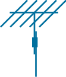
        <div>
            <a href="./img/Cisco/Network-Topology/antenna.svg">SVG</a>
            <div class="img-title">antenna</div>
        </div>
    </div>
    <div>
        
        <div>
            <a href="./img/Cisco/Network-Topology/asic_processor.svg">SVG</a>
            <div class="img-title">asic_processor</div>
        </div>
    </div>
    <div>
        
        <div>
            <a href="./img/Cisco/Network-Topology/ASR_1000_Series.svg">SVG</a>
            <div class="img-title">ASR_1000_Series</div>
        </div>
    </div>
    <div>
        
        <div>
            <a href="./img/Cisco/Network-Topology/ata.svg">SVG</a>
            <div class="img-title">ata</div>
        </div>
    </div>
    <div>
        
        <div>
            <a href="./img/Cisco/Network-Topology/atm_3800.svg">SVG</a>
            <div class="img-title">atm_3800</div>
        </div>
    </div>
    <div>
        
        <div>
            <a href="./img/Cisco/Network-Topology/atm_fast_gigabit_etherswitch.svg">SVG</a>
            <div class="img-title">atm_fast_gigabit_etherswitch</div>
        </div>
    </div>
    <div>
        
        <div>
            <a href="./img/Cisco/Network-Topology/atm_router.svg">SVG</a>
            <div class="img-title">atm_router</div>
        </div>
    </div>
    <div>
        
        <div>
            <a href="./img/Cisco/Network-Topology/atm_switch.svg">SVG</a>
            <div class="img-title">atm_switch</div>
        </div>
    </div>
    <div>
        
        <div>
            <a href="./img/Cisco/Network-Topology/atm_tag_switch_router.svg">SVG</a>
            <div class="img-title">atm_tag_switch_router</div>
        </div>
    </div>
    <div>
        
        <div>
            <a href="./img/Cisco/Network-Topology/avs.svg">SVG</a>
            <div class="img-title">avs</div>
        </div>
    </div>
    <div>
        
        <div>
            <a href="./img/Cisco/Network-Topology/AXP.svg">SVG</a>
            <div class="img-title">AXP</div>
        </div>
    </div>
    <div>
        
        <div>
            <a href="./img/Cisco/Network-Topology/bbfw_media.svg">SVG</a>
            <div class="img-title">bbfw_media</div>
        </div>
    </div>
    <div>
        
        <div>
            <a href="./img/Cisco/Network-Topology/bbfw.svg">SVG</a>
            <div class="img-title">bbfw</div>
        </div>
    </div>
    <div>
        
        <div>
            <a href="./img/Cisco/Network-Topology/bbsm.svg">SVG</a>
            <div class="img-title">bbsm</div>
        </div>
    </div>
    <div>
        
        <div>
            <a href="./img/Cisco/Network-Topology/branch_office.svg">SVG</a>
            <div class="img-title">branch_office</div>
        </div>
    </div>
    <div>
        
        <div>
            <a href="./img/Cisco/Network-Topology/breakout_box.svg">SVG</a>
            <div class="img-title">breakout_box</div>
        </div>
    </div>
    <div>
        
        <div>
            <a href="./img/Cisco/Network-Topology/bridge.svg">SVG</a>
            <div class="img-title">bridge</div>
        </div>
    </div>
    <div>
        
        <div>
            <a href="./img/Cisco/Network-Topology/broadband_router.svg">SVG</a>
            <div class="img-title">broadband_router</div>
        </div>
    </div>
    <div>
        
        <div>
            <a href="./img/Cisco/Network-Topology/bts_10200.svg">SVG</a>
            <div class="img-title">bts_10200</div>
        </div>
    </div>
    <div>
        
        <div>
            <a href="./img/Cisco/Network-Topology/cable_modem.svg">SVG</a>
            <div class="img-title">cable_modem</div>
        </div>
    </div>
    <div>
        
        <div>
            <a href="./img/Cisco/Network-Topology/callmanager.svg">SVG</a>
            <div class="img-title">callmanager</div>
        </div>
    </div>
    <div>
        
        <div>
            <a href="./img/Cisco/Network-Topology/car_(1).svg">SVG</a>
            <div class="img-title">car_(1)</div>
        </div>
    </div>
    <div>
        
        <div>
            <a href="./img/Cisco/Network-Topology/car.svg">SVG</a>
            <div class="img-title">car</div>
        </div>
    </div>
    <div>
        
        <div>
            <a href="./img/Cisco/Network-Topology/carrier_routing_system.svg">SVG</a>
            <div class="img-title">carrier_routing_system</div>
        </div>
    </div>
    <div>
        
        <div>
            <a href="./img/Cisco/Network-Topology/cddi-fddi.svg">SVG</a>
            <div class="img-title">cddi-fddi</div>
        </div>
    </div>
    <div>
        
        <div>
            <a href="./img/Cisco/Network-Topology/cdm.svg">SVG</a>
            <div class="img-title">cdm</div>
        </div>
    </div>
    <div>
        
        <div>
            <a href="./img/Cisco/Network-Topology/cellular_phone.svg">SVG</a>
            <div class="img-title">cellular_phone</div>
        </div>
    </div>
    <div>
        
        <div>
            <a href="./img/Cisco/Network-Topology/centri_firewall.svg">SVG</a>
            <div class="img-title">centri_firewall</div>
        </div>
    </div>
    <div>
        
        <div>
            <a href="./img/Cisco/Network-Topology/cisco_1000.svg">SVG</a>
            <div class="img-title">cisco_1000</div>
        </div>
    </div>
    <div>
        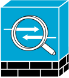
        <div>
            <a href="./img/Cisco/Network-Topology/cisco_asa_5500.svg">SVG</a>
            <div class="img-title">cisco_asa_5500</div>
        </div>
    </div>
    <div>
        
        <div>
            <a href="./img/Cisco/Network-Topology/cisco_ca.svg">SVG</a>
            <div class="img-title">cisco_ca</div>
        </div>
    </div>
    <div>
        
        <div>
            <a href="./img/Cisco/Network-Topology/cisco_file_engine.svg">SVG</a>
            <div class="img-title">cisco_file_engine</div>
        </div>
    </div>
    <div>
        
        <div>
            <a href="./img/Cisco/Network-Topology/cisco_hub.svg">SVG</a>
            <div class="img-title">cisco_hub</div>
        </div>
    </div>
    <div>
        
        <div>
            <a href="./img/Cisco/Network-Topology/cisco_unified_presence_server.svg">SVG</a>
            <div class="img-title">cisco_unified_presence_server</div>
        </div>
    </div>
    <div>
        
        <div>
            <a href="./img/Cisco/Network-Topology/cisco_unityexpress.svg">SVG</a>
            <div class="img-title">cisco_unityexpress</div>
        </div>
    </div>
    <div>
        
        <div>
            <a href="./img/Cisco/Network-Topology/ciscosecurity.svg">SVG</a>
            <div class="img-title">ciscosecurity</div>
        </div>
    </div>
    <div>
        
        <div>
            <a href="./img/Cisco/Network-Topology/ciscoworks.svg">SVG</a>
            <div class="img-title">ciscoworks</div>
        </div>
    </div>
    <div>
        
        <div>
            <a href="./img/Cisco/Network-Topology/class_4_5_switch.svg">SVG</a>
            <div class="img-title">class_4_5_switch</div>
        </div>
    </div>
    <div>
        
        <div>
            <a href="./img/Cisco/Network-Topology/cloud.svg">SVG</a>
            <div class="img-title">cloud</div>
        </div>
    </div>
    <div>
        
        <div>
            <a href="./img/Cisco/Network-Topology/communications_server.svg">SVG</a>
            <div class="img-title">communications_server</div>
        </div>
    </div>
    <div>
        
        <div>
            <a href="./img/Cisco/Network-Topology/contact_center.svg">SVG</a>
            <div class="img-title">contact_center</div>
        </div>
    </div>
    <div>
        
        <div>
            <a href="./img/Cisco/Network-Topology/content_engine_(cache_director).svg">SVG</a>
            <div class="img-title">content_engine_(cache_director)</div>
        </div>
    </div>
    <div>
        
        <div>
            <a href="./img/Cisco/Network-Topology/content_service_router.svg">SVG</a>
            <div class="img-title">content_service_router</div>
        </div>
    </div>
    <div>
        
        <div>
            <a href="./img/Cisco/Network-Topology/content_service_switch_1100.svg">SVG</a>
            <div class="img-title">content_service_switch_1100</div>
        </div>
    </div>
    <div>
        
        <div>
            <a href="./img/Cisco/Network-Topology/content_switch_module.svg">SVG</a>
            <div class="img-title">content_switch_module</div>
        </div>
    </div>
    <div>
        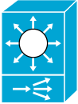
        <div>
            <a href="./img/Cisco/Network-Topology/content_switch.svg">SVG</a>
            <div class="img-title">content_switch</div>
        </div>
    </div>
    <div>
        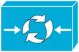
        <div>
            <a href="./img/Cisco/Network-Topology/content_transformation_engine_(cte).svg">SVG</a>
            <div class="img-title">content_transformation_engine_(cte)</div>
        </div>
    </div>
    <div>
        
        <div>
            <a href="./img/Cisco/Network-Topology/cs-mars.svg">SVG</a>
            <div class="img-title">cs-mars</div>
        </div>
    </div>
    <div>
        
        <div>
            <a href="./img/Cisco/Network-Topology/csm-s.svg">SVG</a>
            <div class="img-title">csm-s</div>
        </div>
    </div>
    <div>
        
        <div>
            <a href="./img/Cisco/Network-Topology/csu_dsu.svg">SVG</a>
            <div class="img-title">csu_dsu</div>
        </div>
    </div>
    <div>
        
        <div>
            <a href="./img/Cisco/Network-Topology/CUBE.svg">SVG</a>
            <div class="img-title">CUBE</div>
        </div>
    </div>
    <div>
        
        <div>
            <a href="./img/Cisco/Network-Topology/detector.svg">SVG</a>
            <div class="img-title">detector</div>
        </div>
    </div>
    <div>
        
        <div>
            <a href="./img/Cisco/Network-Topology/director-class_fibre_channel_director.svg">SVG</a>
            <div class="img-title">director-class_fibre_channel_director</div>
        </div>
    </div>
    <div>
        
        <div>
            <a href="./img/Cisco/Network-Topology/directory_server.svg">SVG</a>
            <div class="img-title">directory_server</div>
        </div>
    </div>
    <div>
        
        <div>
            <a href="./img/Cisco/Network-Topology/diskette.svg">SVG</a>
            <div class="img-title">diskette</div>
        </div>
    </div>
    <div>
        
        <div>
            <a href="./img/Cisco/Network-Topology/distributed_director.svg">SVG</a>
            <div class="img-title">distributed_director</div>
        </div>
    </div>
    <div>
        
        <div>
            <a href="./img/Cisco/Network-Topology/dot-dot.svg">SVG</a>
            <div class="img-title">dot-dot</div>
        </div>
    </div>
    <div>
        
        <div>
            <a href="./img/Cisco/Network-Topology/dpt.svg">SVG</a>
            <div class="img-title">dpt</div>
        </div>
    </div>
    <div>
        
        <div>
            <a href="./img/Cisco/Network-Topology/dslam.svg">SVG</a>
            <div class="img-title">dslam</div>
        </div>
    </div>
    <div>
        
        <div>
            <a href="./img/Cisco/Network-Topology/dual_mode_ap.svg">SVG</a>
            <div class="img-title">dual_mode_ap</div>
        </div>
    </div>
    <div>
        
        <div>
            <a href="./img/Cisco/Network-Topology/dwdm_filter.svg">SVG</a>
            <div class="img-title">dwdm_filter</div>
        </div>
    </div>
    <div>
        
        <div>
            <a href="./img/Cisco/Network-Topology/end_office.svg">SVG</a>
            <div class="img-title">end_office</div>
        </div>
    </div>
    <div>
        
        <div>
            <a href="./img/Cisco/Network-Topology/fax.svg">SVG</a>
            <div class="img-title">fax</div>
        </div>
    </div>
    <div>
        
        <div>
            <a href="./img/Cisco/Network-Topology/fc_storage.svg">SVG</a>
            <div class="img-title">fc_storage</div>
        </div>
    </div>
    <div>
        
        <div>
            <a href="./img/Cisco/Network-Topology/fddi_ring.svg">SVG</a>
            <div class="img-title">fddi_ring</div>
        </div>
    </div>
    <div>
        
        <div>
            <a href="./img/Cisco/Network-Topology/fibre_channel_disk_subsystem.svg">SVG</a>
            <div class="img-title">fibre_channel_disk_subsystem</div>
        </div>
    </div>
    <div>
        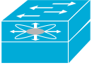
        <div>
            <a href="./img/Cisco/Network-Topology/fibre_channel_fabric_switch.svg">SVG</a>
            <div class="img-title">fibre_channel_fabric_switch</div>
        </div>
    </div>
    <div>
        
        <div>
            <a href="./img/Cisco/Network-Topology/file_cabinet.svg">SVG</a>
            <div class="img-title">file_cabinet</div>
        </div>
    </div>
    <div>
        
        <div>
            <a href="./img/Cisco/Network-Topology/file_server.svg">SVG</a>
            <div class="img-title">file_server</div>
        </div>
    </div>
    <div>
        
        <div>
            <a href="./img/Cisco/Network-Topology/fileserver.svg">SVG</a>
            <div class="img-title">fileserver</div>
        </div>
    </div>
    <div>
        
        <div>
            <a href="./img/Cisco/Network-Topology/firewall_service_module_(fwsm).svg">SVG</a>
            <div class="img-title">firewall_service_module_(fwsm)</div>
        </div>
    </div>
    <div>
        
        <div>
            <a href="./img/Cisco/Network-Topology/firewall.svg">SVG</a>
            <div class="img-title">firewall</div>
        </div>
    </div>
    <div>
        
        <div>
            <a href="./img/Cisco/Network-Topology/front_end_processor.svg">SVG</a>
            <div class="img-title">front_end_processor</div>
        </div>
    </div>
    <div>
        
        <div>
            <a href="./img/Cisco/Network-Topology/gatekeeper.svg">SVG</a>
            <div class="img-title">gatekeeper</div>
        </div>
    </div>
    <div>
        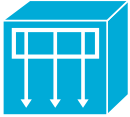
        <div>
            <a href="./img/Cisco/Network-Topology/general_applicance.svg">SVG</a>
            <div class="img-title">general_applicance</div>
        </div>
    </div>
    <div>
        
        <div>
            <a href="./img/Cisco/Network-Topology/generic_building.svg">SVG</a>
            <div class="img-title">generic_building</div>
        </div>
    </div>
    <div>
        
        <div>
            <a href="./img/Cisco/Network-Topology/generic_gateway.svg">SVG</a>
            <div class="img-title">generic_gateway</div>
        </div>
    </div>
    <div>
        
        <div>
            <a href="./img/Cisco/Network-Topology/generic_processor.svg">SVG</a>
            <div class="img-title">generic_processor</div>
        </div>
    </div>
    <div>
        
        <div>
            <a href="./img/Cisco/Network-Topology/generic_softswitch.svg">SVG</a>
            <div class="img-title">generic_softswitch</div>
        </div>
    </div>
    <div>
        
        <div>
            <a href="./img/Cisco/Network-Topology/gigabit_switch_atm_tag_router.svg">SVG</a>
            <div class="img-title">gigabit_switch_atm_tag_router</div>
        </div>
    </div>
    <div>
        
        <div>
            <a href="./img/Cisco/Network-Topology/government_building.svg">SVG</a>
            <div class="img-title">government_building</div>
        </div>
    </div>
    <div>
        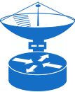
        <div>
            <a href="./img/Cisco/Network-Topology/Ground_terminal.svg">SVG</a>
            <div class="img-title">Ground_terminal</div>
        </div>
    </div>
    <div>
        
        <div>
            <a href="./img/Cisco/Network-Topology/guard.svg">SVG</a>
            <div class="img-title">guard</div>
        </div>
    </div>
    <div>
        
        <div>
            <a href="./img/Cisco/Network-Topology/h.323.svg">SVG</a>
            <div class="img-title">h.323</div>
        </div>
    </div>
    <div>
        
        <div>
            <a href="./img/Cisco/Network-Topology/handheld.svg">SVG</a>
            <div class="img-title">handheld</div>
        </div>
    </div>
    <div>
        
        <div>
            <a href="./img/Cisco/Network-Topology/hootphone.svg">SVG</a>
            <div class="img-title">hootphone</div>
        </div>
    </div>
    <div>
        
        <div>
            <a href="./img/Cisco/Network-Topology/host.svg">SVG</a>
            <div class="img-title">host</div>
        </div>
    </div>
    <div>
        
        <div>
            <a href="./img/Cisco/Network-Topology/hp_mini.svg">SVG</a>
            <div class="img-title">hp_mini</div>
        </div>
    </div>
    <div>
        
        <div>
            <a href="./img/Cisco/Network-Topology/hub.svg">SVG</a>
            <div class="img-title">hub</div>
        </div>
    </div>
    <div>
        
        <div>
            <a href="./img/Cisco/Network-Topology/iad_router.svg">SVG</a>
            <div class="img-title">iad_router</div>
        </div>
    </div>
    <div>
        
        <div>
            <a href="./img/Cisco/Network-Topology/ibm_mainframe.svg">SVG</a>
            <div class="img-title">ibm_mainframe</div>
        </div>
    </div>
    <div>
        
        <div>
            <a href="./img/Cisco/Network-Topology/ibm_mini_as400.svg">SVG</a>
            <div class="img-title">ibm_mini_as400</div>
        </div>
    </div>
    <div>
        
        <div>
            <a href="./img/Cisco/Network-Topology/ibm_tower.svg">SVG</a>
            <div class="img-title">ibm_tower</div>
        </div>
    </div>
    <div>
        
        <div>
            <a href="./img/Cisco/Network-Topology/icm.svg">SVG</a>
            <div class="img-title">icm</div>
        </div>
    </div>
    <div>
        
        <div>
            <a href="./img/Cisco/Network-Topology/ics.svg">SVG</a>
            <div class="img-title">ics</div>
        </div>
    </div>
    <div>
        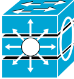
        <div>
            <a href="./img/Cisco/Network-Topology/intelliswitch_stack.svg">SVG</a>
            <div class="img-title">intelliswitch_stack</div>
        </div>
    </div>
    <div>
        
        <div>
            <a href="./img/Cisco/Network-Topology/internet_streamer.svg">SVG</a>
            <div class="img-title">internet_streamer</div>
        </div>
    </div>
    <div>
        
        <div>
            <a href="./img/Cisco/Network-Topology/ios_firewall.svg">SVG</a>
            <div class="img-title">ios_firewall</div>
        </div>
    </div>
    <div>
        
        <div>
            <a href="./img/Cisco/Network-Topology/ios_slb.svg">SVG</a>
            <div class="img-title">ios_slb</div>
        </div>
    </div>
    <div>
        
        <div>
            <a href="./img/Cisco/Network-Topology/ip_communicator.svg">SVG</a>
            <div class="img-title">ip_communicator</div>
        </div>
    </div>
    <div>
        
        <div>
            <a href="./img/Cisco/Network-Topology/ip_dsl.svg">SVG</a>
            <div class="img-title">ip_dsl</div>
        </div>
    </div>
    <div>
        
        <div>
            <a href="./img/Cisco/Network-Topology/ip_phone.svg">SVG</a>
            <div class="img-title">ip_phone</div>
        </div>
    </div>
    <div>
        
        <div>
            <a href="./img/Cisco/Network-Topology/ip_telephony_router.svg">SVG</a>
            <div class="img-title">ip_telephony_router</div>
        </div>
    </div>
    <div>
        
        <div>
            <a href="./img/Cisco/Network-Topology/ip.svg">SVG</a>
            <div class="img-title">ip</div>
        </div>
    </div>
    <div>
        
        <div>
            <a href="./img/Cisco/Network-Topology/iptc.svg">SVG</a>
            <div class="img-title">iptc</div>
        </div>
    </div>
    <div>
        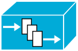
        <div>
            <a href="./img/Cisco/Network-Topology/iptv_content_manager.svg">SVG</a>
            <div class="img-title">iptv_content_manager</div>
        </div>
    </div>
    <div>
        
        <div>
            <a href="./img/Cisco/Network-Topology/iptv_server.svg">SVG</a>
            <div class="img-title">iptv_server</div>
        </div>
    </div>
    <div>
        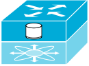
        <div>
            <a href="./img/Cisco/Network-Topology/iscsi_router.svg">SVG</a>
            <div class="img-title">iscsi_router</div>
        </div>
    </div>
    <div>
        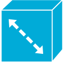
        <div>
            <a href="./img/Cisco/Network-Topology/isdn_switch.svg">SVG</a>
            <div class="img-title">isdn_switch</div>
        </div>
    </div>
    <div>
        
        <div>
            <a href="./img/Cisco/Network-Topology/itp.svg">SVG</a>
            <div class="img-title">itp</div>
        </div>
    </div>
    <div>
        
        <div>
            <a href="./img/Cisco/Network-Topology/jbod.svg">SVG</a>
            <div class="img-title">jbod</div>
        </div>
    </div>
    <div>
        
        <div>
            <a href="./img/Cisco/Network-Topology/key.svg">SVG</a>
            <div class="img-title">key</div>
        </div>
    </div>
    <div>
        
        <div>
            <a href="./img/Cisco/Network-Topology/keys.svg">SVG</a>
            <div class="img-title">keys</div>
        </div>
    </div>
    <div>
        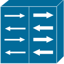
        <div>
            <a href="./img/Cisco/Network-Topology/lan_to_lan.svg">SVG</a>
            <div class="img-title">lan_to_lan</div>
        </div>
    </div>
    <div>
        
        <div>
            <a href="./img/Cisco/Network-Topology/laptop.svg">SVG</a>
            <div class="img-title">laptop</div>
        </div>
    </div>
    <div>
        
        <div>
            <a href="./img/Cisco/Network-Topology/layer_2_remote_switch.svg">SVG</a>
            <div class="img-title">layer_2_remote_switch</div>
        </div>
    </div>
    <div>
        
        <div>
            <a href="./img/Cisco/Network-Topology/layer_3_switch.svg">SVG</a>
            <div class="img-title">layer_3_switch</div>
        </div>
    </div>
    <div>
        
        <div>
            <a href="./img/Cisco/Network-Topology/lightweight_ap.svg">SVG</a>
            <div class="img-title">lightweight_ap</div>
        </div>
    </div>
    <div>
        
        <div>
            <a href="./img/Cisco/Network-Topology/localdirector.svg">SVG</a>
            <div class="img-title">localdirector</div>
        </div>
    </div>
    <div>
        
        <div>
            <a href="./img/Cisco/Network-Topology/lock.svg">SVG</a>
            <div class="img-title">lock</div>
        </div>
    </div>
    <div>
        
        <div>
            <a href="./img/Cisco/Network-Topology/longreach_cpe.svg">SVG</a>
            <div class="img-title">longreach_cpe</div>
        </div>
    </div>
    <div>
        
        <div>
            <a href="./img/Cisco/Network-Topology/mac_woman.svg">SVG</a>
            <div class="img-title">mac_woman</div>
        </div>
    </div>
    <div>
        
        <div>
            <a href="./img/Cisco/Network-Topology/macintosh.svg">SVG</a>
            <div class="img-title">macintosh</div>
        </div>
    </div>
    <div>
        
        <div>
            <a href="./img/Cisco/Network-Topology/man_woman.svg">SVG</a>
            <div class="img-title">man_woman</div>
        </div>
    </div>
    <div>
        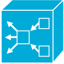
        <div>
            <a href="./img/Cisco/Network-Topology/mas_gateway.svg">SVG</a>
            <div class="img-title">mas_gateway</div>
        </div>
    </div>
    <div>
        
        <div>
            <a href="./img/Cisco/Network-Topology/mau.svg">SVG</a>
            <div class="img-title">mau</div>
        </div>
    </div>
    <div>
        
        <div>
            <a href="./img/Cisco/Network-Topology/mcu.svg">SVG</a>
            <div class="img-title">mcu</div>
        </div>
    </div>
    <div>
        
        <div>
            <a href="./img/Cisco/Network-Topology/mdu.svg">SVG</a>
            <div class="img-title">mdu</div>
        </div>
    </div>
    <div>
        
        <div>
            <a href="./img/Cisco/Network-Topology/me_1100.svg">SVG</a>
            <div class="img-title">me_1100</div>
        </div>
    </div>
    <div>
        
        <div>
            <a href="./img/Cisco/Network-Topology/Mediator.svg">SVG</a>
            <div class="img-title">Mediator</div>
        </div>
    </div>
    <div>
        
        <div>
            <a href="./img/Cisco/Network-Topology/meetingplace.svg">SVG</a>
            <div class="img-title">meetingplace</div>
        </div>
    </div>
    <div>
        
        <div>
            <a href="./img/Cisco/Network-Topology/mesh_ap.svg">SVG</a>
            <div class="img-title">mesh_ap</div>
        </div>
    </div>
    <div>
        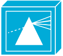
        <div>
            <a href="./img/Cisco/Network-Topology/metro_1500.svg">SVG</a>
            <div class="img-title">metro_1500</div>
        </div>
    </div>
    <div>
        
        <div>
            <a href="./img/Cisco/Network-Topology/mgx_8000_multiservice_switch.svg">SVG</a>
            <div class="img-title">mgx_8000_multiservice_switch</div>
        </div>
    </div>
    <div>
        
        <div>
            <a href="./img/Cisco/Network-Topology/microphone.svg">SVG</a>
            <div class="img-title">microphone</div>
        </div>
    </div>
    <div>
        
        <div>
            <a href="./img/Cisco/Network-Topology/microwebserver.svg">SVG</a>
            <div class="img-title">microwebserver</div>
        </div>
    </div>
    <div>
        
        <div>
            <a href="./img/Cisco/Network-Topology/mini_vax.svg">SVG</a>
            <div class="img-title">mini_vax</div>
        </div>
    </div>
    <div>
        
        <div>
            <a href="./img/Cisco/Network-Topology/mobile_access_ip_phone.svg">SVG</a>
            <div class="img-title">mobile_access_ip_phone</div>
        </div>
    </div>
    <div>
        
        <div>
            <a href="./img/Cisco/Network-Topology/mobile_access_router.svg">SVG</a>
            <div class="img-title">mobile_access_router</div>
        </div>
    </div>
    <div>
        
        <div>
            <a href="./img/Cisco/Network-Topology/mobile_streamer.svg">SVG</a>
            <div class="img-title">mobile_streamer</div>
        </div>
    </div>
    <div>
        
        <div>
            <a href="./img/Cisco/Network-Topology/modem.svg">SVG</a>
            <div class="img-title">modem</div>
        </div>
    </div>
    <div>
        
        <div>
            <a href="./img/Cisco/Network-Topology/moh_server.svg">SVG</a>
            <div class="img-title">moh_server</div>
        </div>
    </div>
    <div>
        
        <div>
            <a href="./img/Cisco/Network-Topology/MSE.svg">SVG</a>
            <div class="img-title">MSE</div>
        </div>
    </div>
    <div>
        
        <div>
            <a href="./img/Cisco/Network-Topology/mulitswitch_device.svg">SVG</a>
            <div class="img-title">mulitswitch_device</div>
        </div>
    </div>
    <div>
        
        <div>
            <a href="./img/Cisco/Network-Topology/multi-fabric_server_switch.svg">SVG</a>
            <div class="img-title">multi-fabric_server_switch</div>
        </div>
    </div>
    <div>
        
        <div>
            <a href="./img/Cisco/Network-Topology/multilayer_remote_switch.svg">SVG</a>
            <div class="img-title">multilayer_remote_switch</div>
        </div>
    </div>
    <div>
        
        <div>
            <a href="./img/Cisco/Network-Topology/mux.svg">SVG</a>
            <div class="img-title">mux</div>
        </div>
    </div>
    <div>
        
        <div>
            <a href="./img/Cisco/Network-Topology/nac_appliance.svg">SVG</a>
            <div class="img-title">nac_appliance</div>
        </div>
    </div>
    <div>
        
        <div>
            <a href="./img/Cisco/Network-Topology/NCE_router.svg">SVG</a>
            <div class="img-title">NCE_router</div>
        </div>
    </div>
    <div>
        
        <div>
            <a href="./img/Cisco/Network-Topology/NCE.svg">SVG</a>
            <div class="img-title">NCE</div>
        </div>
    </div>
    <div>
        
        <div>
            <a href="./img/Cisco/Network-Topology/netflow_router.svg">SVG</a>
            <div class="img-title">netflow_router</div>
        </div>
    </div>
    <div>
        
        <div>
            <a href="./img/Cisco/Network-Topology/netranger.svg">SVG</a>
            <div class="img-title">netranger</div>
        </div>
    </div>
    <div>
        
        <div>
            <a href="./img/Cisco/Network-Topology/netsonar.svg">SVG</a>
            <div class="img-title">netsonar</div>
        </div>
    </div>
    <div>
        
        <div>
            <a href="./img/Cisco/Network-Topology/network_management.svg">SVG</a>
            <div class="img-title">network_management</div>
        </div>
    </div>
    <div>
        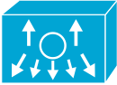
        <div>
            <a href="./img/Cisco/Network-Topology/Nexus_1000.svg">SVG</a>
            <div class="img-title">Nexus_1000</div>
        </div>
    </div>
    <div>
        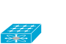
        <div>
            <a href="./img/Cisco/Network-Topology/Nexus_2000.svg">SVG</a>
            <div class="img-title">Nexus_2000</div>
        </div>
    </div>
    <div>
        
        <div>
            <a href="./img/Cisco/Network-Topology/Nexus_5000.svg">SVG</a>
            <div class="img-title">Nexus_5000</div>
        </div>
    </div>
    <div>
        
        <div>
            <a href="./img/Cisco/Network-Topology/Nexus_7000.svg">SVG</a>
            <div class="img-title">Nexus_7000</div>
        </div>
    </div>
    <div>
        
        <div>
            <a href="./img/Cisco/Network-Topology/octel.svg">SVG</a>
            <div class="img-title">octel</div>
        </div>
    </div>
    <div>
        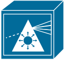
        <div>
            <a href="./img/Cisco/Network-Topology/ons15500.svg">SVG</a>
            <div class="img-title">ons15500</div>
        </div>
    </div>
    <div>
        
        <div>
            <a href="./img/Cisco/Network-Topology/optical_amplifier.svg">SVG</a>
            <div class="img-title">optical_amplifier</div>
        </div>
    </div>
    <div>
        
        <div>
            <a href="./img/Cisco/Network-Topology/optical_services_router.svg">SVG</a>
            <div class="img-title">optical_services_router</div>
        </div>
    </div>
    <div>
        
        <div>
            <a href="./img/Cisco/Network-Topology/optical_transport.svg">SVG</a>
            <div class="img-title">optical_transport</div>
        </div>
    </div>
    <div>
        
        <div>
            <a href="./img/Cisco/Network-Topology/pad_x.28.svg">SVG</a>
            <div class="img-title">pad_x.28</div>
        </div>
    </div>
    <div>
        
        <div>
            <a href="./img/Cisco/Network-Topology/pad.svg">SVG</a>
            <div class="img-title">pad</div>
        </div>
    </div>
    <div>
        
        <div>
            <a href="./img/Cisco/Network-Topology/page_icon.svg">SVG</a>
            <div class="img-title">page_icon</div>
        </div>
    </div>
    <div>
        
        <div>
            <a href="./img/Cisco/Network-Topology/pbx_switch.svg">SVG</a>
            <div class="img-title">pbx_switch</div>
        </div>
    </div>
    <div>
        
        <div>
            <a href="./img/Cisco/Network-Topology/pbx.svg">SVG</a>
            <div class="img-title">pbx</div>
        </div>
    </div>
    <div>
        
        <div>
            <a href="./img/Cisco/Network-Topology/pc_adapter_card.svg">SVG</a>
            <div class="img-title">pc_adapter_card</div>
        </div>
    </div>
    <div>
        
        <div>
            <a href="./img/Cisco/Network-Topology/pc_man.svg">SVG</a>
            <div class="img-title">pc_man</div>
        </div>
    </div>
    <div>
        
        <div>
            <a href="./img/Cisco/Network-Topology/pc_routercard.svg">SVG</a>
            <div class="img-title">pc_routercard</div>
        </div>
    </div>
    <div>
        
        <div>
            <a href="./img/Cisco/Network-Topology/pc_software.svg">SVG</a>
            <div class="img-title">pc_software</div>
        </div>
    </div>
    <div>
        
        <div>
            <a href="./img/Cisco/Network-Topology/pc_video.svg">SVG</a>
            <div class="img-title">pc_video</div>
        </div>
    </div>
    <div>
        
        <div>
            <a href="./img/Cisco/Network-Topology/pc.svg">SVG</a>
            <div class="img-title">pc</div>
        </div>
    </div>
    <div>
        
        <div>
            <a href="./img/Cisco/Network-Topology/pda.svg">SVG</a>
            <div class="img-title">pda</div>
        </div>
    </div>
    <div>
        
        <div>
            <a href="./img/Cisco/Network-Topology/phone_fax.svg">SVG</a>
            <div class="img-title">phone_fax</div>
        </div>
    </div>
    <div>
        
        <div>
            <a href="./img/Cisco/Network-Topology/phone.svg">SVG</a>
            <div class="img-title">phone</div>
        </div>
    </div>
    <div>
        
        <div>
            <a href="./img/Cisco/Network-Topology/pix_firewall.svg">SVG</a>
            <div class="img-title">pix_firewall</div>
        </div>
    </div>
    <div>
        
        <div>
            <a href="./img/Cisco/Network-Topology/pmc.svg">SVG</a>
            <div class="img-title">pmc</div>
        </div>
    </div>
    <div>
        
        <div>
            <a href="./img/Cisco/Network-Topology/printer.svg">SVG</a>
            <div class="img-title">printer</div>
        </div>
    </div>
    <div>
        
        <div>
            <a href="./img/Cisco/Network-Topology/programmable_switch.svg">SVG</a>
            <div class="img-title">programmable_switch</div>
        </div>
    </div>
    <div>
        
        <div>
            <a href="./img/Cisco/Network-Topology/protocol_translator.svg">SVG</a>
            <div class="img-title">protocol_translator</div>
        </div>
    </div>
    <div>
        
        <div>
            <a href="./img/Cisco/Network-Topology/pxf.svg">SVG</a>
            <div class="img-title">pxf</div>
        </div>
    </div>
    <div>
        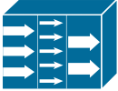
        <div>
            <a href="./img/Cisco/Network-Topology/ratemux.svg">SVG</a>
            <div class="img-title">ratemux</div>
        </div>
    </div>
    <div>
        
        <div>
            <a href="./img/Cisco/Network-Topology/relational_database.svg">SVG</a>
            <div class="img-title">relational_database</div>
        </div>
    </div>
    <div>
        
        <div>
            <a href="./img/Cisco/Network-Topology/repeater.svg">SVG</a>
            <div class="img-title">repeater</div>
        </div>
    </div>
    <div>
        
        <div>
            <a href="./img/Cisco/Network-Topology/RF_modem.svg">SVG</a>
            <div class="img-title">RF_modem</div>
        </div>
    </div>
    <div>
        
        <div>
            <a href="./img/Cisco/Network-Topology/route_switch_processor.svg">SVG</a>
            <div class="img-title">route_switch_processor</div>
        </div>
    </div>
    <div>
        
        <div>
            <a href="./img/Cisco/Network-Topology/router_firewall.svg">SVG</a>
            <div class="img-title">router_firewall</div>
        </div>
    </div>
    <div>
        
        <div>
            <a href="./img/Cisco/Network-Topology/router_with_silicon_switch.svg">SVG</a>
            <div class="img-title">router_with_silicon_switch</div>
        </div>
    </div>
    <div>
        
        <div>
            <a href="./img/Cisco/Network-Topology/router.svg">SVG</a>
            <div class="img-title">router</div>
        </div>
    </div>
    <div>
        
        <div>
            <a href="./img/Cisco/Network-Topology/routerin_building.svg">SVG</a>
            <div class="img-title">routerin_building</div>
        </div>
    </div>
    <div>
        
        <div>
            <a href="./img/Cisco/Network-Topology/rpsrps.svg">SVG</a>
            <div class="img-title">rpsrps</div>
        </div>
    </div>
    <div>
        
        <div>
            <a href="./img/Cisco/Network-Topology/running_man.svg">SVG</a>
            <div class="img-title">running_man</div>
        </div>
    </div>
    <div>
        
        <div>
            <a href="./img/Cisco/Network-Topology/safeharbor_icon.svg">SVG</a>
            <div class="img-title">safeharbor_icon</div>
        </div>
    </div>
    <div>
        
        <div>
            <a href="./img/Cisco/Network-Topology/sattelite_dish.svg">SVG</a>
            <div class="img-title">sattelite_dish</div>
        </div>
    </div>
    <div>
        
        <div>
            <a href="./img/Cisco/Network-Topology/sattelite.svg">SVG</a>
            <div class="img-title">sattelite</div>
        </div>
    </div>
    <div>
        
        <div>
            <a href="./img/Cisco/Network-Topology/scanner.svg">SVG</a>
            <div class="img-title">scanner</div>
        </div>
    </div>
    <div>
        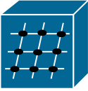
        <div>
            <a href="./img/Cisco/Network-Topology/server_switch.svg">SVG</a>
            <div class="img-title">server_switch</div>
        </div>
    </div>
    <div>
        
        <div>
            <a href="./img/Cisco/Network-Topology/server_with_router.svg">SVG</a>
            <div class="img-title">server_with_router</div>
        </div>
    </div>
    <div>
        
        <div>
            <a href="./img/Cisco/Network-Topology/service_control.svg">SVG</a>
            <div class="img-title">service_control</div>
        </div>
    </div>
    <div>
        
        <div>
            <a href="./img/Cisco/Network-Topology/Service_Module.svg">SVG</a>
            <div class="img-title">Service_Module</div>
        </div>
    </div>
    <div>
        
        <div>
            <a href="./img/Cisco/Network-Topology/Service_router.svg">SVG</a>
            <div class="img-title">Service_router</div>
        </div>
    </div>
    <div>
        
        <div>
            <a href="./img/Cisco/Network-Topology/Services.svg">SVG</a>
            <div class="img-title">Services</div>
        </div>
    </div>
    <div>
        
        <div>
            <a href="./img/Cisco/Network-Topology/Set_top_box.svg">SVG</a>
            <div class="img-title">Set_top_box</div>
        </div>
    </div>
    <div>
        
        <div>
            <a href="./img/Cisco/Network-Topology/simulitlayer_switch.svg">SVG</a>
            <div class="img-title">simulitlayer_switch</div>
        </div>
    </div>
    <div>
        
        <div>
            <a href="./img/Cisco/Network-Topology/sip_proxy_werver.svg">SVG</a>
            <div class="img-title">sip_proxy_werver</div>
        </div>
    </div>
    <div>
        
        <div>
            <a href="./img/Cisco/Network-Topology/sitting_woman.svg">SVG</a>
            <div class="img-title">sitting_woman</div>
        </div>
    </div>
    <div>
        
        <div>
            <a href="./img/Cisco/Network-Topology/small_business.svg">SVG</a>
            <div class="img-title">small_business</div>
        </div>
    </div>
    <div>
        
        <div>
            <a href="./img/Cisco/Network-Topology/small_hub.svg">SVG</a>
            <div class="img-title">small_hub</div>
        </div>
    </div>
    <div>
        
        <div>
            <a href="./img/Cisco/Network-Topology/softphone.svg">SVG</a>
            <div class="img-title">softphone</div>
        </div>
    </div>
    <div>
        
        <div>
            <a href="./img/Cisco/Network-Topology/softswitch_pgw_mgc.svg">SVG</a>
            <div class="img-title">softswitch_pgw_mgc</div>
        </div>
    </div>
    <div>
        
        <div>
            <a href="./img/Cisco/Network-Topology/software_based_server.svg">SVG</a>
            <div class="img-title">software_based_server</div>
        </div>
    </div>
    <div>
        
        <div>
            <a href="./img/Cisco/Network-Topology/Space_router.svg">SVG</a>
            <div class="img-title">Space_router</div>
        </div>
    </div>
    <div>
        
        <div>
            <a href="./img/Cisco/Network-Topology/speaker.svg">SVG</a>
            <div class="img-title">speaker</div>
        </div>
    </div>
    <div>
        
        <div>
            <a href="./img/Cisco/Network-Topology/ssc.svg">SVG</a>
            <div class="img-title">ssc</div>
        </div>
    </div>
    <div>
        
        <div>
            <a href="./img/Cisco/Network-Topology/ssl_terminator.svg">SVG</a>
            <div class="img-title">ssl_terminator</div>
        </div>
    </div>
    <div>
        
        <div>
            <a href="./img/Cisco/Network-Topology/standard_host.svg">SVG</a>
            <div class="img-title">standard_host</div>
        </div>
    </div>
    <div>
        
        <div>
            <a href="./img/Cisco/Network-Topology/standing_man.svg">SVG</a>
            <div class="img-title">standing_man</div>
        </div>
    </div>
    <div>
        
        <div>
            <a href="./img/Cisco/Network-Topology/standing_woman.svg">SVG</a>
            <div class="img-title">standing_woman</div>
        </div>
    </div>
    <div>
        
        <div>
            <a href="./img/Cisco/Network-Topology/stb.svg">SVG</a>
            <div class="img-title">stb</div>
        </div>
    </div>
    <div>
        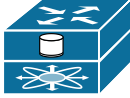
        <div>
            <a href="./img/Cisco/Network-Topology/storage_router.svg">SVG</a>
            <div class="img-title">storage_router</div>
        </div>
    </div>
    <div>
        
        <div>
            <a href="./img/Cisco/Network-Topology/storage_server.svg">SVG</a>
            <div class="img-title">storage_server</div>
        </div>
    </div>
    <div>
        
        <div>
            <a href="./img/Cisco/Network-Topology/stp.svg">SVG</a>
            <div class="img-title">stp</div>
        </div>
    </div>
    <div>
        
        <div>
            <a href="./img/Cisco/Network-Topology/streamer.svg">SVG</a>
            <div class="img-title">streamer</div>
        </div>
    </div>
    <div>
        
        <div>
            <a href="./img/Cisco/Network-Topology/sun_workstation.svg">SVG</a>
            <div class="img-title">sun_workstation</div>
        </div>
    </div>
    <div>
        
        <div>
            <a href="./img/Cisco/Network-Topology/supercomputer.svg">SVG</a>
            <div class="img-title">supercomputer</div>
        </div>
    </div>
    <div>
        
        <div>
            <a href="./img/Cisco/Network-Topology/svx.svg">SVG</a>
            <div class="img-title">svx</div>
        </div>
    </div>
    <div>
        
        <div>
            <a href="./img/Cisco/Network-Topology/system_controller.svg">SVG</a>
            <div class="img-title">system_controller</div>
        </div>
    </div>
    <div>
        
        <div>
            <a href="./img/Cisco/Network-Topology/tablet.svg">SVG</a>
            <div class="img-title">tablet</div>
        </div>
    </div>
    <div>
        
        <div>
            <a href="./img/Cisco/Network-Topology/tape_array.svg">SVG</a>
            <div class="img-title">tape_array</div>
        </div>
    </div>
    <div>
        
        <div>
            <a href="./img/Cisco/Network-Topology/tdm_router.svg">SVG</a>
            <div class="img-title">tdm_router</div>
        </div>
    </div>
    <div>
        
        <div>
            <a href="./img/Cisco/Network-Topology/telecommuter_house_pc.svg">SVG</a>
            <div class="img-title">telecommuter_house_pc</div>
        </div>
    </div>
    <div>
        
        <div>
            <a href="./img/Cisco/Network-Topology/telecommuter_house.svg">SVG</a>
            <div class="img-title">telecommuter_house</div>
        </div>
    </div>
    <div>
        
        <div>
            <a href="./img/Cisco/Network-Topology/telecommuter_icon.svg">SVG</a>
            <div class="img-title">telecommuter_icon</div>
        </div>
    </div>
    <div>
        
        <div>
            <a href="./img/Cisco/Network-Topology/terminal.svg">SVG</a>
            <div class="img-title">terminal</div>
        </div>
    </div>
    <div>
        
        <div>
            <a href="./img/Cisco/Network-Topology/token.svg">SVG</a>
            <div class="img-title">token</div>
        </div>
    </div>
    <div>
        
        <div>
            <a href="./img/Cisco/Network-Topology/TP_MCU.svg">SVG</a>
            <div class="img-title">TP_MCU</div>
        </div>
    </div>
    <div>
        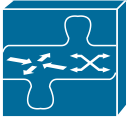
        <div>
            <a href="./img/Cisco/Network-Topology/transpath.svg">SVG</a>
            <div class="img-title">transpath</div>
        </div>
    </div>
    <div>
        
        <div>
            <a href="./img/Cisco/Network-Topology/truck.svg">SVG</a>
            <div class="img-title">truck</div>
        </div>
    </div>
    <div>
        
        <div>
            <a href="./img/Cisco/Network-Topology/turret.svg">SVG</a>
            <div class="img-title">turret</div>
        </div>
    </div>
    <div>
        
        <div>
            <a href="./img/Cisco/Network-Topology/tv.svg">SVG</a>
            <div class="img-title">tv</div>
        </div>
    </div>
    <div>
        
        <div>
            <a href="./img/Cisco/Network-Topology/ubr910.svg">SVG</a>
            <div class="img-title">ubr910</div>
        </div>
    </div>
    <div>
        
        <div>
            <a href="./img/Cisco/Network-Topology/umg_series.svg">SVG</a>
            <div class="img-title">umg_series</div>
        </div>
    </div>
    <div>
        
        <div>
            <a href="./img/Cisco/Network-Topology/unity_server.svg">SVG</a>
            <div class="img-title">unity_server</div>
        </div>
    </div>
    <div>
        
        <div>
            <a href="./img/Cisco/Network-Topology/universal_gateway.svg">SVG</a>
            <div class="img-title">universal_gateway</div>
        </div>
    </div>
    <div>
        
        <div>
            <a href="./img/Cisco/Network-Topology/university.svg">SVG</a>
            <div class="img-title">university</div>
        </div>
    </div>
    <div>
        
        <div>
            <a href="./img/Cisco/Network-Topology/upc.svg">SVG</a>
            <div class="img-title">upc</div>
        </div>
    </div>
    <div>
        
        <div>
            <a href="./img/Cisco/Network-Topology/ups.svg">SVG</a>
            <div class="img-title">ups</div>
        </div>
    </div>
    <div>
        
        <div>
            <a href="./img/Cisco/Network-Topology/vault.svg">SVG</a>
            <div class="img-title">vault</div>
        </div>
    </div>
    <div>
        
        <div>
            <a href="./img/Cisco/Network-Topology/video_camera.svg">SVG</a>
            <div class="img-title">video_camera</div>
        </div>
    </div>
    <div>
        
        <div>
            <a href="./img/Cisco/Network-Topology/vip.svg">SVG</a>
            <div class="img-title">vip</div>
        </div>
    </div>
    <div>
        
        <div>
            <a href="./img/Cisco/Network-Topology/virtual_layer_switch.svg">SVG</a>
            <div class="img-title">virtual_layer_switch</div>
        </div>
    </div>
    <div>
        
        <div>
            <a href="./img/Cisco/Network-Topology/virtual_switch_controller_(vsc3000).svg">SVG</a>
            <div class="img-title">virtual_switch_controller_(vsc3000)</div>
        </div>
    </div>
    <div>
        
        <div>
            <a href="./img/Cisco/Network-Topology/voice_atm_switch.svg">SVG</a>
            <div class="img-title">voice_atm_switch</div>
        </div>
    </div>
    <div>
        
        <div>
            <a href="./img/Cisco/Network-Topology/voice_commserver.svg">SVG</a>
            <div class="img-title">voice_commserver</div>
        </div>
    </div>
    <div>
        
        <div>
            <a href="./img/Cisco/Network-Topology/voice_router.svg">SVG</a>
            <div class="img-title">voice_router</div>
        </div>
    </div>
    <div>
        
        <div>
            <a href="./img/Cisco/Network-Topology/voice_switch.svg">SVG</a>
            <div class="img-title">voice_switch</div>
        </div>
    </div>
    <div>
        
        <div>
            <a href="./img/Cisco/Network-Topology/vpn_concentrator.svg">SVG</a>
            <div class="img-title">vpn_concentrator</div>
        </div>
    </div>
    <div>
        
        <div>
            <a href="./img/Cisco/Network-Topology/vpn_gateway.svg">SVG</a>
            <div class="img-title">vpn_gateway</div>
        </div>
    </div>
    <div>
        
        <div>
            <a href="./img/Cisco/Network-Topology/VSD.svg">SVG</a>
            <div class="img-title">VSD</div>
        </div>
    </div>
    <div>
        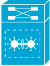
        <div>
            <a href="./img/Cisco/Network-Topology/VSS.svg">SVG</a>
            <div class="img-title">VSS</div>
        </div>
    </div>
    <div>
        
        <div>
            <a href="./img/Cisco/Network-Topology/wae.svg">SVG</a>
            <div class="img-title">wae</div>
        </div>
    </div>
    <div>
        
        <div>
            <a href="./img/Cisco/Network-Topology/wavelength_router.svg">SVG</a>
            <div class="img-title">wavelength_router</div>
        </div>
    </div>
    <div>
        
        <div>
            <a href="./img/Cisco/Network-Topology/web_browser.svg">SVG</a>
            <div class="img-title">web_browser</div>
        </div>
    </div>
    <div>
        
        <div>
            <a href="./img/Cisco/Network-Topology/web_cluster.svg">SVG</a>
            <div class="img-title">web_cluster</div>
        </div>
    </div>
    <div>
        
        <div>
            <a href="./img/Cisco/Network-Topology/wi-fi_tag.svg">SVG</a>
            <div class="img-title">wi-fi_tag</div>
        </div>
    </div>
    <div>
        
        <div>
            <a href="./img/Cisco/Network-Topology/wireless_bridge.svg">SVG</a>
            <div class="img-title">wireless_bridge</div>
        </div>
    </div>
    <div>
        
        <div>
            <a href="./img/Cisco/Network-Topology/wireless_location_appliance.svg">SVG</a>
            <div class="img-title">wireless_location_appliance</div>
        </div>
    </div>
    <div>
        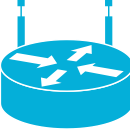
        <div>
            <a href="./img/Cisco/Network-Topology/wireless_router.svg">SVG</a>
            <div class="img-title">wireless_router</div>
        </div>
    </div>
    <div>
        
        <div>
            <a href="./img/Cisco/Network-Topology/wireless_transport.svg">SVG</a>
            <div class="img-title">wireless_transport</div>
        </div>
    </div>
    <div>
        
        <div>
            <a href="./img/Cisco/Network-Topology/wireless.svg">SVG</a>
            <div class="img-title">wireless</div>
        </div>
    </div>
    <div>
        
        <div>
            <a href="./img/Cisco/Network-Topology/wism.svg">SVG</a>
            <div class="img-title">wism</div>
        </div>
    </div>
    <div>
        
        <div>
            <a href="./img/Cisco/Network-Topology/wlan_controller.svg">SVG</a>
            <div class="img-title">wlan_controller</div>
        </div>
    </div>
    <div>
        
        <div>
            <a href="./img/Cisco/Network-Topology/workgroup_director.svg">SVG</a>
            <div class="img-title">workgroup_director</div>
        </div>
    </div>
    <div>
        
        <div>
            <a href="./img/Cisco/Network-Topology/workgroup_switch.svg">SVG</a>
            <div class="img-title">workgroup_switch</div>
        </div>
    </div>
    <div>
        
        <div>
            <a href="./img/Cisco/Network-Topology/workstation.svg">SVG</a>
            <div class="img-title">workstation</div>
        </div>
    </div>
    <div>
        
        <div>
            <a href="./img/Cisco/Network-Topology/www_server.svg">SVG</a>
            <div class="img-title">www_server</div>
        </div>
    </div>
</div>

<br />

## Cisco SAFE Icon Library
[https://www.cisco.com/c/en/us/solutions/collateral/enterprise/design-zone-security/safe-icon-library.html](https://www.cisco.com/c/en/us/solutions/collateral/enterprise/design-zone-security/safe-icon-library.html)

>`SAFE` - Secure Architecture For Everyone 

* Design Icons
* Capability Icons
* Threat Icons
* Architecture Icons


```
ls *' '* | awk '{orig=$0; gsub(/ /, "_"); print "mv -n -- \"" orig "\" \"" $0 "\""}' | bash
```

```
ls -1 | awk '{orig=$0; gsub(/Gray/, "Attack_Surface"); print "mv -n -- \"" orig "\" \"" $0 "\""}' | bash
``` 

```
ls -1 | sed -E 's|([A-Za-z_]+_[0-9]+_)(.*).png|!\[\2\]\(./img/Cisco/SAFE/&\) \2 \[SVG\]\(\1\2.svg\)<br />|'
```

```
ls -1 | sed -E 's|([A-Za-z]+_[0-9]+_)(.*).png|  \2 \[SVG\]\(\1\2.svg\)<br />|'
```

```
ls *.png | sed -E 's|([A-Za-z]+_[0-9]+_)(.*).png|    <div>\n        \n        <div>\n            <a href="./img/Cisco/SAFE/\1\2.svg">SVG</a>\n            <div class="img-title">\2</div>\n        </div>\n    </div>|'
```

### Design

<div class="icon-table">
    <div>
        
        <div>
            <a href="./img/Cisco/SAFE/Design_38_Access_Point.svg">SVG</a>
            <div class="img-title">Access_Point</div>
        </div>
    </div>
    <div>
        
        <div>
            <a href="./img/Cisco/SAFE/Design_38_Access_Switch.svg">SVG</a>
            <div class="img-title">Access_Switch</div>
        </div>
    </div>
    <div>
        
        <div>
            <a href="./img/Cisco/SAFE/Design_38_ACI_Controller.svg">SVG</a>
            <div class="img-title">ACI_Controller</div>
        </div>
    </div>
    <div>
        
        <div>
            <a href="./img/Cisco/SAFE/Design_38_Actuator.svg">SVG</a>
            <div class="img-title">Actuator</div>
        </div>
    </div>
    <div>
        
        <div>
            <a href="./img/Cisco/SAFE/Design_38_Adaptive_Security_Appliance.svg">SVG</a>
            <div class="img-title">Adaptive_Security_Appliance</div>
        </div>
    </div>
    <div>
        
        <div>
            <a href="./img/Cisco/SAFE/Design_38_Automated_System.svg">SVG</a>
            <div class="img-title">Automated_System</div>
        </div>
    </div>
    <div>
        
        <div>
            <a href="./img/Cisco/SAFE/Design_38_Blade_Server.svg">SVG</a>
            <div class="img-title">Blade_Server</div>
        </div>
    </div>
    <div>
        
        <div>
            <a href="./img/Cisco/SAFE/Design_38_Catalyst_Data_Center_Switch.svg">SVG</a>
            <div class="img-title">Catalyst_Data_Center_Switch</div>
        </div>
    </div>
    <div>
        
        <div>
            <a href="./img/Cisco/SAFE/Design_38_Cisco_Unbrella.svg">SVG</a>
            <div class="img-title">Cisco_Unbrella</div>
        </div>
    </div>
    <div>
        
        <div>
            <a href="./img/Cisco/SAFE/Design_38_CloudLock.svg">SVG</a>
            <div class="img-title">CloudLock</div>
        </div>
    </div>
    <div>
        
        <div>
            <a href="./img/Cisco/SAFE/Design_38_Core_Switch.svg">SVG</a>
            <div class="img-title">Core_Switch</div>
        </div>
    </div>
    <div>
        
        <div>
            <a href="./img/Cisco/SAFE/Design_38_Corporate_Device.svg">SVG</a>
            <div class="img-title">Corporate_Device</div>
        </div>
    </div>
    <div>
        
        <div>
            <a href="./img/Cisco/SAFE/Design_38_Corporate_Wireless_Device.svg">SVG</a>
            <div class="img-title">Corporate_Wireless_Device</div>
        </div>
    </div>
    <div>
        
        <div>
            <a href="./img/Cisco/SAFE/Design_38_DDOS_Protection.svg">SVG</a>
            <div class="img-title">DDOS_Protection</div>
        </div>
    </div>
    <div>
        
        <div>
            <a href="./img/Cisco/SAFE/Design_38_Distribution_Switch.svg">SVG</a>
            <div class="img-title">Distribution_Switch</div>
        </div>
    </div>
    <div>
        
        <div>
            <a href="./img/Cisco/SAFE/Design_38_Email_Security.svg">SVG</a>
            <div class="img-title">Email_Security</div>
        </div>
    </div>
    <div>
        
        <div>
            <a href="./img/Cisco/SAFE/Design_38_Endpoint_Concentrator.svg">SVG</a>
            <div class="img-title">Endpoint_Concentrator</div>
        </div>
    </div>
    <div>
        
        <div>
            <a href="./img/Cisco/SAFE/Design_38_Fabric_Switch.svg">SVG</a>
            <div class="img-title">Fabric_Switch</div>
        </div>
    </div>
    <div>
        
        <div>
            <a href="./img/Cisco/SAFE/Design_38_Firepower_Appliance.svg">SVG</a>
            <div class="img-title">Firepower_Appliance</div>
        </div>
    </div>
    <div>
        
        <div>
            <a href="./img/Cisco/SAFE/Design_38_Firepower_Management_Center.svg">SVG</a>
            <div class="img-title">Firepower_Management_Center</div>
        </div>
    </div>
    <div>
        
        <div>
            <a href="./img/Cisco/SAFE/Design_38_Firewall.svg">SVG</a>
            <div class="img-title">Firewall</div>
        </div>
    </div>
    <div>
        
        <div>
            <a href="./img/Cisco/SAFE/Design_38_Flow_Connector.svg">SVG</a>
            <div class="img-title">Flow_Connector</div>
        </div>
    </div>
    <div>
        
        <div>
            <a href="./img/Cisco/SAFE/Design_38_Flow_Sensor.svg">SVG</a>
            <div class="img-title">Flow_Sensor</div>
        </div>
    </div>
    <div>
        
        <div>
            <a href="./img/Cisco/SAFE/Design_38_Identity_Directory.svg">SVG</a>
            <div class="img-title">Identity_Directory</div>
        </div>
    </div>
    <div>
        
        <div>
            <a href="./img/Cisco/SAFE/Design_38_Intrusion_Prevention_System_(IPS).svg">SVG</a>
            <div class="img-title">Intrusion_Prevention_System_(IPS)</div>
        </div>
    </div>
    <div>
        
        <div>
            <a href="./img/Cisco/SAFE/Design_38_L2_Switch.svg">SVG</a>
            <div class="img-title">L2_Switch</div>
        </div>
    </div>
    <div>
        
        <div>
            <a href="./img/Cisco/SAFE/Design_38_L3_Switch.svg">SVG</a>
            <div class="img-title">L3_Switch</div>
        </div>
    </div>
    <div>
        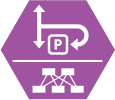
        <div>
            <a href="./img/Cisco/SAFE/Design_38_Leaf_Switch.svg">SVG</a>
            <div class="img-title">Leaf_Switch</div>
        </div>
    </div>
    <div>
        
        <div>
            <a href="./img/Cisco/SAFE/Design_38_Load_Balancer.svg">SVG</a>
            <div class="img-title">Load_Balancer</div>
        </div>
    </div>
    <div>
        
        <div>
            <a href="./img/Cisco/SAFE/Design_38_Log_Collector.svg">SVG</a>
            <div class="img-title">Log_Collector</div>
        </div>
    </div>
    <div>
        
        <div>
            <a href="./img/Cisco/SAFE/Design_38_Management_Console.svg">SVG</a>
            <div class="img-title">Management_Console</div>
        </div>
    </div>
    <div>
        
        <div>
            <a href="./img/Cisco/SAFE/Design_38_Mobile_Device_Management.svg">SVG</a>
            <div class="img-title">Mobile_Device_Management</div>
        </div>
    </div>
    <div>
        
        <div>
            <a href="./img/Cisco/SAFE/Design_38_Mobile.svg">SVG</a>
            <div class="img-title">Mobile</div>
        </div>
    </div>
    <div>
        
        <div>
            <a href="./img/Cisco/SAFE/Design_38_Monitoring.svg">SVG</a>
            <div class="img-title">Monitoring</div>
        </div>
    </div>
    <div>
        
        <div>
            <a href="./img/Cisco/SAFE/Design_38_MS_Active_Directory.svg">SVG</a>
            <div class="img-title">MS_Active_Directory</div>
        </div>
    </div>
    <div>
        
        <div>
            <a href="./img/Cisco/SAFE/Design_38_Nexus_1kv.svg">SVG</a>
            <div class="img-title">Nexus_1kv</div>
        </div>
    </div>
    <div>
        
        <div>
            <a href="./img/Cisco/SAFE/Design_38_Nexus_Data_Center_Switch.svg">SVG</a>
            <div class="img-title">Nexus_Data_Center_Switch</div>
        </div>
    </div>
    <div>
        
        <div>
            <a href="./img/Cisco/SAFE/Design_38_Nexus_Fabric_Switch.svg">SVG</a>
            <div class="img-title">Nexus_Fabric_Switch</div>
        </div>
    </div>
    <div>
        
        <div>
            <a href="./img/Cisco/SAFE/Design_38_Nexus_Switch.svg">SVG</a>
            <div class="img-title">Nexus_Switch</div>
        </div>
    </div>
    <div>
        
        <div>
            <a href="./img/Cisco/SAFE/Design_38_NTP.svg">SVG</a>
            <div class="img-title">NTP</div>
        </div>
    </div>
    <div>
        
        <div>
            <a href="./img/Cisco/SAFE/Design_38_Phone.svg">SVG</a>
            <div class="img-title">Phone</div>
        </div>
    </div>
    <div>
        
        <div>
            <a href="./img/Cisco/SAFE/Design_38_Policy.svg">SVG</a>
            <div class="img-title">Policy</div>
        </div>
    </div>
    <div>
        
        <div>
            <a href="./img/Cisco/SAFE/Design_38_Posture_Assessment.svg">SVG</a>
            <div class="img-title">Posture_Assessment</div>
        </div>
    </div>
    <div>
        
        <div>
            <a href="./img/Cisco/SAFE/Design_38_Radware_Appliance.svg">SVG</a>
            <div class="img-title">Radware_Appliance</div>
        </div>
    </div>
    <div>
        
        <div>
            <a href="./img/Cisco/SAFE/Design_38_Router.svg">SVG</a>
            <div class="img-title">Router</div>
        </div>
    </div>
    <div>
        
        <div>
            <a href="./img/Cisco/SAFE/Design_38_SD_WAN.svg">SVG</a>
            <div class="img-title">SD_WAN</div>
        </div>
    </div>
    <div>
        
        <div>
            <a href="./img/Cisco/SAFE/Design_38_Secure_DNS.svg">SVG</a>
            <div class="img-title">Secure_DNS</div>
        </div>
    </div>
    <div>
        
        <div>
            <a href="./img/Cisco/SAFE/Design_38_Secure_Server.svg">SVG</a>
            <div class="img-title">Secure_Server</div>
        </div>
    </div>
    <div>
        
        <div>
            <a href="./img/Cisco/SAFE/Design_38_Secure_X.svg">SVG</a>
            <div class="img-title">Secure_X</div>
        </div>
    </div>
    <div>
        
        <div>
            <a href="./img/Cisco/SAFE/Design_38_Sensor.svg">SVG</a>
            <div class="img-title">Sensor</div>
        </div>
    </div>
    <div>
        
        <div>
            <a href="./img/Cisco/SAFE/Design_38_Server.svg">SVG</a>
            <div class="img-title">Server</div>
        </div>
    </div>
    <div>
        
        <div>
            <a href="./img/Cisco/SAFE/Design_38_SIEM.svg">SVG</a>
            <div class="img-title">SIEM</div>
        </div>
    </div>
    <div>
        
        <div>
            <a href="./img/Cisco/SAFE/Design_38_Spine_Switch.svg">SVG</a>
            <div class="img-title">Spine_Switch</div>
        </div>
    </div>
    <div>
        
        <div>
            <a href="./img/Cisco/SAFE/Design_38_Stacked_Switch.svg">SVG</a>
            <div class="img-title">Stacked_Switch</div>
        </div>
    </div>
    <div>
        
        <div>
            <a href="./img/Cisco/SAFE/Design_38_Storage.svg">SVG</a>
            <div class="img-title">Storage</div>
        </div>
    </div>
    <div>
        
        <div>
            <a href="./img/Cisco/SAFE/Design_38_Switch_Stack.svg">SVG</a>
            <div class="img-title">Switch_Stack</div>
        </div>
    </div>
    <div>
        
        <div>
            <a href="./img/Cisco/SAFE/Design_38_Tetration_Appliance.svg">SVG</a>
            <div class="img-title">Tetration_Appliance</div>
        </div>
    </div>
    <div>
        
        <div>
            <a href="./img/Cisco/SAFE/Design_38_Threat_Grid.svg">SVG</a>
            <div class="img-title">Threat_Grid</div>
        </div>
    </div>
    <div>
        
        <div>
            <a href="./img/Cisco/SAFE/Design_38_TLS_Appliance.svg">SVG</a>
            <div class="img-title">TLS_Appliance</div>
        </div>
    </div>
    <div>
        
        <div>
            <a href="./img/Cisco/SAFE/Design_38_UDP_Director.svg">SVG</a>
            <div class="img-title">UDP_Director</div>
        </div>
    </div>
    <div>
        
        <div>
            <a href="./img/Cisco/SAFE/Design_38_Vehicle_Commercial.svg">SVG</a>
            <div class="img-title">Vehicle_Commercial</div>
        </div>
    </div>
    <div>
        
        <div>
            <a href="./img/Cisco/SAFE/Design_38_Vehicle_Consumer.svg">SVG</a>
            <div class="img-title">Vehicle_Consumer</div>
        </div>
    </div>
    <div>
        
        <div>
            <a href="./img/Cisco/SAFE/Design_38_Vehicle_Flight.svg">SVG</a>
            <div class="img-title">Vehicle_Flight</div>
        </div>
    </div>
    <div>
        
        <div>
            <a href="./img/Cisco/SAFE/Design_38_Video_Endpoint.svg">SVG</a>
            <div class="img-title">Video_Endpoint</div>
        </div>
    </div>
    <div>
        
        <div>
            <a href="./img/Cisco/SAFE/Design_38_VPN_Concentrator.svg">SVG</a>
            <div class="img-title">VPN_Concentrator</div>
        </div>
    </div>
    <div>
        
        <div>
            <a href="./img/Cisco/SAFE/Design_38_Vulnerability_Management.svg">SVG</a>
            <div class="img-title">Vulnerability_Management</div>
        </div>
    </div>
    <div>
        
        <div>
            <a href="./img/Cisco/SAFE/Design_38_Web_App_Firewall.svg">SVG</a>
            <div class="img-title">Web_App_Firewall</div>
        </div>
    </div>
    <div>
        
        <div>
            <a href="./img/Cisco/SAFE/Design_38_Web_Filterning.svg">SVG</a>
            <div class="img-title">Web_Filterning</div>
        </div>
    </div>
    <div>
        
        <div>
            <a href="./img/Cisco/SAFE/Design_38_Web_Security.svg">SVG</a>
            <div class="img-title">Web_Security</div>
        </div>
    </div>
    <div>
        
        <div>
            <a href="./img/Cisco/SAFE/Design_38_Wide_Area_App_Engine.svg">SVG</a>
            <div class="img-title">Wide_Area_App_Engine</div>
        </div>
    </div>
    <div>
        
        <div>
            <a href="./img/Cisco/SAFE/Design_38_Wireless_Controller.svg">SVG</a>
            <div class="img-title">Wireless_Controller</div>
        </div>
    </div>
    <div>
        
        <div>
            <a href="./img/Cisco/SAFE/Design_38_Wireless_LAN_Controller.svg">SVG</a>
            <div class="img-title">Wireless_LAN_Controller</div>
        </div>
    </div>
    <div>
        
        <div>
            <a href="./img/Cisco/SAFE/Design_38_Wireless_Switch.svg">SVG</a>
            <div class="img-title">Wireless_Switch</div>
        </div>
    </div>
</div>


### Capability

<div class="icon-table">
    <div>
        
        <div>
            <a href="./img/Cisco/SAFE/Capability_43_Analysis_Correlation.svg">SVG</a>
            <div class="img-title">Analysis_Correlation</div>
        </div>
    </div>
    <div>
        
        <div>
            <a href="./img/Cisco/SAFE/Capability_43_Anomaly_Detection.svg">SVG</a>
            <div class="img-title">Anomaly_Detection</div>
        </div>
    </div>
    <div>
        
        <div>
            <a href="./img/Cisco/SAFE/Capability_43_AntiMalware.svg">SVG</a>
            <div class="img-title">AntiMalware</div>
        </div>
    </div>
    <div>
        
        <div>
            <a href="./img/Cisco/SAFE/Capability_43_AntiSpam.svg">SVG</a>
            <div class="img-title">AntiSpam</div>
        </div>
    </div>
    <div>
        
        <div>
            <a href="./img/Cisco/SAFE/Capability_43_AntiVirus.svg">SVG</a>
            <div class="img-title">AntiVirus</div>
        </div>
    </div>
    <div>
        
        <div>
            <a href="./img/Cisco/SAFE/Capability_43_API_Interface.svg">SVG</a>
            <div class="img-title">API_Interface</div>
        </div>
    </div>
    <div>
        
        <div>
            <a href="./img/Cisco/SAFE/Capability_43_App_Visibility_Control.svg">SVG</a>
            <div class="img-title">App_Visibility_Control</div>
        </div>
    </div>
    <div>
        
        <div>
            <a href="./img/Cisco/SAFE/Capability_43_Block.svg">SVG</a>
            <div class="img-title">Block</div>
        </div>
    </div>
    <div>
        
        <div>
            <a href="./img/Cisco/SAFE/Capability_43_Cage.svg">SVG</a>
            <div class="img-title">Cage</div>
        </div>
    </div>
    <div>
        
        <div>
            <a href="./img/Cisco/SAFE/Capability_43_Central_Management.svg">SVG</a>
            <div class="img-title">Central_Management</div>
        </div>
    </div>
    <div>
        
        <div>
            <a href="./img/Cisco/SAFE/Capability_43_Certificate_Authority.svg">SVG</a>
            <div class="img-title">Certificate_Authority</div>
        </div>
    </div>
    <div>
        
        <div>
            <a href="./img/Cisco/SAFE/Capability_43_Certificate_Services.svg">SVG</a>
            <div class="img-title">Certificate_Services</div>
        </div>
    </div>
    <div>
        
        <div>
            <a href="./img/Cisco/SAFE/Capability_43_ClientBased_Security.svg">SVG</a>
            <div class="img-title">ClientBased_Security</div>
        </div>
    </div>
    <div>
        
        <div>
            <a href="./img/Cisco/SAFE/Capability_43_Cloud_Access_Security_Broker_CASB.svg">SVG</a>
            <div class="img-title">Cloud_Access_Security_Broker_CASB</div>
        </div>
    </div>
    <div>
        
        <div>
            <a href="./img/Cisco/SAFE/Capability_43_Cloud_Security.svg">SVG</a>
            <div class="img-title">Cloud_Security</div>
        </div>
    </div>
    <div>
        
        <div>
            <a href="./img/Cisco/SAFE/Capability_43_Conduit.svg">SVG</a>
            <div class="img-title">Conduit</div>
        </div>
    </div>
    <div>
        
        <div>
            <a href="./img/Cisco/SAFE/Capability_43_Conference_Bridge.svg">SVG</a>
            <div class="img-title">Conference_Bridge</div>
        </div>
    </div>
    <div>
        
        <div>
            <a href="./img/Cisco/SAFE/Capability_43_Data_Integrity.svg">SVG</a>
            <div class="img-title">Data_Integrity</div>
        </div>
    </div>
    <div>
        
        <div>
            <a href="./img/Cisco/SAFE/Capability_43_Data_Loss_Prevention.svg">SVG</a>
            <div class="img-title">Data_Loss_Prevention</div>
        </div>
    </div>
    <div>
        
        <div>
            <a href="./img/Cisco/SAFE/Capability_43_Database.svg">SVG</a>
            <div class="img-title">Database</div>
        </div>
    </div>
    <div>
        
        <div>
            <a href="./img/Cisco/SAFE/Capability_43_Device_Encryption.svg">SVG</a>
            <div class="img-title">Device_Encryption</div>
        </div>
    </div>
    <div>
        
        <div>
            <a href="./img/Cisco/SAFE/Capability_43_Device_Profiling.svg">SVG</a>
            <div class="img-title">Device_Profiling</div>
        </div>
    </div>
    <div>
        
        <div>
            <a href="./img/Cisco/SAFE/Capability_43_Device_Trajectory.svg">SVG</a>
            <div class="img-title">Device_Trajectory</div>
        </div>
    </div>
    <div>
        
        <div>
            <a href="./img/Cisco/SAFE/Capability_43_Disk_Encryption.svg">SVG</a>
            <div class="img-title">Disk_Encryption</div>
        </div>
    </div>
    <div>
        
        <div>
            <a href="./img/Cisco/SAFE/Capability_43_Distributed_Denial_of_Service_Protection.svg">SVG</a>
            <div class="img-title">Distributed_Denial_of_Service_Protection</div>
        </div>
    </div>
    <div>
        
        <div>
            <a href="./img/Cisco/SAFE/Capability_43_DNS_Security.svg">SVG</a>
            <div class="img-title">DNS_Security</div>
        </div>
    </div>
    <div>
        
        <div>
            <a href="./img/Cisco/SAFE/Capability_43_Email_Encryption.svg">SVG</a>
            <div class="img-title">Email_Encryption</div>
        </div>
    </div>
    <div>
        
        <div>
            <a href="./img/Cisco/SAFE/Capability_43_Email_Security.svg">SVG</a>
            <div class="img-title">Email_Security</div>
        </div>
    </div>
    <div>
        
        <div>
            <a href="./img/Cisco/SAFE/Capability_43_Fabric_Switching.svg">SVG</a>
            <div class="img-title">Fabric_Switching</div>
        </div>
    </div>
    <div>
        
        <div>
            <a href="./img/Cisco/SAFE/Capability_43_Federation.svg">SVG</a>
            <div class="img-title">Federation</div>
        </div>
    </div>
    <div>
        
        <div>
            <a href="./img/Cisco/SAFE/Capability_43_Fence.svg">SVG</a>
            <div class="img-title">Fence</div>
        </div>
    </div>
    <div>
        
        <div>
            <a href="./img/Cisco/SAFE/Capability_43_File_Trajectory.svg">SVG</a>
            <div class="img-title">File_Trajectory</div>
        </div>
    </div>
    <div>
        
        <div>
            <a href="./img/Cisco/SAFE/Capability_43_Firewall_Virtual.svg">SVG</a>
            <div class="img-title">Firewall_Virtual</div>
        </div>
    </div>
    <div>
        
        <div>
            <a href="./img/Cisco/SAFE/Capability_43_Firewall.svg">SVG</a>
            <div class="img-title">Firewall</div>
        </div>
    </div>
    <div>
        
        <div>
            <a href="./img/Cisco/SAFE/Capability_43_Flow_Analytics.svg">SVG</a>
            <div class="img-title">Flow_Analytics</div>
        </div>
    </div>
    <div>
        
        <div>
            <a href="./img/Cisco/SAFE/Capability_43_FSO.svg">SVG</a>
            <div class="img-title">FSO</div>
        </div>
    </div>
    <div>
        
        <div>
            <a href="./img/Cisco/SAFE/Capability_43_Guard.svg">SVG</a>
            <div class="img-title">Guard</div>
        </div>
    </div>
    <div>
        
        <div>
            <a href="./img/Cisco/SAFE/Capability_43_Host_Context.svg">SVG</a>
            <div class="img-title">Host_Context</div>
        </div>
    </div>
    <div>
        
        <div>
            <a href="./img/Cisco/SAFE/Capability_43_HVAC.svg">SVG</a>
            <div class="img-title">HVAC</div>
        </div>
    </div>
    <div>
        
        <div>
            <a href="./img/Cisco/SAFE/Capability_43_Identity.svg">SVG</a>
            <div class="img-title">Identity</div>
        </div>
    </div>
    <div>
        
        <div>
            <a href="./img/Cisco/SAFE/Capability_43_Intrusion_Detection.svg">SVG</a>
            <div class="img-title">Intrusion_Detection</div>
        </div>
    </div>
    <div>
        
        <div>
            <a href="./img/Cisco/SAFE/Capability_43_Intrusion_Prevention.svg">SVG</a>
            <div class="img-title">Intrusion_Prevention</div>
        </div>
    </div>
    <div>
        
        <div>
            <a href="./img/Cisco/SAFE/Capability_43_L2_Switching_Virtual.svg">SVG</a>
            <div class="img-title">L2_Switching_Virtual</div>
        </div>
    </div>
    <div>
        
        <div>
            <a href="./img/Cisco/SAFE/Capability_43_L2_Switching.svg">SVG</a>
            <div class="img-title">L2_Switching</div>
        </div>
    </div>
    <div>
        
        <div>
            <a href="./img/Cisco/SAFE/Capability_43_L2-L3_Network_Virtual.svg">SVG</a>
            <div class="img-title">L2-L3_Network_Virtual</div>
        </div>
    </div>
    <div>
        
        <div>
            <a href="./img/Cisco/SAFE/Capability_43_L2-L3_Network.svg">SVG</a>
            <div class="img-title">L2-L3_Network</div>
        </div>
    </div>
    <div>
        
        <div>
            <a href="./img/Cisco/SAFE/Capability_43_L3_Switching.svg">SVG</a>
            <div class="img-title">L3_Switching</div>
        </div>
    </div>
    <div>
        
        <div>
            <a href="./img/Cisco/SAFE/Capability_43_Load_Balancer.svg">SVG</a>
            <div class="img-title">Load_Balancer</div>
        </div>
    </div>
    <div>
        
        <div>
            <a href="./img/Cisco/SAFE/Capability_43_Logging_Reporting.svg">SVG</a>
            <div class="img-title">Logging_Reporting</div>
        </div>
    </div>
    <div>
        
        <div>
            <a href="./img/Cisco/SAFE/Capability_43_Malware_Sandbox.svg">SVG</a>
            <div class="img-title">Malware_Sandbox</div>
        </div>
    </div>
    <div>
        
        <div>
            <a href="./img/Cisco/SAFE/Capability_43_Microsegmentation.svg">SVG</a>
            <div class="img-title">Microsegmentation</div>
        </div>
    </div>
    <div>
        
        <div>
            <a href="./img/Cisco/SAFE/Capability_43_Mobile_Device_Management.svg">SVG</a>
            <div class="img-title">Mobile_Device_Management</div>
        </div>
    </div>
    <div>
        
        <div>
            <a href="./img/Cisco/SAFE/Capability_43_Monitoring.svg">SVG</a>
            <div class="img-title">Monitoring</div>
        </div>
    </div>
    <div>
        
        <div>
            <a href="./img/Cisco/SAFE/Capability_43_Multi-Factor_Authentication.svg">SVG</a>
            <div class="img-title">Multi-Factor_Authentication</div>
        </div>
    </div>
    <div>
        
        <div>
            <a href="./img/Cisco/SAFE/Capability_43_Name_Resolution.svg">SVG</a>
            <div class="img-title">Name_Resolution</div>
        </div>
    </div>
    <div>
        
        <div>
            <a href="./img/Cisco/SAFE/Capability_43_Network_Anti_Malware.svg">SVG</a>
            <div class="img-title">Network_Anti_Malware</div>
        </div>
    </div>
    <div>
        
        <div>
            <a href="./img/Cisco/SAFE/Capability_43_Policy_Configuration.svg">SVG</a>
            <div class="img-title">Policy_Configuration</div>
        </div>
    </div>
    <div>
        
        <div>
            <a href="./img/Cisco/SAFE/Capability_43_Posture_Assessment.svg">SVG</a>
            <div class="img-title">Posture_Assessment</div>
        </div>
    </div>
    <div>
        
        <div>
            <a href="./img/Cisco/SAFE/Capability_43_PPE.svg">SVG</a>
            <div class="img-title">PPE</div>
        </div>
    </div>
    <div>
        
        <div>
            <a href="./img/Cisco/SAFE/Capability_43_Quarantine.svg">SVG</a>
            <div class="img-title">Quarantine</div>
        </div>
    </div>
    <div>
        
        <div>
            <a href="./img/Cisco/SAFE/Capability_43_Remediate.svg">SVG</a>
            <div class="img-title">Remediate</div>
        </div>
    </div>
    <div>
        
        <div>
            <a href="./img/Cisco/SAFE/Capability_43_Remote_Access.svg">SVG</a>
            <div class="img-title">Remote_Access</div>
        </div>
    </div>
    <div>
        
        <div>
            <a href="./img/Cisco/SAFE/Capability_43_RoomAccess.svg">SVG</a>
            <div class="img-title">RoomAccess</div>
        </div>
    </div>
    <div>
        
        <div>
            <a href="./img/Cisco/SAFE/Capability_43_Routing.svg">SVG</a>
            <div class="img-title">Routing</div>
        </div>
    </div>
    <div>
        
        <div>
            <a href="./img/Cisco/SAFE/Capability_43_Secure_API_Gateway.svg">SVG</a>
            <div class="img-title">Secure_API_Gateway</div>
        </div>
    </div>
    <div>
        
        <div>
            <a href="./img/Cisco/SAFE/Capability_43_Secure_File_Share.svg">SVG</a>
            <div class="img-title">Secure_File_Share</div>
        </div>
    </div>
    <div>
        
        <div>
            <a href="./img/Cisco/SAFE/Capability_43_Secure_X.svg">SVG</a>
            <div class="img-title">Secure_X</div>
        </div>
    </div>
    <div>
        
        <div>
            <a href="./img/Cisco/SAFE/Capability_43_ServerBased_Security.svg">SVG</a>
            <div class="img-title">ServerBased_Security</div>
        </div>
    </div>
    <div>
        
        <div>
            <a href="./img/Cisco/SAFE/Capability_43_SOAR_XDR.svg">SVG</a>
            <div class="img-title">SOAR_XDR</div>
        </div>
    </div>
    <div>
        
        <div>
            <a href="./img/Cisco/SAFE/Capability_43_Storage.svg">SVG</a>
            <div class="img-title">Storage</div>
        </div>
    </div>
    <div>
        
        <div>
            <a href="./img/Cisco/SAFE/Capability_43_Switch.svg">SVG</a>
            <div class="img-title">Switch</div>
        </div>
    </div>
    <div>
        
        <div>
            <a href="./img/Cisco/SAFE/Capability_43_Tagging.svg">SVG</a>
            <div class="img-title">Tagging</div>
        </div>
    </div>
    <div>
        
        <div>
            <a href="./img/Cisco/SAFE/Capability_43_Threat_Intelligence.svg">SVG</a>
            <div class="img-title">Threat_Intelligence</div>
        </div>
    </div>
    <div>
        
        <div>
            <a href="./img/Cisco/SAFE/Capability_43_Time_Synchronization.svg">SVG</a>
            <div class="img-title">Time_Synchronization</div>
        </div>
    </div>
    <div>
        
        <div>
            <a href="./img/Cisco/SAFE/Capability_43_TLS_Offload.svg">SVG</a>
            <div class="img-title">TLS_Offload</div>
        </div>
    </div>
    <div>
        
        <div>
            <a href="./img/Cisco/SAFE/Capability_43_USB-Security.svg">SVG</a>
            <div class="img-title">USB-Security</div>
        </div>
    </div>
    <div>
        
        <div>
            <a href="./img/Cisco/SAFE/Capability_43_User.svg">SVG</a>
            <div class="img-title">User</div>
        </div>
    </div>
    <div>
        
        <div>
            <a href="./img/Cisco/SAFE/Capability_43_VDC_VPC_OTV_Microsegmentation.svg">SVG</a>
            <div class="img-title">VDC_VPC_OTV_Microsegmentation</div>
        </div>
    </div>
    <div>
        
        <div>
            <a href="./img/Cisco/SAFE/Capability_43_Video.svg">SVG</a>
            <div class="img-title">Video</div>
        </div>
    </div>
    <div>
        
        <div>
            <a href="./img/Cisco/SAFE/Capability_43_VideoCamera.svg">SVG</a>
            <div class="img-title">VideoCamera</div>
        </div>
    </div>
    <div>
        
        <div>
            <a href="./img/Cisco/SAFE/Capability_43_Virtual_Private_Network.svg">SVG</a>
            <div class="img-title">Virtual_Private_Network</div>
        </div>
    </div>
    <div>
        
        <div>
            <a href="./img/Cisco/SAFE/Capability_43_Virtualized_Capabilities.svg">SVG</a>
            <div class="img-title">Virtualized_Capabilities</div>
        </div>
    </div>
    <div>
        
        <div>
            <a href="./img/Cisco/SAFE/Capability_43_Voice.svg">SVG</a>
            <div class="img-title">Voice</div>
        </div>
    </div>
    <div>
        
        <div>
            <a href="./img/Cisco/SAFE/Capability_43_VPN_Concentrator.svg">SVG</a>
            <div class="img-title">VPN_Concentrator</div>
        </div>
    </div>
    <div>
        
        <div>
            <a href="./img/Cisco/SAFE/Capability_43_Vulnerability_Management.svg">SVG</a>
            <div class="img-title">Vulnerability_Management</div>
        </div>
    </div>
    <div>
        
        <div>
            <a href="./img/Cisco/SAFE/Capability_43_Web_Application_Firewall.svg">SVG</a>
            <div class="img-title">Web_Application_Firewall</div>
        </div>
    </div>
    <div>
        
        <div>
            <a href="./img/Cisco/SAFE/Capability_43_Web_Reputation_Filtering_DCS.svg">SVG</a>
            <div class="img-title">Web_Reputation_Filtering_DCS</div>
        </div>
    </div>
    <div>
        
        <div>
            <a href="./img/Cisco/SAFE/Capability_43_Web_Security.svg">SVG</a>
            <div class="img-title">Web_Security</div>
        </div>
    </div>
    <div>
        
        <div>
            <a href="./img/Cisco/SAFE/Capability_43_Wireless_Connection.svg">SVG</a>
            <div class="img-title">Wireless_Connection</div>
        </div>
    </div>
    <div>
        
        <div>
            <a href="./img/Cisco/SAFE/Capability_43_Wireless_Intrusion_Detection_System.svg">SVG</a>
            <div class="img-title">Wireless_Intrusion_Detection_System</div>
        </div>
    </div>
    <div>
        
        <div>
            <a href="./img/Cisco/SAFE/Capability_43_Wireless_Intrusion_Prevention_System.svg">SVG</a>
            <div class="img-title">Wireless_Intrusion_Prevention_System</div>
        </div>
    </div>
    <div>
        
        <div>
            <a href="./img/Cisco/SAFE/Capability_43_Wireless_Rogue_Detection.svg">SVG</a>
            <div class="img-title">Wireless_Rogue_Detection</div>
        </div>
    </div>
</div>


### Threat

<div class="icon-table">
    <div>
        
        <div>
            <a href="./img/Cisco/SAFE/Threat_54_Advanced_Threat.svg">SVG</a>
            <div class="img-title">Advanced_Threat</div>
        </div>
    </div>
    <div>
        
        <div>
            <a href="./img/Cisco/SAFE/Threat_54_Botnets_DDOS.svg">SVG</a>
            <div class="img-title">Botnets_DDOS</div>
        </div>
    </div>
    <div>
        
        <div>
            <a href="./img/Cisco/SAFE/Threat_54_BYOD_Theat.svg">SVG</a>
            <div class="img-title">BYOD_Theat</div>
        </div>
    </div>
    <div>
        
        <div>
            <a href="./img/Cisco/SAFE/Threat_54_C2_Sites.svg">SVG</a>
            <div class="img-title">C2_Sites</div>
        </div>
    </div>
    <div>
        
        <div>
            <a href="./img/Cisco/SAFE/Threat_54_Empty_Threat.svg">SVG</a>
            <div class="img-title">Empty_Threat</div>
        </div>
    </div>
    <div>
        
        <div>
            <a href="./img/Cisco/SAFE/Threat_54_Exfiltration.svg">SVG</a>
            <div class="img-title">Exfiltration</div>
        </div>
    </div>
    <div>
        
        <div>
            <a href="./img/Cisco/SAFE/Threat_54_Exploit_Redirection.svg">SVG</a>
            <div class="img-title">Exploit_Redirection</div>
        </div>
    </div>
    <div>
        
        <div>
            <a href="./img/Cisco/SAFE/Threat_54_Malicious_Device.svg">SVG</a>
            <div class="img-title">Malicious_Device</div>
        </div>
    </div>
    <div>
        
        <div>
            <a href="./img/Cisco/SAFE/Threat_54_Malicious_Insider_1.svg">SVG</a>
            <div class="img-title">Malicious_Insider_1</div>
        </div>
    </div>
    <div>
        
        <div>
            <a href="./img/Cisco/SAFE/Threat_54_Malicious_Insider_2.svg">SVG</a>
            <div class="img-title">Malicious_Insider_2</div>
        </div>
    </div>
    <div>
        
        <div>
            <a href="./img/Cisco/SAFE/Threat_54_Malware.svg">SVG</a>
            <div class="img-title">Malware</div>
        </div>
    </div>
    <div>
        
        <div>
            <a href="./img/Cisco/SAFE/Threat_54_Man_In_The_Middle.svg">SVG</a>
            <div class="img-title">Man_In_The_Middle</div>
        </div>
    </div>
    <div>
        
        <div>
            <a href="./img/Cisco/SAFE/Threat_54_Phish_Link.svg">SVG</a>
            <div class="img-title">Phish_Link</div>
        </div>
    </div>
    <div>
        
        <div>
            <a href="./img/Cisco/SAFE/Threat_54_Phishing.svg">SVG</a>
            <div class="img-title">Phishing</div>
        </div>
    </div>
    <div>
        
        <div>
            <a href="./img/Cisco/SAFE/Threat_54_Rogue.svg">SVG</a>
            <div class="img-title">Rogue</div>
        </div>
    </div>
    <div>
        
        <div>
            <a href="./img/Cisco/SAFE/Threat_54_Social_Engineering_1.svg">SVG</a>
            <div class="img-title">Social_Engineering_1</div>
        </div>
    </div>
    <div>
        
        <div>
            <a href="./img/Cisco/SAFE/Threat_54_Social_Engineering_2.svg">SVG</a>
            <div class="img-title">Social_Engineering_2</div>
        </div>
    </div>
    <div>
        
        <div>
            <a href="./img/Cisco/SAFE/Threat_54_Social_Engineering_3.svg">SVG</a>
            <div class="img-title">Social_Engineering_3</div>
        </div>
    </div>
    <div>
        
        <div>
            <a href="./img/Cisco/SAFE/Threat_54_Social_Engineering_4_.svg">SVG</a>
            <div class="img-title">Social_Engineering_4_</div>
        </div>
    </div>
    <div>
        
        <div>
            <a href="./img/Cisco/SAFE/Threat_54_Spying.svg">SVG</a>
            <div class="img-title">Spying</div>
        </div>
    </div>
    <div>
        
        <div>
            <a href="./img/Cisco/SAFE/Threat_54_Unwitting_Threat_Actor.svg">SVG</a>
            <div class="img-title">Unwitting_Threat_Actor</div>
        </div>
    </div>
    <div>
        
        <div>
            <a href="./img/Cisco/SAFE/Threat_54_Virus.svg">SVG</a>
            <div class="img-title">Virus</div>
        </div>
    </div>
</div>

### Attach Surface

<div class="icon-table">
    <div>
        
        <div>
            <a href="./img/Cisco/SAFE/Threat_54_Advanced_Threat.svg">SVG</a>
            <div class="img-title">Advanced_Threat</div>
        </div>
    </div>
    <div>
        
        <div>
            <a href="./img/Cisco/SAFE/Threat_54_Botnets_DDOS.svg">SVG</a>
            <div class="img-title">Botnets_DDOS</div>
        </div>
    </div>
    <div>
        
        <div>
            <a href="./img/Cisco/SAFE/Threat_54_BYOD_Theat.svg">SVG</a>
            <div class="img-title">BYOD_Theat</div>
        </div>
    </div>
    <div>
        
        <div>
            <a href="./img/Cisco/SAFE/Threat_54_C2_Sites.svg">SVG</a>
            <div class="img-title">C2_Sites</div>
        </div>
    </div>
    <div>
        
        <div>
            <a href="./img/Cisco/SAFE/Threat_54_Empty_Threat.svg">SVG</a>
            <div class="img-title">Empty_Threat</div>
        </div>
    </div>
    <div>
        
        <div>
            <a href="./img/Cisco/SAFE/Threat_54_Exfiltration.svg">SVG</a>
            <div class="img-title">Exfiltration</div>
        </div>
    </div>
    <div>
        
        <div>
            <a href="./img/Cisco/SAFE/Threat_54_Exploit_Redirection.svg">SVG</a>
            <div class="img-title">Exploit_Redirection</div>
        </div>
    </div>
    <div>
        
        <div>
            <a href="./img/Cisco/SAFE/Threat_54_Malicious_Device.svg">SVG</a>
            <div class="img-title">Malicious_Device</div>
        </div>
    </div>
    <div>
        
        <div>
            <a href="./img/Cisco/SAFE/Threat_54_Malicious_Insider_1.svg">SVG</a>
            <div class="img-title">Malicious_Insider_1</div>
        </div>
    </div>
    <div>
        
        <div>
            <a href="./img/Cisco/SAFE/Threat_54_Malicious_Insider_2.svg">SVG</a>
            <div class="img-title">Malicious_Insider_2</div>
        </div>
    </div>
    <div>
        
        <div>
            <a href="./img/Cisco/SAFE/Threat_54_Malware.svg">SVG</a>
            <div class="img-title">Malware</div>
        </div>
    </div>
    <div>
        
        <div>
            <a href="./img/Cisco/SAFE/Threat_54_Man_In_The_Middle.svg">SVG</a>
            <div class="img-title">Man_In_The_Middle</div>
        </div>
    </div>
    <div>
        
        <div>
            <a href="./img/Cisco/SAFE/Threat_54_Phish_Link.svg">SVG</a>
            <div class="img-title">Phish_Link</div>
        </div>
    </div>
    <div>
        
        <div>
            <a href="./img/Cisco/SAFE/Threat_54_Phishing.svg">SVG</a>
            <div class="img-title">Phishing</div>
        </div>
    </div>
    <div>
        
        <div>
            <a href="./img/Cisco/SAFE/Threat_54_Rogue.svg">SVG</a>
            <div class="img-title">Rogue</div>
        </div>
    </div>
    <div>
        
        <div>
            <a href="./img/Cisco/SAFE/Threat_54_Social_Engineering_1.svg">SVG</a>
            <div class="img-title">Social_Engineering_1</div>
        </div>
    </div>
    <div>
        
        <div>
            <a href="./img/Cisco/SAFE/Threat_54_Social_Engineering_2.svg">SVG</a>
            <div class="img-title">Social_Engineering_2</div>
        </div>
    </div>
    <div>
        
        <div>
            <a href="./img/Cisco/SAFE/Threat_54_Social_Engineering_3.svg">SVG</a>
            <div class="img-title">Social_Engineering_3</div>
        </div>
    </div>
    <div>
        
        <div>
            <a href="./img/Cisco/SAFE/Threat_54_Social_Engineering_4_.svg">SVG</a>
            <div class="img-title">Social_Engineering_4_</div>
        </div>
    </div>
    <div>
        
        <div>
            <a href="./img/Cisco/SAFE/Threat_54_Spying.svg">SVG</a>
            <div class="img-title">Spying</div>
        </div>
    </div>
    <div>
        
        <div>
            <a href="./img/Cisco/SAFE/Threat_54_Unwitting_Threat_Actor.svg">SVG</a>
            <div class="img-title">Unwitting_Threat_Actor</div>
        </div>
    </div>
    <div>
        
        <div>
            <a href="./img/Cisco/SAFE/Threat_54_Virus.svg">SVG</a>
            <div class="img-title">Virus</div>
        </div>
    </div>
</div>

### Architecture

<div class="icon-table">
    <div>
        
        <div>
            <a href="./img/Cisco/SAFE/Arch_63_Access_Switch.svg">SVG</a>
            <div class="img-title">Access_Switch</div>
        </div>
    </div>
    <div>
        
        <div>
            <a href="./img/Cisco/SAFE/Arch_63_Actuator.svg">SVG</a>
            <div class="img-title">Actuator</div>
        </div>
    </div>
    <div>
        
        <div>
            <a href="./img/Cisco/SAFE/Arch_63_Adaptive_Security_Appliance.svg">SVG</a>
            <div class="img-title">Adaptive_Security_Appliance</div>
        </div>
    </div>
    <div>
        
        <div>
            <a href="./img/Cisco/SAFE/Arch_63_Application_Workspace_BLANK.svg">SVG</a>
            <div class="img-title">Application_Workspace_BLANK</div>
        </div>
    </div>
    <div>
        
        <div>
            <a href="./img/Cisco/SAFE/Arch_63_Application_Workspace.svg">SVG</a>
            <div class="img-title">Application_Workspace</div>
        </div>
    </div>
    <div>
        
        <div>
            <a href="./img/Cisco/SAFE/Arch_63_Automated_System.svg">SVG</a>
            <div class="img-title">Automated_System</div>
        </div>
    </div>
    <div>
        
        <div>
            <a href="./img/Cisco/SAFE/Arch_63_Blade_Server.svg">SVG</a>
            <div class="img-title">Blade_Server</div>
        </div>
    </div>
    <div>
        
        <div>
            <a href="./img/Cisco/SAFE/Arch_63_Catalyst_Data_Center_Switch.svg">SVG</a>
            <div class="img-title">Catalyst_Data_Center_Switch</div>
        </div>
    </div>
    <div>
        
        <div>
            <a href="./img/Cisco/SAFE/Arch_63_Cell_Tower_Optn1.svg">SVG</a>
            <div class="img-title">Cell_Tower_Optn1</div>
        </div>
    </div>
    <div>
        
        <div>
            <a href="./img/Cisco/SAFE/Arch_63_Cell_Tower_Optn2.svg">SVG</a>
            <div class="img-title">Cell_Tower_Optn2</div>
        </div>
    </div>
    <div>
        
        <div>
            <a href="./img/Cisco/SAFE/Arch_63_Cisco_Appliance.svg">SVG</a>
            <div class="img-title">Cisco_Appliance</div>
        </div>
    </div>
    <div>
        
        <div>
            <a href="./img/Cisco/SAFE/Arch_63_Cloud_Security.svg">SVG</a>
            <div class="img-title">Cloud_Security</div>
        </div>
    </div>
    <div>
        
        <div>
            <a href="./img/Cisco/SAFE/Arch_63_Core_Switch.svg">SVG</a>
            <div class="img-title">Core_Switch</div>
        </div>
    </div>
    <div>
        
        <div>
            <a href="./img/Cisco/SAFE/Arch_63_Corporate_Device.svg">SVG</a>
            <div class="img-title">Corporate_Device</div>
        </div>
    </div>
    <div>
        
        <div>
            <a href="./img/Cisco/SAFE/Arch_63_Corporate_Wireless_Device.svg">SVG</a>
            <div class="img-title">Corporate_Wireless_Device</div>
        </div>
    </div>
    <div>
        
        <div>
            <a href="./img/Cisco/SAFE/Arch_63_DDOS_Protection_Appliance.svg">SVG</a>
            <div class="img-title">DDOS_Protection_Appliance</div>
        </div>
    </div>
    <div>
        
        <div>
            <a href="./img/Cisco/SAFE/Arch_63_Distribution_Switch.svg">SVG</a>
            <div class="img-title">Distribution_Switch</div>
        </div>
    </div>
    <div>
        
        <div>
            <a href="./img/Cisco/SAFE/Arch_63_Email_Security.svg">SVG</a>
            <div class="img-title">Email_Security</div>
        </div>
    </div>
    <div>
        
        <div>
            <a href="./img/Cisco/SAFE/Arch_63_Endpoint_Concentrator.svg">SVG</a>
            <div class="img-title">Endpoint_Concentrator</div>
        </div>
    </div>
    <div>
        
        <div>
            <a href="./img/Cisco/SAFE/Arch_63_Environmental_Controls.svg">SVG</a>
            <div class="img-title">Environmental_Controls</div>
        </div>
    </div>
    <div>
        
        <div>
            <a href="./img/Cisco/SAFE/Arch_63_Fabric_Switch.svg">SVG</a>
            <div class="img-title">Fabric_Switch</div>
        </div>
    </div>
    <div>
        
        <div>
            <a href="./img/Cisco/SAFE/Arch_63_Firepower_Appliance_BLANK.svg">SVG</a>
            <div class="img-title">Firepower_Appliance_BLANK</div>
        </div>
    </div>
    <div>
        
        <div>
            <a href="./img/Cisco/SAFE/Arch_63_Firepower_Appliance.svg">SVG</a>
            <div class="img-title">Firepower_Appliance</div>
        </div>
    </div>
    <div>
        
        <div>
            <a href="./img/Cisco/SAFE/Arch_63_Firepower_Management_Center_BLANK.svg">SVG</a>
            <div class="img-title">Firepower_Management_Center_BLANK</div>
        </div>
    </div>
    <div>
        
        <div>
            <a href="./img/Cisco/SAFE/Arch_63_Firepower_Management_Center.svg">SVG</a>
            <div class="img-title">Firepower_Management_Center</div>
        </div>
    </div>
    <div>
        
        <div>
            <a href="./img/Cisco/SAFE/Arch_63_Firewall.svg">SVG</a>
            <div class="img-title">Firewall</div>
        </div>
    </div>
    <div>
        
        <div>
            <a href="./img/Cisco/SAFE/Arch_63_Flow_Connector.svg">SVG</a>
            <div class="img-title">Flow_Connector</div>
        </div>
    </div>
    <div>
        
        <div>
            <a href="./img/Cisco/SAFE/Arch_63_Flow_Sensor.svg">SVG</a>
            <div class="img-title">Flow_Sensor</div>
        </div>
    </div>
    <div>
        
        <div>
            <a href="./img/Cisco/SAFE/Arch_63_Generic_Appliance.svg">SVG</a>
            <div class="img-title">Generic_Appliance</div>
        </div>
    </div>
    <div>
        
        <div>
            <a href="./img/Cisco/SAFE/Arch_63_Identity_Directory.svg">SVG</a>
            <div class="img-title">Identity_Directory</div>
        </div>
    </div>
    <div>
        
        <div>
            <a href="./img/Cisco/SAFE/Arch_63_Intrusion_Prevention.svg">SVG</a>
            <div class="img-title">Intrusion_Prevention</div>
        </div>
    </div>
    <div>
        
        <div>
            <a href="./img/Cisco/SAFE/Arch_63_Leaf_Switch.svg">SVG</a>
            <div class="img-title">Leaf_Switch</div>
        </div>
    </div>
    <div>
        
        <div>
            <a href="./img/Cisco/SAFE/Arch_63_Load_Balancer.svg">SVG</a>
            <div class="img-title">Load_Balancer</div>
        </div>
    </div>
    <div>
        
        <div>
            <a href="./img/Cisco/SAFE/Arch_63_Log_Collector.svg">SVG</a>
            <div class="img-title">Log_Collector</div>
        </div>
    </div>
    <div>
        
        <div>
            <a href="./img/Cisco/SAFE/Arch_63_Management_Console.svg">SVG</a>
            <div class="img-title">Management_Console</div>
        </div>
    </div>
    <div>
        
        <div>
            <a href="./img/Cisco/SAFE/Arch_63_MDM_Appliance.svg">SVG</a>
            <div class="img-title">MDM_Appliance</div>
        </div>
    </div>
    <div>
        
        <div>
            <a href="./img/Cisco/SAFE/Arch_63_Mobile.svg">SVG</a>
            <div class="img-title">Mobile</div>
        </div>
    </div>
    <div>
        
        <div>
            <a href="./img/Cisco/SAFE/Arch_63_Monitoring.svg">SVG</a>
            <div class="img-title">Monitoring</div>
        </div>
    </div>
    <div>
        
        <div>
            <a href="./img/Cisco/SAFE/Arch_63_Nexus_1kv.svg">SVG</a>
            <div class="img-title">Nexus_1kv</div>
        </div>
    </div>
    <div>
        
        <div>
            <a href="./img/Cisco/SAFE/Arch_63_Nexus_Data_Center_Switch.svg">SVG</a>
            <div class="img-title">Nexus_Data_Center_Switch</div>
        </div>
    </div>
    <div>
        
        <div>
            <a href="./img/Cisco/SAFE/Arch_63_Nexus_Fabric_Switch.svg">SVG</a>
            <div class="img-title">Nexus_Fabric_Switch</div>
        </div>
    </div>
    <div>
        
        <div>
            <a href="./img/Cisco/SAFE/Arch_63_Nexus_Switch.svg">SVG</a>
            <div class="img-title">Nexus_Switch</div>
        </div>
    </div>
    <div>
        
        <div>
            <a href="./img/Cisco/SAFE/Arch_63_NTP.svg">SVG</a>
            <div class="img-title">NTP</div>
        </div>
    </div>
    <div>
        
        <div>
            <a href="./img/Cisco/SAFE/Arch_63_Phone.svg">SVG</a>
            <div class="img-title">Phone</div>
        </div>
    </div>
    <div>
        
        <div>
            <a href="./img/Cisco/SAFE/Arch_63_Policy.svg">SVG</a>
            <div class="img-title">Policy</div>
        </div>
    </div>
    <div>
        
        <div>
            <a href="./img/Cisco/SAFE/Arch_63_Posture_Assessment.svg">SVG</a>
            <div class="img-title">Posture_Assessment</div>
        </div>
    </div>
    <div>
        
        <div>
            <a href="./img/Cisco/SAFE/Arch_63_Radware_Appliance.svg">SVG</a>
            <div class="img-title">Radware_Appliance</div>
        </div>
    </div>
    <div>
        
        <div>
            <a href="./img/Cisco/SAFE/Arch_63_Router.svg">SVG</a>
            <div class="img-title">Router</div>
        </div>
    </div>
    <div>
        
        <div>
            <a href="./img/Cisco/SAFE/Arch_63_Sandbox_Appliance.svg">SVG</a>
            <div class="img-title">Sandbox_Appliance</div>
        </div>
    </div>
    <div>
        
        <div>
            <a href="./img/Cisco/SAFE/Arch_63_SD_Controller.svg">SVG</a>
            <div class="img-title">SD_Controller</div>
        </div>
    </div>
    <div>
        
        <div>
            <a href="./img/Cisco/SAFE/Arch_63_SD_WAN.svg">SVG</a>
            <div class="img-title">SD_WAN</div>
        </div>
    </div>
    <div>
        
        <div>
            <a href="./img/Cisco/SAFE/Arch_63_Secure_DNS.svg">SVG</a>
            <div class="img-title">Secure_DNS</div>
        </div>
    </div>
    <div>
        
        <div>
            <a href="./img/Cisco/SAFE/Arch_63_Secure_Server.svg">SVG</a>
            <div class="img-title">Secure_Server</div>
        </div>
    </div>
    <div>
        
        <div>
            <a href="./img/Cisco/SAFE/Arch_63_Secure_X.svg">SVG</a>
            <div class="img-title">Secure_X</div>
        </div>
    </div>
    <div>
        
        <div>
            <a href="./img/Cisco/SAFE/Arch_63_Sensor.svg">SVG</a>
            <div class="img-title">Sensor</div>
        </div>
    </div>
    <div>
        
        <div>
            <a href="./img/Cisco/SAFE/Arch_63_Server.svg">SVG</a>
            <div class="img-title">Server</div>
        </div>
    </div>
    <div>
        
        <div>
            <a href="./img/Cisco/SAFE/Arch_63_SIEM.svg">SVG</a>
            <div class="img-title">SIEM</div>
        </div>
    </div>
    <div>
        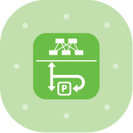
        <div>
            <a href="./img/Cisco/SAFE/Arch_63_Spine_Switch.svg">SVG</a>
            <div class="img-title">Spine_Switch</div>
        </div>
    </div>
    <div>
        
        <div>
            <a href="./img/Cisco/SAFE/Arch_63_Storage.svg">SVG</a>
            <div class="img-title">Storage</div>
        </div>
    </div>
    <div>
        
        <div>
            <a href="./img/Cisco/SAFE/Arch_63_Switch.svg">SVG</a>
            <div class="img-title">Switch</div>
        </div>
    </div>
    <div>
        
        <div>
            <a href="./img/Cisco/SAFE/Arch_63_Tetration.svg">SVG</a>
            <div class="img-title">Tetration</div>
        </div>
    </div>
    <div>
        
        <div>
            <a href="./img/Cisco/SAFE/Arch_63_TLS_Appliance.svg">SVG</a>
            <div class="img-title">TLS_Appliance</div>
        </div>
    </div>
    <div>
        
        <div>
            <a href="./img/Cisco/SAFE/Arch_63_UDP_Director.svg">SVG</a>
            <div class="img-title">UDP_Director</div>
        </div>
    </div>
    <div>
        
        <div>
            <a href="./img/Cisco/SAFE/Arch_63_Vehicle_Commercial.svg">SVG</a>
            <div class="img-title">Vehicle_Commercial</div>
        </div>
    </div>
    <div>
        
        <div>
            <a href="./img/Cisco/SAFE/Arch_63_Vehicle_Consumer.svg">SVG</a>
            <div class="img-title">Vehicle_Consumer</div>
        </div>
    </div>
    <div>
        
        <div>
            <a href="./img/Cisco/SAFE/Arch_63_Vehicle_Flight.svg">SVG</a>
            <div class="img-title">Vehicle_Flight</div>
        </div>
    </div>
    <div>
        
        <div>
            <a href="./img/Cisco/SAFE/Arch_63_Video_Endpoint.svg">SVG</a>
            <div class="img-title">Video_Endpoint</div>
        </div>
    </div>
    <div>
        
        <div>
            <a href="./img/Cisco/SAFE/Arch_63_VPN_Concentrator.svg">SVG</a>
            <div class="img-title">VPN_Concentrator</div>
        </div>
    </div>
    <div>
        
        <div>
            <a href="./img/Cisco/SAFE/Arch_63_Vulnerability_Management.svg">SVG</a>
            <div class="img-title">Vulnerability_Management</div>
        </div>
    </div>
    <div>
        
        <div>
            <a href="./img/Cisco/SAFE/Arch_63_Web_App_Firewall.svg">SVG</a>
            <div class="img-title">Web_App_Firewall</div>
        </div>
    </div>
    <div>
        
        <div>
            <a href="./img/Cisco/SAFE/Arch_63_Web_Filtering.svg">SVG</a>
            <div class="img-title">Web_Filtering</div>
        </div>
    </div>
    <div>
        
        <div>
            <a href="./img/Cisco/SAFE/Arch_63_Web_Security.svg">SVG</a>
            <div class="img-title">Web_Security</div>
        </div>
    </div>
    <div>
        
        <div>
            <a href="./img/Cisco/SAFE/Arch_63_Wide_Area_Application_Engine.svg">SVG</a>
            <div class="img-title">Wide_Area_Application_Engine</div>
        </div>
    </div>
    <div>
        
        <div>
            <a href="./img/Cisco/SAFE/Arch_63_Wireless_Access_Point.svg">SVG</a>
            <div class="img-title">Wireless_Access_Point</div>
        </div>
    </div>
    <div>
        
        <div>
            <a href="./img/Cisco/SAFE/Arch_63_Wireless_Controller.svg">SVG</a>
            <div class="img-title">Wireless_Controller</div>
        </div>
    </div>
    <div>
        
        <div>
            <a href="./img/Cisco/SAFE/Arch_63_Wireless_LAN_Controller.svg">SVG</a>
            <div class="img-title">Wireless_LAN_Controller</div>
        </div>
    </div>
</div>