# Cookies Catalog

also see [Cookiepedia](https://cookiepedia.co.uk/)

## Session

## User Consent

>>`CookieConsent` (or other) is a user consent choices cookie set by website.

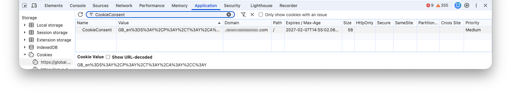

>>>>"Accept All", "Decline All", etc.

>>`{COOKIE}-userid` is a user ID cookie for user consent set by website.

## Analytics

### Adobe Analytics (formerly Omniture, SiteCatalyst)

see [Adobe Analytics cookies](https://experienceleague.adobe.com/en/docs/core-services/interface/data-collection/cookies/analytics)

#### `s_ecid`

>>`s_ecid` is a unique visitor ID set by Adobe Analytics.

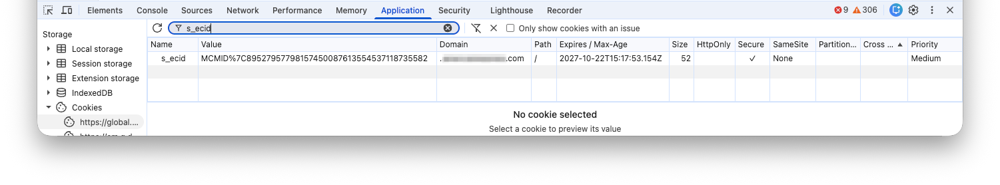

>>>>_Stores the CX Enterprise ID (ECID) or MID. Set by HTTP response. The MID is stored in s_ecid=MCMID format. Set after the client sets the AMCV cookie. It allows persistent first-party ID tracking and is used as a reference ID if the AMCV cookie expires. SameSite is set to “Lax”. If you use the Web SDK to implement Adobe Analytics, the cookie expiration is set to 2 years; however, most modern browsers truncate the expiration to 13 months._ (Adobe)

#### `s_pers`

>>`s_pers` is a persistent analytic cookie set by Adobe Analytics.

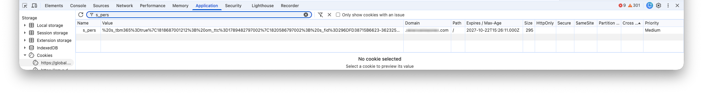

#### `s_sess`

>>`s_sess` is a temporary session cookie set by Adobe Analytics.

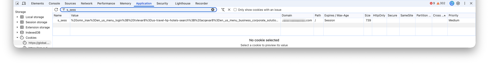

#### `s_vi`

>>`s_vi` is a unique visitor ID set by Adobe Analytics.

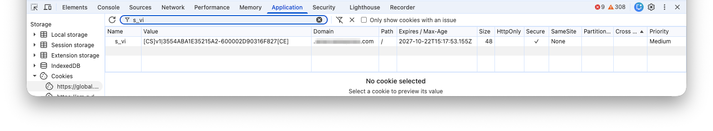

>>>>_Stores a unique visitor ID and timestamp. Set by HTTP response. Each visitor ID is associated with a visitor profile on Adobe servers. Visitor profiles are deleted after 1 year of inactivity, regardless of any visitor ID cookie expiration. The Secure flag is set when SameSite is “None” and connection is HTTPS. SameSite is “Lax” by default for first-party cookies. SameSite is “None” when using third-party cookies, such as on omtrdc.net or 2o7.net. Set SameSite to “None” when using a single CNAME to track multiple domains or properties._ (Adobe)

### Adobe Experience Cloud

see [CX Enterprise cookies](https://experienceleague.adobe.com/en/docs/core-services/interface/data-collection/cookies/experience-cloud)

#### `AMCV_###@AdobeOrg`

>>`AMCV_###@AdobeOrg` is a unique visitor ID set by Adobe Experience Cloud.

>>>>_The Visitor ID Service uses JavaScript to store a unique visitor ID in an AMCV_###@AdobeOrg cookie on the domain of the current website, where ### represents a random string of characters, such as AMCV_1FD6776A524453CC0A490D44%40AdobeOrg._ (Adobe)

### Contentsquare

see [Contentsquare: Cookies](https://docs.contentsquare.com/en/web/cookies/)

#### `_cs_c`

>>`_cs_c` is a cookie set by Contentsquare.

>>>>_Stores user consent on use of session data use within replays._ (Contentsquare)

#### `_cs_cvars`

>>`_cs_cvars` is a cookie set by Contentsquare.

>>>>_Stores the URL-encoded custom variables from the session._ (Contentsquare)

#### `_cs_id`

>>`_cs_id` is a cookie set by Contentsquare.

>>>>_Stores technical user data._ (Contentsquare)

### NetTracker

#### `SaneID`

>>`SaneID` is a persistent analytic cookie set by NetTracker.

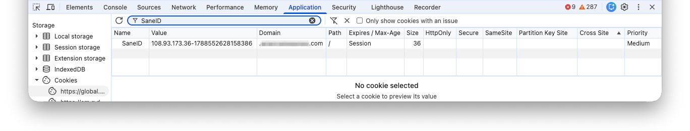

>>>>_Originally developed by Sane Solutions. SaneID often captures the client's source IP coupled with a unique epoch timestamp string (e.g., 172.22.24.180-4728804960004)._ (Google Gemini)

### Tealeaf

see [Tealeaf cookie scheme](https://help.goacoustic.com/hc/en-us/articles/360043785893-Tealeaf-cookie-scheme) or [Tealeaf Configuration > Cookie Settings](https://developer.goacoustic.com/acoustic-exp-analytics/docs/configuration#cookie-settings)

#### `TLTDID`

>>`TLTDID` is a unique visitor ID set by Acoutstic Tealeaf.

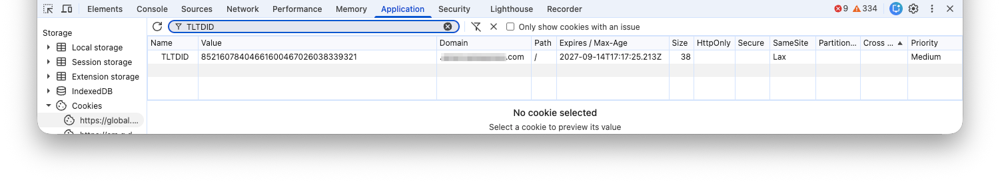

>>>>_The TLTDID is a cookie used to identify a visitor's device uniquely. A Device ID, or device identifier, helps distinguish between different devices and associate specific events with them. The device identifier is a unique alphanumeric string stored in the TLTDID cookie by default._ (Acoustic Tealeaf)

#### `TLTSID`

>>`TLTSID` is a temporary session cookie set by Acoutstic Tealeaf.

>>>>_TLTSID (Session) is a temporary cookie, active only for the length of a browser session, used to group hits into a session. The end user can decide whether or not to allow this cookie._ (Acoustic Tealeaf)

## Bot Manager

### Akamai Bot Manager

see [Akamai: Cookies and local storage](https://techdocs.akamai.com/identity-cloud/docs/hosted-login-cookies-and-local-storage-1) or [Akamai: Manage Cookie Preferences](https://www.akamai.com/legal/manage-cookie-preferences)

#### `_abck`

>>`_abck` is a bot manager cookie set by Akamai Bot Manager (BM).

#### `bm_sv`

>>`bm_sv` is a bot manager agent ID cookie set by Akamai Bot Manager (BM).

>>>>_Bot Manager Session Validation (BM SV) cookie is primarily used to differentiate between automated bot requests and human users._ (Google Gemnini)

>>>>_Cookie used by ​Akamai​ Bot Manager to help differentiate between web requests generated by humans and web requests generated by bots or other automated processes._ (Akamai)

#### `bm_vz`

>>`bm_vz` is a bot manager zone cookie set by Akamai Bot Manager (BM).

>>>>_Bot Manager Verification Zone (BM VZ) cookie. This belongs to the same Akamai anti-bot script suite. It acts as a telemetry or transaction signature to verify that the traffic coming to a website is legitimate and hasn't bypassed the security perimeter. [Used to] help segment bot-detection rules across different geographical regions or edge servers._ (Google Gemnini)

## Web Application Firewall

### F5 ASM

see [K6850: Overview of ASM cookies](https://my.f5.com/manage/s/article/K6850)

#### `TSxxxxxxxx`

>>`TSxxxxxxxx` is a security and session-validation cookie set by an F5 BIG-IP Application Security Manager (ASM) Web Application Firewall (WAF).

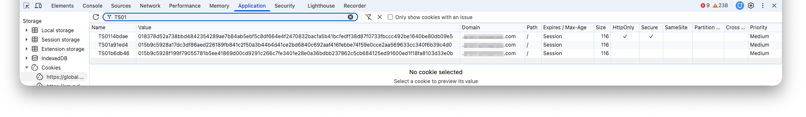

>>>>BIG-IP ASM 11.4.0 and later
The ASM Main cookie name structure contains eight hexadecimal characters (TSxxxxxxxx). The first two characters are the revision number and the remaining six characters represent the name of the active security policy.

## Real-User Monitoring (RUM)

### Dynatrace

see [Dynatrace: Cookies and client-side storage for RUM and Session Replay](https://docs.dynatrace.com/docs/manage/data-privacy-and-security/data-privacy/rum-cookies-and-web-storage)

#### `rxVisitor`

>>`rxVisitor` is a unique Visitor ID set by Dynatrace RUM.

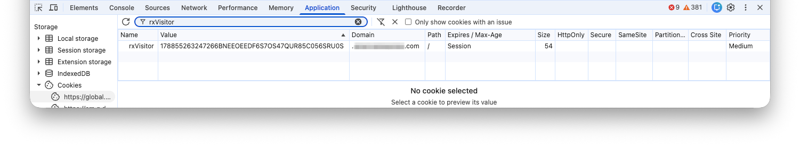

>>>>Contains the visitor ID to correlate sessions.

#### `rxvt`

>>`rxvt` is a session cookie set by Dynatrace RUM.

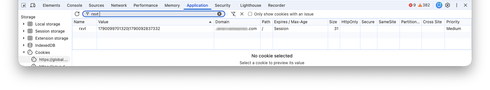

>>>>Stores the session timeout.

#### `dtCookie`

>>`dtCookie` is a persistent visit cookie set by Dynatrace RUM.

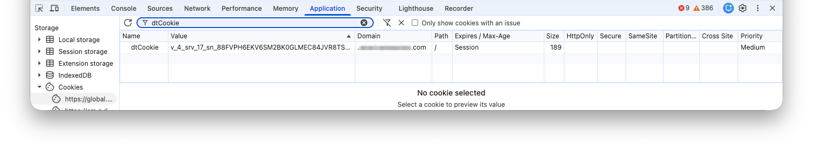

>>>>Tracks a visit across multiple requests.

#### `dtPC`

>>`dtPC` is a persistent beacon cookie set by Dynatrace RUM.

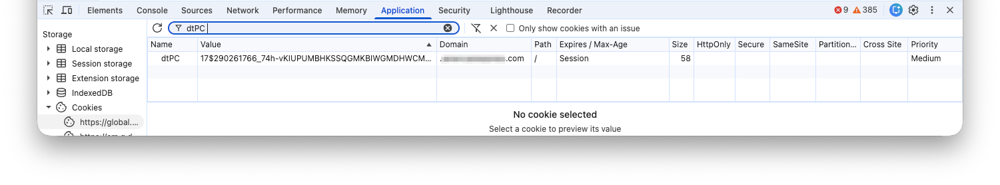

>>>>Required for routing RUM beacons; includes session ID for user session aggregation.

#### `dtSa`

>>`dtSa` is a RUM user action cookie set by Dynatrace RUM.

>>>>Serves as an intermediate storage for page-spanning actions. This cookie is used to save user action names, such as Click on Login, across different pages. This is required because page loads result in JavaScript code restart, so all contextual information must be stored in cookies.

## Advertising

### Google Ads

see [Google: Our advertising and measurement cookies](https://business.safety.google/adscookies/)

#### `__eoi`

>>`__eoi` is a advertising cookie set by Google Ads.

#### `__gads`

>>`__gads` is a advertising cookie set by Google Ads.

>>>>Purpose is Advertising, Security for products AdSense, Display & Video 360, Google Ad Manager, Google Ads and is set from partner domain.

#### `__gpi`

>>`__gpi` is a advertising cookie set by Google Ads.

>>>>Purpose is Advertising, Security for products AdSense, Google Ad Manager and is set from partner domain.

#### `_gcl_au`

>>`_gcl_au` is a advertising cookie set by Google Ads.

>>>>Purpose is Analytics, Advertising, Security for products Campaign Manager, Display & Video 360, Google Ads, Search Ads 360 and is set from partner domain.

#### `DSID`

>>`DSID` is a advertising cookie set by Google (formerly "DoubleClick").

>>>>Purpose is Security, Functionality, Advertising for products AdSense, Campaign Manager, Google Ad Manager, Google Analytics, Display & Video 360, Search Ads 360 and is set by doubleclick.net.

## Survey

### Qualtrics

see [Qualtrics: Website / App Insights Browser Cookies](https://www.qualtrics.com/support/website-app-feedback/getting-started-with-website-app-feedback/website-app-feedback-browser-cookies/)

#### `QSI`

>>`QSI` is a cookie set by Qualtrics.

### Mouseflow

#### `fp_mf`

>>`fp_mf` is a "first-party" (FP) analytic cookie set by Mouseflow (MF).