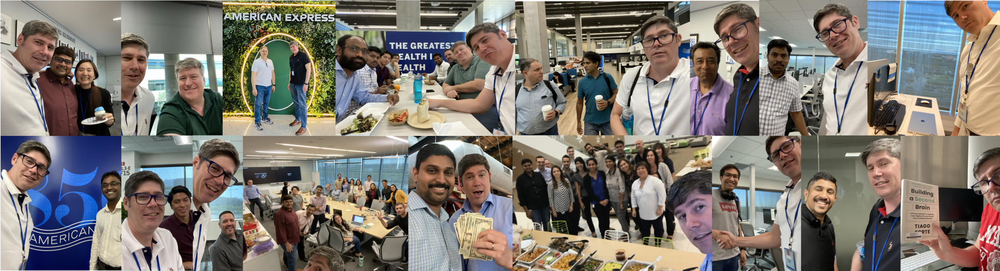
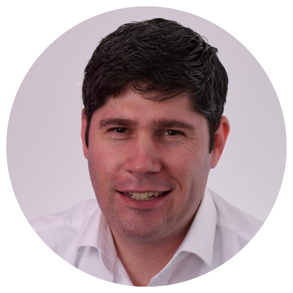
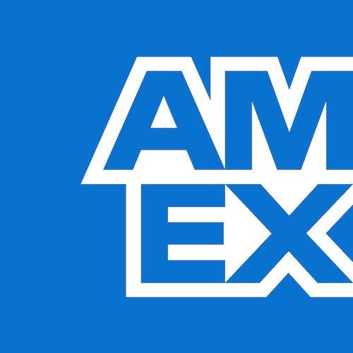
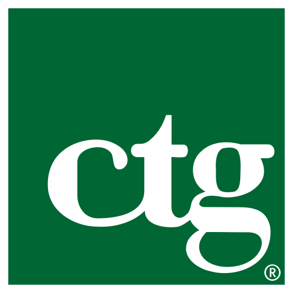
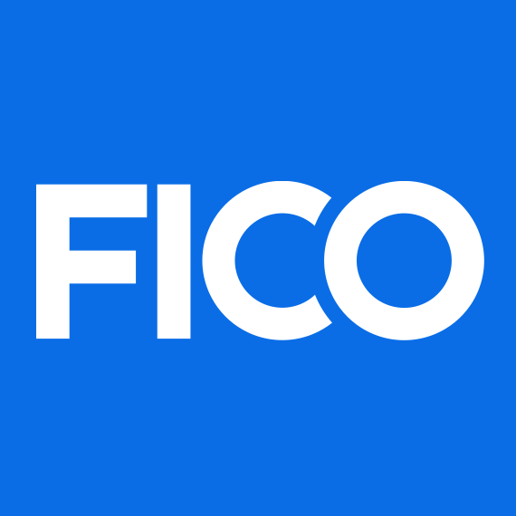
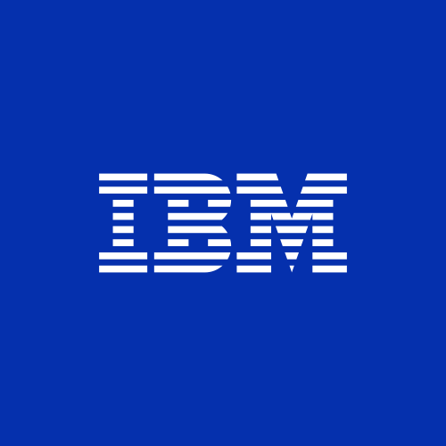
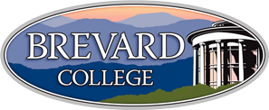
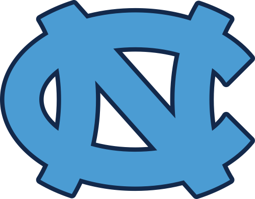
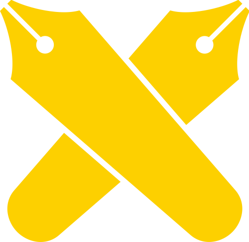

  

    
  

  

    
  

# Steven Park
**Staff Architect**  
Email: [parkdesigns@gmail.com](mailto:parkdesigns@gmail.com)  
LinkedIn: [https://www.linkedin.com/in/steven-park-6611856](https://www.linkedin.com/in/steven-park-6611856)  
GitHub: [https://parkdesigns.github.io/](https://parkdesigns.github.io/)  
X: [https://x.com/StevenPark76086](https://x.com/StevenPark76086)  
Website: TBD  
 

## Activity

* [Posts](./activity/posts/README.md)
  * 2026-09-13
    * [SVG Tiny Portable/Secure](./activity/posts/2026-09-13-svg-tiny-ps.md)
    * [BIMI](./activity/posts/2026-09-13-bimi.md)
  * 2026-09-04
    * [i18n - Internationalization (button)](./activity/posts/2026-09-04-i18n-button.md)
    * [i18n - Internationalization (images)](./activity/posts/2026-09-04-i18n-images.md)
    * [Title Blocks](./activity/posts/2026-09-04-title-blocks.md)

## Experience

### Layoff/position eliminated

  Unemployed  
  May 2026 - present

 

Certifications 
⠀⠀• ISC²: ⠀🚧 CISSP,⠀🚧 CCSP 
⠀⠀• AWS: ⠀⠀🚧 SAP, ⠀⠀🚧 DOP, ⠀⠀🚧 SCS 
⠀⠀• GCP: ⠀⠀🚧 PCA, ⠀⠀🚧 PCDOE,⠀🚧 PCSE 
⠀⠀• Cisco:⠀🚧 CCNA 

 

Portfolio
* GitHub - [parkdesigns.github.io](https://parkdesigns.github.io/)
* Website - [parkdesigns.uk](https://parkdesigns.uk)

### American Express

  Full-time • 9 yrs  
  Sunrise, FL, USA

 

    
Sr Software Engineer II - Architect

    

        Nov 2021 - May 2026 • 4 yrs 7 mos  
        Remote  
    

 
Unsupervised since Sr Staff Engineer retired late 2023

Contact Center Channels  
⠀⠀- Chat ............... 4 yrs web-based customer-to-agent chats using custom built solution, HTTP WebSocket  
⠀⠀- Email ............. 3 yr emails bi-directional customer-to-agent using SMTP email & web technologies  
⠀⠀- Social ............ 4 yrs social media customer-to-agent communication primarily for X.com using COTS  

Achievements  
 • Built documentation for Email (1,500+ pages) & Social (100+ pages) from nothing  
 • Created internal doc Libraries for Chat, Email, & Social containing 30,000+ file artifacts  
 • Researched & Designed metrics for Availability Dashboard & Scorecard for Chat  
 • Threat Modeling of Chat, Email, & Social systems (600+ countermeasures)  
 • Designed Architecture of Email ($4M/yr savings)  
 • Privacy Risk Assessment of Chat & Email (CA, DE, IT, JP, US, etc)  
 • Architecture as Design of Chat & Email  
 • Designed Authentication solution in travel.americanexpress.com 3rd Party website for Chat  
 • Designed Anonymous Authentication solution in americanexpress.com website for Chat  
 • Acted as Data Custodian for Chat & Email  
 • Designed Data Retention Lifecycle of Chat through Google BigQuery queries  
 • Decommissioned LivePerson Chat ($2M/yr savings)  
 • Mentored 10+ Colleagues over 4 year period (1 - 2 meetings/mo)  
 • Hosted over 200+ Architecture Review meetings; 20+ Design meetings  
 • Governed & Supported production operations: led multiple Incident RCA & Resolution emergency calls (20+)  

Products  
 • Contact Center: LiveWorld Social; Genesys Chat & Email

    
Sr Software Engineer I - Architect

    

        Jun 2017 - Nov 2021 • 4 yrs 6 mos  
        On-site  
    

 
Supervised by Sr Staff Engineer

Contact Center Channels  
⠀⠀- Chat ............... 4 yrs web-based customer-to-agent chats using COTS & inhouse, HTTP WebSocket  
⠀⠀- Co-Browse .... 4 yrs web-based co-browse customer “screen sharing” sessions with agent  
⠀⠀- Social ............ 4 yrs social media customer-to-agent communication primarily for Twitter using COTS  

Achievements  
 • Built documentation for Chat (5,000+ pages) & CoBrowse (100+ pages) from nothing  
 • Designed ETL of LivePerson Chat data to Amex for data retention needs  
 • Designed Tagging solution in americanexpress.com website for Chat  
 • Led Pilot solution of out-of-the-box Genesys WebChat   
 • Designed Authentication integration in Chat leveraging americanexpress.com website Auth  
 • Designed Privacy solution in Chat  
 • Designed Integration of web-based Chat with mobile-app Chat core  
 • Created & Executed DR Plan for Chat & Routing backend   
 • Maintained & Improved DR Plan(s) for Chat  
 • Performed 1st pilot Privacy by Design (aka Privacy Risk Assessment) for Chat  
 • Hosted over 100+ Architecture Review meetings; 30+ Design meetings  
 • Governed production operations: led multiple Incident RCA & Resolution emergency calls (60+)  

Products  
 • Contact Center: LiveWorld Social; Genesys Chat & Email

### Royal Caribbean International

  Full-time • 6 yrs  
  Miramar, FL, United States

 

    
Sr Software Engineer

    

        Apr 2011 - Mar 2017 • 6 yrs  
        On-site  
    

 

Roles  
⠀- Application Operations ...... 0.7 yrs - ops team supporting B2C/B2B websites, web services, etc  
⠀- Enterprise Services ........... 1.4 yrs - ESL web services Tech Lead/Production Support Lead  
⠀- CelebrityCruises.com ........ 0.7 yrs - website Tech Lead/Production Support Lead  
⠀- RoyalCaribbean.com .......... 2.9 yrs - websites (6) Tech Lead/Production Support Lead  

Achievements  
 • Took responsibility for every layer: CDN, FW, IPS, LB, Gateway, Web/App/Srv, HTTP/TCP/IP, Unix  
 • Identified and analyzed mystifying issues involving IPS, AIX-VIOs, GFW, PConns, HTTP 504s, etc  
 • Recognized across all departments as a true expert, veteran, and 365/24/7 duty-phone holder  
 • Tooling used:  sed/awk/grep, Splunk, Dynatrace, Ganglia, WireShark, SoapUI/Postman, Firefox addons  
 

### Computer Task Group

  Full-time • 3 yrs 4 mos  
  Flowood, MS, USA

 

    
Software Engineer

    

        Jan 2008 - Apr 2011 • 3 yrs 4 mos  
        On-site  
    

 

Achievements  
 • Designed and coded multiple high profile internal and external BCBSMS web applications over 3 years  
 • Provided solid ownership of tasks and lead other developers in achieving goals in a flexible manner  
 • Gathered and documented software requirements, implemented complex business rules into J2EE apps  
 • Performed Object Oriented Analysis & Design to generate Business Domain Model and architecture  
 • Used Struts 1.1/2.0, Spring, JUnit, iBATIS, DbUnit, WebSphere 6.1, RAD, CVS/Subversion, & Maven  
 • Utilized FireBug and Apache Web Server to develop HTML, CSS, JavaScript, and Dojo for web pages  
 • Presented applications on a regular basis to major stakeholders at client to solicit feedback/approval  
 • Participated in full SDLC from inception (requirements) to transition (production, pilot, maintenance)  
 

### FICO

  Full-time • 1 yr 3 mos  
  Chicago, IL, USA

 

    
Systems Integration Consultant

    

        Apr 2006 - Jun 2007 • 1 yr 3 mos  
        On-site  
    

 

Achievements  
 • Supported hosted web, app, database, and email servers in terms of configs and surrounding processes  
 • Maintained J2EE web-container based Struts application for client in creating and updating features  
 • Migrated application from WebLogic 6.1 to Tomcat 5.5.17 and from Apache 1.3.22 to Apache 2.0.55  
 • Assisted database migration from Oracle 8i to 9i, migration of cron jobs to Unisys, and user changes  
 • Performed load testing using Mercury Load Runner and improved the general practice of QA testing	  
 • Managed many SDLC/project aspects, examples - documentation, estimates, requirements elicitation  
 

### IBM Contract

  Full-time • 10 mos  
  Raliegh-Durham-Chapel Hill Area, NC, USA

 

    
Systems Administrator

    

        Jun 2004 - Mar 2005 • 10 mos  
        On-site  
    

 

Achievements  
 • Analyzed Logidex - a software asset management system based on RAS specification (see OMG.org)  
 • Programmed extension to Logidex using WebSphere family products  (WSAD, WAS, MQ) and DB2  
 • Used technologies and APIs:  EJB, EJB-QL, SOAP, WSDL, JMS, SQL, log4j, Ant, JUnit, and Cactus  
 • Secured application w/ Java 2 Security declarative policy files, HTTP over SSL, & basic authentication  
 • Administered test-box WebSphere Application Server 5.x with AdminConsole / wsadmin scripts(JACL)  
 • Researched RUP and other modeling, process, and test oriented aspects of software lifecycle for project  

## Education

    

        
    

    

        Brevard College 
        Sep 1996 - Dec 1996 
        Dropped Dec 1996 
        BA Art
    

    

    

         
    

    

        University of North Carolina at Chapel Hill 
        May 1997 - Aug 2000 
        Graduated Aug 2001 
        BS Computer Science - Mathematical Science
    

    

    

        
    

    

        Keio University 
        Sep 2000 - Aug 2001 
        Exchange 
        Japanese Language Program
    

    

## Skills

## Certifications

