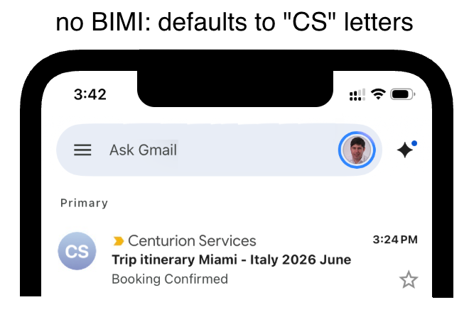
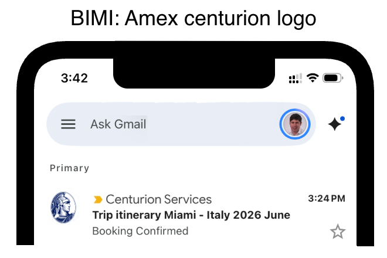
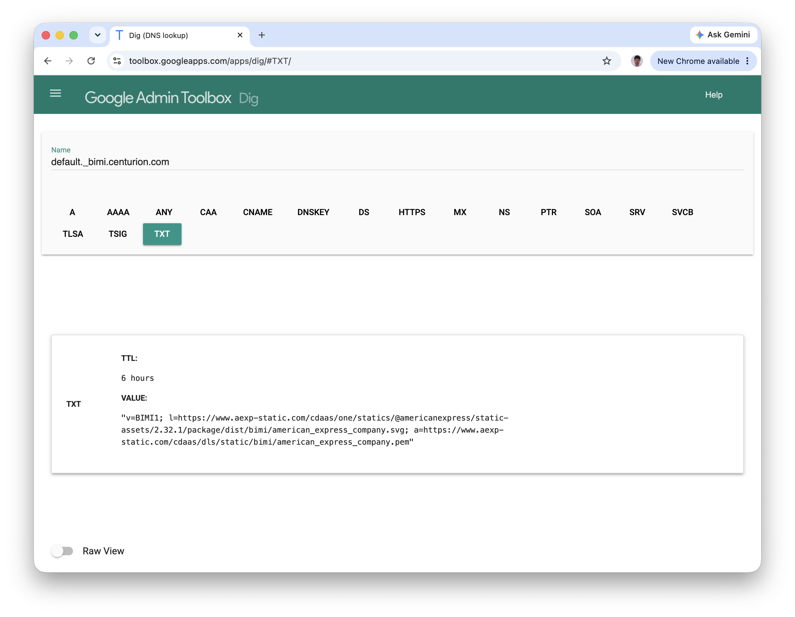

# Brand Indicators for Message Identification

I, Steven Park, added BIMI for `centurion.com` in 2025 and proved the customization BIMI proposal in 2026.

* BIMI - Brand Indicators for Message Identification
  - see [bimigroup.org](https://bimigroup.org/)
  - see IETF draft [RFC BIMI](https://datatracker.ietf.org/doc/draft-brand-indicators-for-message-identification/)
* SVG - Scalable Vector Graphics

My Contributions:

* Researched UI/UX improvements
* Discovered BIMI absent
* Created proposal to add BIMI
* Created alternate proposal to us "Centurion" logo for BIMI
* Coordinated with Security to add DNS entry
* Tested
* Proved 32 KB "Centurion" SVG possible

Benefits to Amex:

* Better branding
* Improved UX/UI look-and-feel
* More Secure
  * Anti-phishing

<table width="100%">
  <tr>
    <td bgcolor="#f4f4f4">
      <strong>ⓘ NOTE:</strong><br>
      Technology Leadership refused to acknowledge this achievement and went as far to say I should NOT have done it.<br /><br />
      Only my personal time was used.<br /><br />
      Business was extremely happy.<br /><br />
      CIO goals of `Best Customer Experience` and `Cyber` were the impetus.
    </td>
  </tr>
</table>


## Before



## After 2025


## Proposal



## Options Side-by-Side


## Implementation

### DNS TXT record 
```
default._bimi.centurion.com. IN TXT "v=BIMI1; l=https://www.aexp-static.com/cdaas/one/statics/@americanexpress/static-assets/2.32.1/package/dist/bimi/american_express_company.svg; a=https://www.aexp-static.com/cdaas/dls/static/bimi/american_express_company.pem"
```

### PEM file

* https://www.aexp-static.com/cdaas/dls/static/bimi/american_express_company.pem

### SVG file

* https://www.aexp-static.com/cdaas/one/statics/@americanexpress/static-assets/2.32.1/package/dist/bimi/american_express_company.svg

### Timeline

Weekends and after-hours

| Date            | Activity                            | Comments    |
| --------------- | ----------------------------------- | ----------- |
| 2025-01-11 & 12 | UX/UI research of Email Client(s)   | Weekend     |
| 2025-01-17      | proposed BIMI for centurion.com     | After-hours |
| 2025-02-*       | coordination w/ Business & Security |             |
| 2025-03-04      | implemented BIMI for centurion.com  |             |


## Customization Proposal

The centurion logo SVG was also proposed by me for BIMI in 2025.

* 
* sourced from https://www.aexp-static.com/cdaas/one/statics/axp-static-assets/2.24.1/package/dist/img/brand/centurion-linear-gray-05.svg

However, interest dwindled given no immediate 32 KB file existed and the BIMI process requiring lawyers could take time.

Post Amex layoff I proved a 32 KB svg could be generated as part of my portfolio of work.

* 

See [SVG Tiny Portable Secure](../images/SVG-Tiny-Portable-Secure.md) for how this 32 KB svg was achieved.

## Reference

### BIMI

* BIMI - Brand Indicators for Message Identification
  - see [bimigroup.org](https://bimigroup.org/)
  - see IETF draft [RFC BIMI](https://datatracker.ietf.org/doc/draft-brand-indicators-for-message-identification/)

### SVG

* SVG - [Scalable Vector Graphics](https://www.w3.org/TR/SVG2/)
  * 🚧 DRAFT: [SVG Tiny Portable/Secure](https://www.ietf.org/archive/id/draft-svg-tiny-ps-abrotman-07.html)

### Checking DNS

#### Google Admin Toolbox Dig

https://toolbox.googleapps.com/apps/dig/#TXT/

`default._bimi.centurion.com`




